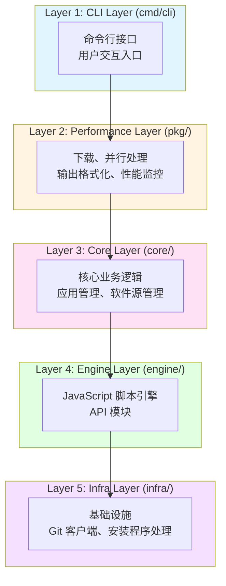
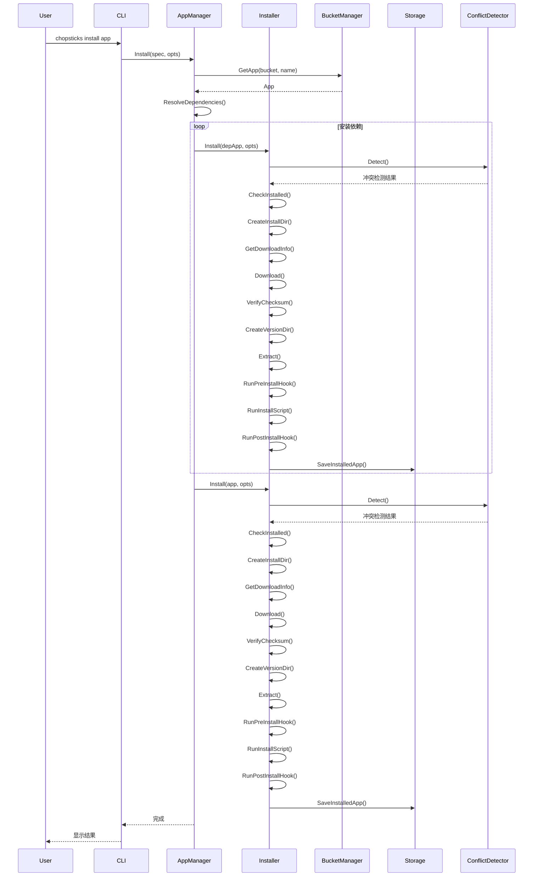
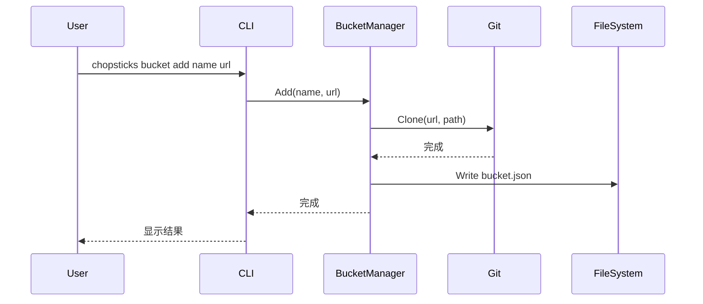
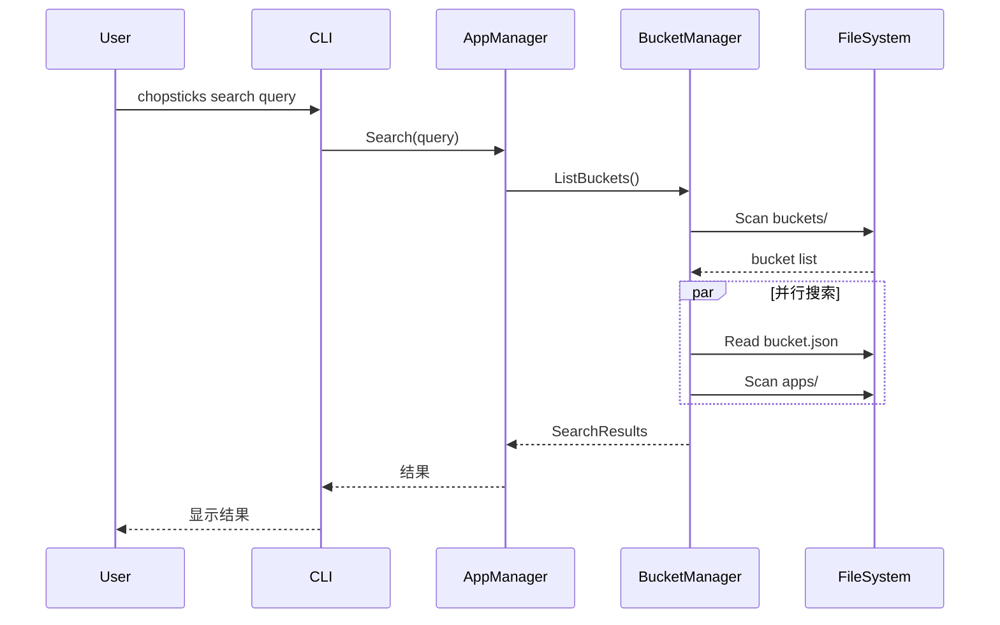

# Chopsticks 架构文档

> 版本：v1.0.0
> 最后更新：2026-03-06

> 描述 Chopsticks 系统架构设计、核心组件、数据模型和扩展点

---

## 1. 架构概述

Chopsticks 是一个 Windows 包管理器，采用分层架构设计，核心设计理念是：

- **纯文件系统存储**: 完全摒弃 SQLite，所有数据通过 JSON 文件和目录结构存储
- **同步优先**: 核心功能使用同步函数，调用方通过 `errgroup` 控制并发
- **纯 Go 实现**: 零 CGO 依赖，使用 Goja (JS 引擎)、go-git (Git 客户端)
- **缓存优化**: 启动时加载索引到内存，运行时使用懒加载和批量读取

### 1.1 架构分层



```
┌─────────────────────────────────────────────────────────────────┐
│ Layer 1: CLI Layer (cmd/cli)                                    │
│   - 命令行接口，用户交互入口                                     │
├─────────────────────────────────────────────────────────────────┤
│ Layer 2: Performance Layer (pkg/)                               │
│   - 下载、并行处理、输出格式化、性能监控等通用功能                │
├─────────────────────────────────────────────────────────────────┤
│ Layer 3: Core Layer (core/)                                     │
│   - 核心业务逻辑：应用管理、软件源管理                                │
├─────────────────────────────────────────────────────────────────┤
│ Layer 4: Engine Layer (engine/)                                 │
│   - JavaScript 脚本引擎和 API 模块                              │
├─────────────────────────────────────────────────────────────────┤
│ Layer 5: Infra Layer (infra/)                                   │
│   - 基础设施：Git 客户端、安装程序处理                               │
└─────────────────────────────────────────────────────────────────┘
```

### 1.2 核心组件

| 组件                  | 包路径            | 职责                                   |
| --------------------- | ----------------- | -------------------------------------- |
| **AppManager**        | `core/app`        | 应用安装、卸载、更新、查询             |
| **BucketManager**     | `core/bucket`     | 软件源管理、应用搜索                   |
| **Storage**           | `core/store`      | 文件系统存储                           |
| **ConflictDetector**  | `core/conflict`   | 冲突检测与格式化                       |
| **Manifest**          | `core/manifest`   | 应用和软件源数据结构定义               |
| **DependencyManager** | `core/dep`        | 依赖管理、引用计数、反向依赖、孤儿清理 |
| **VersionModule**     | `engine/semver`   | 版本号解析、比较、约束                 |
| **JSEngine**          | `engine`          | JavaScript 脚本执行                    |
| **Git**               | `infra/git`       | 软件源仓库操作                         |
| **Installer**         | `infra/installer` | 安装程序处理                           |

## 2. 核心接口

### 2.1 AppManager - 应用管理器

```go
type AppManager interface {
    Install(ctx context.Context, spec InstallSpec, opts InstallOptions) error
    Remove(ctx context.Context, name string, opts RemoveOptions) error
    Update(ctx context.Context, name string, opts UpdateOptions) error
    UpdateAll(ctx context.Context, opts UpdateOptions) error
    Switch(ctx context.Context, name, version string) error
    ListInstalled() ([]*manifest.InstalledApp, error)
    Info(ctx context.Context, bucket, name string) (*manifest.AppInfo, error)
    Search(ctx context.Context, query string, bucket string) ([]SearchResult, error)
}
```

### 2.2 BucketManager - 软件源管理器

```go
type BucketManager interface {
    Add(ctx context.Context, name, url string, opts AddOptions) error
    Remove(ctx context.Context, name string, purge bool) error
    Update(ctx context.Context, name string) error
    UpdateAll(ctx context.Context) error
    GetBucket(ctx context.Context, name string) (*manifest.BucketConfig, error)
    GetApp(ctx context.Context, bucket, name string) (*manifest.App, error)
    ListApps(ctx context.Context, bucket string) (map[string]*manifest.AppRef, error)
    ListBuckets(ctx context.Context) ([]string, error)
    Search(ctx context.Context, query string, opts SearchOptions) ([]SearchResult, error)
}
```

### 2.3 Storage - 文件系统存储

```go
type Storage interface {
    // 已安装的应用
    SaveApp(ctx context.Context, app *AppManifest) error
    GetApp(ctx context.Context, name string) (*AppManifest, error)
    DeleteApp(ctx context.Context, name string) error
    ListApps(ctx context.Context) ([]*AppManifest, error)
    IsInstalled(ctx context.Context, name string) (bool, error)

    // 软件源配置
    SaveBucket(ctx context.Context, bucket *BucketConfig) error
    GetBucket(ctx context.Context, name string) (*BucketConfig, error)
    DeleteBucket(ctx context.Context, name string) error
    ListBuckets(ctx context.Context) ([]*BucketConfig, error)

    // 操作记录
    SaveOperation(ctx context.Context, appName string, op *Operation) error
    GetOperations(ctx context.Context, appName string) ([]Operation, error)
    DeleteOperations(ctx context.Context, appName string) error

    // 依赖索引
    SaveRuntimeIndex(ctx context.Context, index RuntimeIndex) error
    GetRuntimeIndex(ctx context.Context) (RuntimeIndex, error)
    SaveDepsIndex(ctx context.Context, index *DepsIndex) error
    GetDepsIndex(ctx context.Context) (*DepsIndex, error)

    Close() error
}
```

### 2.4 DependencyManager - 依赖管理器

```go
type DependencyManager interface {
    // 依赖解析
    Resolve(ctx context.Context, app *manifest.App) (*DependencyGraph, error)
    CheckConflicts(ctx context.Context, deps *manifest.Dependencies) ([]Conflict, error)
    CheckCircular(ctx context.Context, deps []string) error

    // 运行时库管理
    InstallRuntime(ctx context.Context, dep, version, appName string, size int64) error
    UninstallRuntime(ctx context.Context, dep, appName string) error
    GetRuntimeInfo(ctx context.Context, dep string) (*manifest.RuntimeInfo, error)
    CleanupRuntime(ctx context.Context) error
    ListRuntimes(ctx context.Context) map[string]*manifest.RuntimeInfo

    // 反向依赖计算
    GetDependents(ctx context.Context, appName string) ([]string, error)
    GetAllDependents(ctx context.Context, appName string) ([]string, error)
    GetDependentsTree(ctx context.Context, appName string) *DependentTree

    // 孤儿依赖清理
    FindOrphans(ctx context.Context) (*manifest.Orphans, error)
    CleanupOrphans(ctx context.Context, orphans *manifest.Orphans) error
    DryRunCleanup(ctx context.Context, orphans *manifest.Orphans) error

    // 依赖索引管理
    RebuildIndex(ctx context.Context) error
    UpdateDepsIndex(ctx context.Context, appName string, deps []string) error
}
```

### 2.5 VersionManager - 版本管理器

```go
type VersionManager interface {
    // 版本解析
    Parse(version string) (*Version, error)
    Normalize(version string) string
    DetectType(version string) string

    // 版本比较
    Compare(v1, v2 *Version) int
    CompareStrings(v1, v2 string) (int, error)

    // 版本约束
    Satisfies(version *Version, constraint string) bool
    ParseConstraint(constraint string) (*Constraint, error)

    // 版本排序
    Sort(versions []*Version) []*Version
    Latest(versions []*Version) *Version
}
```

### 2.6 Installer - 安装器

```go
type Installer interface {
    Install(ctx context.Context, app *manifest.App, opts InstallOptions) error
    Uninstall(ctx context.Context, name string, opts UninstallOptions) error
    Refresh(ctx context.Context, app *manifest.App, installed *manifest.InstalledApp, opts RefreshOptions) error
    Switch(ctx context.Context, name, version string) error
}
```

## 3. 数据模型

### 3.1 软件包模型

```go
// App - 软件包完整信息
type App struct {
    Script *AppScript // 脚本信息（来自 .js 文件）
    Meta   *AppMeta   // 元数据（来自 .meta.json 文件）
    Ref    *AppRef    // 引用信息
}

// AppScript - 软件包脚本信息
type AppScript struct {
    Name         string       // 软件名称
    Description  string       // 描述
    Homepage     string       // 主页 URL
    License      string       // 许可证
    Category     string       // 分类
    Tags         []string     // 标签
    Maintainer   string       // 维护者
    Bucket       string       // 所属软件源
    Dependencies []Dependency // 依赖列表
}

// Dependency - 依赖定义
type Dependency struct {
    Name       string            // 依赖软件包名称
    Version    string            // 版本约束（如 ">=1.0.0"）
    Optional   bool              // 是否为可选依赖
    Conditions map[string]string // 安装条件
}

// Dependencies - 完整依赖声明
type Dependencies struct {
    Runtime    []Dependency // 运行时库
    Tools      []Dependency // 工具软件
    Libraries  []Dependency // 库文件
    Conflicts  []string     // 冲突软件
}

// RuntimeInfo - 运行时库信息
type RuntimeInfo struct {
    Version     string    // 版本号
    InstalledAt time.Time // 安装时间
    RequiredBy  []string  // 依赖此运行时库的软件列表
    RefCount    int       // 引用计数
    Size        int64     // 占用字节数
}

// Orphans - 孤儿依赖
type Orphans struct {
    Runtime []string // 孤儿运行时库
    Tools   []string // 孤儿工具软件
}

// Version - 版本号
type Version struct {
    Raw          string   // 原始字符串
    Normalized   string   // 规范化后
    Type         string   // 类型：semver/calver/quad/build/custom
    Segments     []int    // 数字段
    Prerelease   string   // 预发布标识
    PrereleaseNum int     // 预发布编号
    Build        string   // 构建元数据
    Comparable   bool     // 是否可比较
}

// Constraint - 版本约束
type Constraint struct {
    Type    string   // 约束类型：semver/calver/loose/exact/any
    Ranges  []Range  // 约束范围
}

// Range - 版本范围
type Range struct {
    Operator string  // 操作符：>= <= > < ^ ~
    Version  *Version
}

// AppMeta - 软件包元数据
type AppMeta struct {
    Version  string                 // 当前版本
    Versions map[string]VersionInfo // 所有版本信息
}

// VersionInfo - 版本信息
type VersionInfo struct {
    Version    string                  // 版本号
    ReleasedAt time.Time               // 发布时间
    Downloads  map[string]DownloadInfo // 各架构下载信息
}

// DownloadInfo - 下载信息
type DownloadInfo struct {
    URL  string // 下载地址
    Hash string // 校验和
    Size int64  // 文件大小
    Type string // 压缩类型
}

// AppRef - 软件包引用（索引用）
type AppRef struct {
    Name        string   // 名称
    Description string   // 描述
    Version     string   // 最新版本
    Category    string   // 分类
    Tags        []string // 标签
    ScriptPath  string   // 脚本文件路径
    MetaPath    string   // 元数据文件路径
}

// InstalledApp - 已安装软件包
type InstalledApp struct {
    Name        string    // 名称
    Version     string    // 版本
    Bucket      string    // 所属软件源
    InstallDir  string    // 安装目录
    InstalledAt time.Time // 安装时间
    UpdatedAt   time.Time // 更新时间
}
```

### 3.2 软件源模型

```go
// BucketConfig - 软件源配置
type BucketConfig struct {
    ID          string         // 标识符
    Name        string         // 显示名称
    Author      string         // 作者
    Description string         // 描述
    Homepage    string         // 主页
    License     string         // 许可证
    Repository  RepositoryInfo // 仓库信息
}

// RepositoryInfo - 仓库信息
type RepositoryInfo struct {
    Type   string // 类型（git, svn 等）
    URL    string // 地址
    Branch string // 分支
}

// Bucket - 软件源完整信息
type Bucket struct {
    Config      BucketConfig       // 配置
    Path        string             // 本地路径
    Apps        map[string]*AppRef // 应用索引
    LastUpdated time.Time          // 最后更新时间
}
```

## 4. 数据存储

### 4.1 存储架构

Chopsticks 采用**纯文件系统存储架构**，完全摒弃 SQLite 数据库。

| 数据类型     | 存储位置                        | 格式               |
| ------------ | ------------------------------- | ------------------ |
| 已安装软件包 | `apps/{name}/manifest.json`     | JSON               |
| 操作记录     | `apps/{name}/operations.json`   | JSON               |
| 软件源配置   | `bucket-index.json`             | JSON               |
| 软件包脚本   | `buckets/{id}/apps/*.js`        | JavaScript         |
| 软件包元数据 | `buckets/{id}/apps/*.meta.json` | JSON               |
| 运行时库索引 | `runtime-index.json`            | JSON               |
| 依赖索引     | `deps-index.json`               | JSON（可重建缓存） |
| 下载缓存     | `cache/downloads/`              | 二进制文件         |
| 持久化数据   | `persist/{app}/`                | 任意格式           |

### 4.2 核心数据文件

#### manifest.json - 已安装应用元数据

```json
{
  "name": "git",
  "bucket": "main",
  "current_version": "2.43.0",
  "installed_versions": ["2.43.0", "2.42.0"],
  "dependencies": {
    "runtime": [{ "name": "vcredist140", "version": ">=14.0", "shared": true }],
    "tools": [{ "name": "7zip", "version": ">=19.0", "shared": true }],
    "libraries": [],
    "conflicts": ["git-for-windows"]
  },
  "installed_at": "2026-03-04T10:30:00Z",
  "installed_on_request": true,
  "isolated": false
}
```

#### operations.json - 系统操作记录

```json
{
  "version": "2.43.0",
  "operations": [
    {
      "type": "path",
      "path": "bin",
      "created_at": "2026-03-04T10:30:00Z"
    },
    {
      "type": "env",
      "key": "GIT_HOME",
      "value": "C:\\Users\\xxx\\.chopsticks\\apps\\git\\2.43.0",
      "created_at": "2026-03-04T10:30:01Z"
    },
    {
      "type": "registry",
      "key": "HKCU\\Software\\Git",
      "name": "InstallPath",
      "value": "C:\\Users\\xxx\\.chopsticks\\apps\\git\\2.43.0",
      "created_at": "2026-03-04T10:30:02Z"
    }
  ]
}
```

#### runtime-index.json - 运行时库索引

```json
{
  "vcredist140": {
    "version": "14.38.33135",
    "installed_at": "2026-03-04T10:30:00Z",
    "required_by": ["git", "nodejs", "python"],
    "ref_count": 3,
    "size": 23500000
  },
  "dotnet6": {
    "version": "6.0.25",
    "required_by": ["powershell"],
    "ref_count": 1
  }
}
```

#### deps-index.json - 依赖索引（可重建缓存）

```json
{
  "generated_at": "2026-03-04T10:30:00Z",
  "apps": {
    "git": {
      "dependencies": ["vcredist140", "7zip"],
      "dependents": ["git-lfs", "hub"]
    },
    "7zip": {
      "dependencies": [],
      "dependents": ["git", "nodejs"]
    }
  }
}
```

## 5. 核心流程

### 5.1 应用安装流程



### 5.2 软件源管理流程



### 5.3 搜索流程



## 6. JavaScript 引擎

### 6.1 引擎架构

Chopsticks 使用 Goja (纯 Go JavaScript 引擎) 执行应用安装脚本。

```
┌─────────────────────────────────────────┐
│           JS Engine (Goja)              │
├─────────────────────────────────────────┤
│  ┌─────────┐ ┌─────────┐ ┌─────────┐   │
│  │   fs    │ │  fetch  │ │  exec   │   │
│  └─────────┘ └─────────┘ └─────────┘   │
│  ┌─────────┐ ┌─────────┐ ┌─────────┐   │
│  │ archive │ │checksum │ │  path   │   │
│  └─────────┘ └─────────┘ └─────────┘   │
│  ┌─────────┐ ┌─────────┐ ┌─────────┐   │
│  │   log   │ │  json   │ │ symlink │   │
│  └─────────┘ └─────────┘ └─────────┘   │
│  ┌─────────┐ ┌─────────┐ ┌─────────┐   │
│  │registry │ │ semver  │ │chopsticks│   │
│  └─────────┘ └─────────┘ └─────────┘   │
│  ┌─────────┐                            │
│  │installer│                            │
│  └─────────┘                            │
└─────────────────────────────────────────┘
```

### 6.2 内置模块

| 模块         | 功能                        |
| ------------ | --------------------------- |
| `fs`         | 文件读写、目录操作          |
| `fetch`      | HTTP 请求、下载             |
| `exec`       | 命令执行                    |
| `archive`    | 压缩解压 (zip, tar, 7z)     |
| `checksum`   | 校验和验证 (MD5, SHA256)    |
| `path`       | 路径操作                    |
| `log`        | 日志输出                    |
| `json`       | JSON 处理                   |
| `symlink`    | 符号链接操作                |
| `registry`   | Windows 注册表操作          |
| `semver`     | 语义化版本比较              |
| `chopsticks` | 系统 API (获取架构、路径等) |
| `installer`  | 安装程序处理                |

## 7. 目录结构

```
chopsticks/
├── cmd/                    # 程序入口
│   ├── main.go            # 主函数
│   └── cli/               # CLI 命令
│       ├── root.go
│       ├── install.go
│       ├── search.go
│       └── ...
├── core/                   # 核心业务逻辑
│   ├── app/               # 应用管理
│   │   ├── manager.go
│   │   ├── install.go
│   │   └── installer.go
│   ├── bucket/            # 软件源管理
│   │   ├── bucket.go
│   │   ├── loader.go
│   │   └── parallel_search.go
│   ├── manifest/          # 数据结构
│   │   ├── app.go
│   │   └── bucket.go
│   ├── store/             # 数据存储
│   │   └── storage.go
│   └── conflict/          # 冲突检测
│       └── detector.go
├── engine/                 # JS 引擎
│   ├── engine.go
│   ├── js_engine.go
│   ├── js_pool.go
│   ├── js_batch.go
│   └── */register.go      # 模块注册
├── infra/                  # 基础设施
│   ├── git/               # Git 客户端
│   │   └── git.go
│   └── installer/         # 安装程序处理
│       └── installer.go
├── pkg/                    # 通用包
│   ├── config/            # 配置管理
│   ├── download/          # 下载功能
│   ├── errors/            # 错误处理
│   ├── metrics/           # 性能监控
│   ├── output/            # 输出格式化
│   └── parallel/          # 并行处理
└── wiki/                   # 文档
    ├── ARCHITECTURE.md    # 本文件
    ├── design/            # 设计文档
    └── user/              # 用户文档
```

## 8. 依赖列表

| 依赖                              | 用途            | 版本                  |
| --------------------------------- | --------------- | --------------------- |
| `github.com/dop251/goja`          | JavaScript 引擎 | v0.0.0-20260226184354 |
| `github.com/go-git/go-git/v5`     | Git 操作        | v5.17.0               |
| `github.com/spf13/cobra`          | CLI 框架        | v1.10.2               |
| `github.com/ulikunitz/xz`         | XZ 压缩         | v0.5.15               |
| `golang.org/x/sync`               | 并发工具        | v0.19.0               |
| `github.com/google/uuid`          | UUID 生成       | v1.6.0                |
| `github.com/natefinch/lumberjack` | 日志轮转        | v2.0.0                |
| `github.com/goccy/go-yaml`        | YAML 解析       | v1.x.x                |

## 9. 设计原则

### 9.1 纯文件系统存储

- 完全摒弃 SQLite，所有数据使用 JSON 文件存储
- 目录结构反映数据状态，删除目录即删除数据
- 人类可读的 JSON 格式，便于调试和手动修复
- 所有索引文件可从原始数据重新生成

### 9.2 配置系统简化

- 统一使用 `RootDir` 作为配置核心
- 其他目录自动基于 `RootDir` 推导
- 支持环境变量覆盖
- 配置文件使用 YAML 格式

### 9.3 依赖管理完善

- 依赖分类管理：runtime、tools、libraries、conflicts
- 引用计数机制：运行时库共享管理
- 动态计算反向依赖：保证数据一致性
- 孤儿依赖清理：自动检测并提示清理

### 9.4 性能优化

- 启动时懒加载：索引文件加载到内存
- 缓存策略：bucket、runtime、deps 索引缓存
- 批量读取：减少文件系统 IO 操作
- 并发控制：使用 RWMutex 保护并发访问

### 9.5 错误处理增强

- 错误码系统：分类错误（NotFound、AlreadyExists、IO 等）
- 恢复建议：错误信息包含恢复建议
- 优雅降级：索引损坏时自动重建

## 10. 扩展点

### 10.1 添加新的 JS 模块

1. 在 `engine/` 下创建新目录
2. 实现 `JSRegistrar` 接口
3. 在 `engine/register.go` 注册模块

### 10.2 添加新的存储后端

1. 实现 `Storage` 接口
2. 在 `core/app/app.go` 中配置使用

### 10.3 添加新的依赖类型

1. 在 `manifest.Dependencies` 中添加新类型
2. 更新 `core/dep` 包的处理逻辑
3. 更新清理策略

---

## 11. 相关文档

- [REQUIREMENT.md](design/REQUIREMENT.md) - 功能需求规格
- [DATABASE.md](design/DATABASE.md) - 数据存储设计
- [DEPENDENCY.md](design/DEPENDENCY.md) - 依赖管理设计
- [VERSION.md](design/VERSION.md) - 版本号处理设计
- [README.md](README.md) - 项目概述

---

_最后更新：2026-03-20_  
_版本：v1.0.0_

---

## 12. 版本历史

### v1.0.0 (2026-03-06)

**重大变更**：

- 完全摒弃 SQLite，改用纯文件系统存储
- 配置系统简化和统一
- 依赖管理系统完善（引用计数、反向依赖、孤儿清理）
- 性能优化（缓存、懒加载、批量读取）
- 错误处理增强（错误码系统、恢复建议）

### v0.10.0-alpha (2026-03-01)

- CLI 框架从 urfave/cli 迁移到 Cobra
- 颜色输出库迁移到 Lipgloss
- 添加异步操作支持
