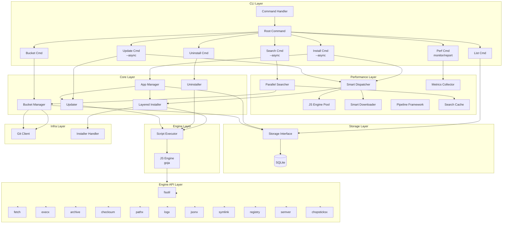
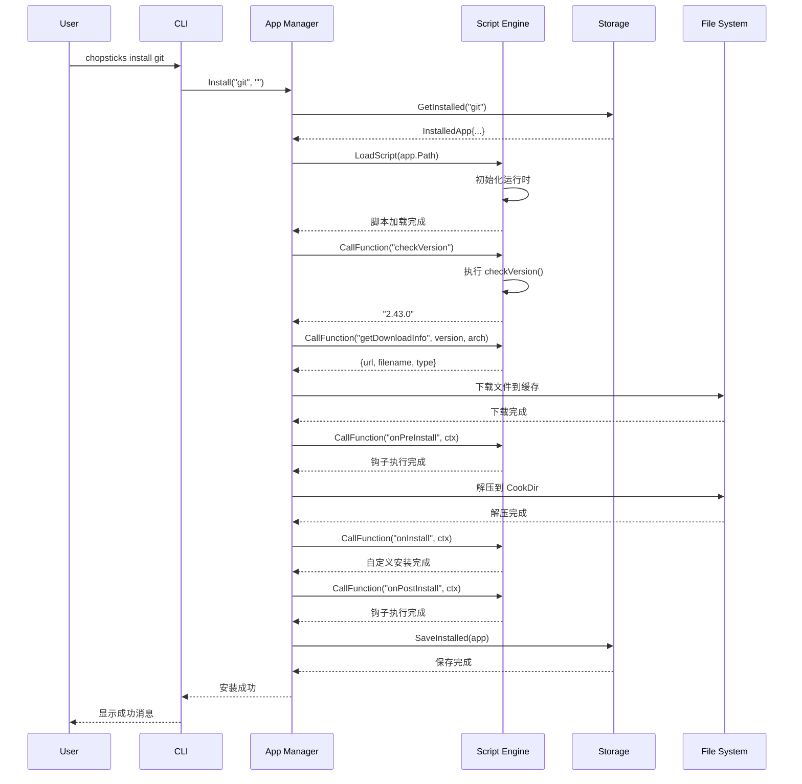
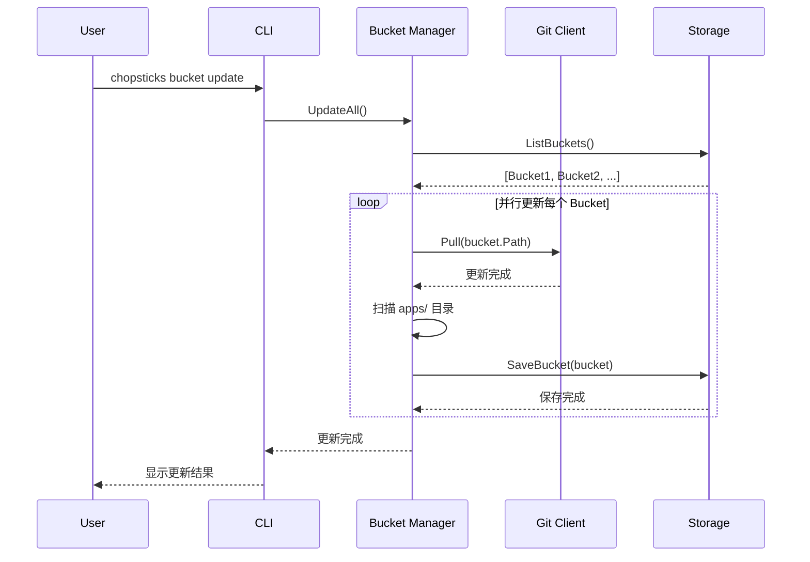
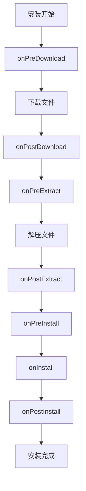

# Chopsticks 架构设计

> 版本: v0.8.0-alpha  
> 最后更新: 2026-03-01

> 系统架构和技术设计文档

---

## 目录

1. [架构概览](#架构概览)
2. [系统架构图](#系统架构图)
3. [性能优化架构](#性能优化架构)
4. [核心模块](#核心模块)
5. [数据流](#数据流)
6. [技术选型](#技术选型)
7. [扩展机制](#扩展机制)
8. [安全设计](#安全设计)

---

## 架构概览

Chopsticks 采用分层架构设计，遵循以下原则：

- **关注点分离**: 每个模块负责单一职责
- **接口驱动**: 通过接口定义模块间契约
- **可测试性**: 模块间松耦合，便于单元测试
- **可扩展性**: 支持插件和脚本扩展

### 架构分层

```
┌─────────────────────────────────────────────────────────────────────────────┐
│  CLI Layer (cmd/chopsticks/cli)                                             │
│  ┌──────────┬──────────┬──────────┬──────────┬─────────────────────────┐   │
│  │ install  │uninstall │ update   │ search   │ perf                    │   │
│  │ [--async]│          │ [--async]│ [--async]│ [monitor/status/report] │   │
│  └────┬─────┴────┬─────┴────┬─────┴────┬─────┴──────────┬──────────────┘   │
└───────┴──────────┴──────────┴──────────┴────────────────┴───────────────────┘
                                    │
                                    ▼
┌─────────────────────────────────────────────────────────────────────────────┐
│  Performance Layer (pkg/) - 性能优化层                                       │
│  ┌──────────────────────────────────────────────────────────────────────┐   │
│  │  ┌──────────────┐  ┌──────────────┐  ┌──────────────┐               │   │
│  │  │   Parallel   │  │   Pipeline   │  │   Metrics    │               │   │
│  │  │  任务调度器   │  │   流水线框架  │  │   性能监控    │               │   │
│  │  └──────────────┘  └──────────────┘  └──────────────┘               │   │
│  │  ┌──────────────┐  ┌──────────────┐  ┌──────────────┐               │   │
│  │  │ Smart Download│  │   JS Pool    │  │ Search Cache │               │   │
│  │  │   智能下载器  │  │   JS引擎池   │  │   搜索缓存    │               │   │
│  │  └──────────────┘  └──────────────┘  └──────────────┘               │   │
│  └──────────────────────────────────────────────────────────────────────┘   │
└─────────────────────────────────────────────────────────────────────────────┘
                                    │
                                    ▼
┌─────────────────────────────────────────────────────────────────────────────┐
│  Core Layer (core/)                                                          │
│  ┌────────────────┬────────────────┬─────────────────────────────────────┐   │
│  │  App Manager   │ Bucket Manager │         Store (SQLite)              │   │
│  │  ├─ Layered    │  ├─ Parallel   │                                     │   │
│  │  │   Installer │  │   Searcher  │                                     │   │
│  │  ├─ Updater    │  └─ Git Client │                                     │   │
│  │  └─ Uninstaller│                │                                     │   │
│  └────────────────┴────────────────┴─────────────────────────────────────┘   │
                                    │
                                    ▼
┌─────────────────────────────────────────────────────────────────────────────┐
│  Engine Layer (engine/)                                                      │
│  ┌──────────────────────────────────────────────────────────────────────┐   │
│  │                        JS Engine (Goja)                              │   │
│  │  ┌────────┬────────┬────────┬────────┬────────┬────────┬──────────┐ │   │
│  │  │ Fetch  │ FSUtil │  Exec  │Archive │Checksum│  Path  │   ...    │ │   │
│  │  └────────┴────────┴────────┴────────┴────────┴────────┴──────────┘ │   │
│  └──────────────────────────────────────────────────────────────────────┘   │
└─────────────────────────────────────────────────────────────────────────────┘
                                    │
                                    ▼
┌─────────────────────────────────────────────────────────────────────────────┐
│  Infra Layer (infra/)                                                        │
│  ┌────────────────────────┬────────────────────────┐                        │
│  │      Git Client        │   Installer Handler    │                        │
│  │      (go-git/v5)       │   (Windows System)     │                        │
│  └────────────────────────┴────────────────────────┘                        │
└─────────────────────────────────────────────────────────────────────────────┘
```

---

## 系统架构图

### 整体架构



---

## 性能优化架构

### 并行处理系统

Chopsticks 实现了完整的并行处理系统，大幅提升批量操作性能：

```
┌─────────────────────────────────────────────────────────────┐
│                    并行处理层 (pkg)                           │
│  ┌─────────────┐  ┌─────────────┐  ┌─────────────────────┐  │
│  │  parallel   │  │  pipeline   │  │      metrics        │  │
│  │   任务调度   │  │   流水线    │  │     性能监控        │  │
│  └──────┬──────┘  └──────┬──────┘  └──────────┬──────────┘  │
│         │                │                    │             │
│  ┌──────┴────────────────┴────────────────────┴──────┐      │
│  │              核心并行组件                           │      │
│  │  ┌─────────┐ ┌─────────┐ ┌─────────┐ ┌─────────┐  │      │
│  │  │JSEngine │ │  Smart  │ │Parallel │ │Layered  │  │      │
│  │  │  Pool   │ │Downloader│ │Searcher│ │Installer│  │      │
│  │  └─────────┘ └─────────┘ └─────────┘ └─────────┘  │      │
│  └────────────────────────────────────────────────────┘      │
└─────────────────────────────────────────────────────────────┘
```

### 1. Parallel 包 (pkg/parallel/)

**SmartDispatcher** - 智能任务调度器

```go
type SmartDispatcher struct {
    workers     int
    taskQueues  map[TaskCategory]chan Task
    categories  map[TaskCategory]*CategoryConfig
}
```

**特性**:

- 任务分类支持（CPU/IO/Memory 密集型）
- Work Stealing 算法实现负载均衡
- 优先级队列支持
- 动态 Worker 扩缩容

### 2. JS 引擎池 (engine/js_pool/)

**JSEnginePool** - JS 引擎复用池

```go
type JSEnginePool struct {
    engines    chan *JSEngine
    maxSize    int
    minSize    int
    cache      *ScriptCache
}
```

**性能提升**:

- 引擎复用减少 **80%** 初始化时间
- 动态扩缩容适应负载
- 脚本缓存和预编译

### 3. 智能下载器 (pkg/download/)

**SmartDownloader** - 多连接并行下载

```go
type SmartDownloader struct {
    connections   int
    chunkSize     int64
    adaptiveCtrl  *AdaptiveController
}
```

**特性**:

- 多连接分片并行下载
- 自适应带宽调整
- 断点续传支持
- 下载速度提升 **3-5 倍**

### 4. 并行搜索器 (core/bucket/)

**ParallelSearcher** - 并发搜索多个 Bucket

```go
type ParallelSearcher struct {
    manager      Manager
    maxParallel  int
    cache        *SearchCache
}
```

**性能提升**:

- 并发搜索多个软件源
- 搜索结果缓存（TTL 5分钟）
- 搜索速度提升 **5-6 倍**

### 5. 分层安装器 (core/app/)

**LayeredParallelInstaller** - 依赖感知的并行安装

```go
type LayeredParallelInstaller struct {
    scheduler     *SmartDispatcher
    resolver      *DependencyResolver
    maxParallel   int
}
```

**特性**:

- 依赖图拓扑排序分层
- 层内并行、层间顺序
- 批量安装性能提升 **5-6 倍**

### 6. 流水线框架 (pkg/pipeline/)

**Pipeline** - 多阶段流水线处理

```go
type Pipeline struct {
    stages      []Stage
    bufferSize  int
    errorPolicy ErrorPolicy
}
```

**特性**:

- 多阶段流水线（下载→校验→解压→执行→注册）
- 阶段内并行处理
- 背压控制防止内存溢出
- 灵活的错误处理策略

### 7. 性能监控 (pkg/metrics/)

**MetricsCollector** - 实时性能指标收集

```go
type MetricsCollector struct {
    history         *MetricsHistory
    sampleInterval  time.Duration
}
```

**监控指标**:

- 任务统计：提交/完成速率、队列深度
- 资源使用：内存、Goroutines、GC
- JS 池：利用率、缓存命中率
- 下载：速度、活跃数、错误数

---

## 性能优化架构

详细的性能优化设计文档请参考：[PERFORMANCE-OPTIMIZATION.md](design/PERFORMANCE-OPTIMIZATION.md)

### 核心优化成果

| 场景                   | 优化前 | 优化后 | 提升倍数 |
| ---------------------- | ------ | ------ | -------- |
| 批量安装 10 个独立应用 | 60s    | 10s    | **6x**   |
| 安装带 5 层依赖的应用  | 45s    | 15s    | **3x**   |
| 搜索 10 个 bucket      | 2s     | 0.3s   | **6.7x** |
| 下载 100MB 文件        | 50s    | 10s    | **5x**   |
| 批量更新 20 个应用     | 60s    | 12s    | **5x**   |
| 执行 10 个 JS 脚本     | 25s    | 8s     | **3x**   |

### 关键组件

- **Parallel 包** (`pkg/parallel/`) - 智能任务调度
- **JS 引擎池** (`engine/js_pool/`) - 引擎复用和缓存
- **智能下载器** (`pkg/download/`) - 多连接并行下载
- **并行搜索器** (`core/bucket/`) - 并发搜索多个 Bucket
- **分层安装器** (`core/app/`) - 依赖感知的并行安装
- **流水线框架** (`pkg/pipeline/`) - 多阶段流水线处理
- **性能监控** (`pkg/metrics/`) - 实时指标收集

---

## 核心模块

### 1. CLI 层 (cmd/chopsticks/cli/)

负责命令行界面和用户交互。基于 `urfave/cli/v2` 框架实现。

```go
// cmd/chopsticks/cli/app.go
func NewApp() *cli.App {
    return &cli.App{
        Name:    "chopsticks",
        Usage:   "Windows 包管理器",
        Version: "0.2.0-alpha",
        Commands: []*cli.Command{
            installCommand(),
            uninstallCommand(),
            updateCommand(),
            searchCommand(),
            listCommand(),
            bucketCommand(),
            completionCommand(),
        },
    }
}
```

**CLI 框架特性**:

- **声明式命令定义**: 使用结构体定义命令，清晰直观
- **自动帮助生成**: 框架自动生成帮助信息
- **类型安全的 Flag 解析**: 支持 String、Bool、Int 等多种类型
- **优雅的子命令支持**: bucket 等子命令使用框架原生支持
- **Shell 自动补全**: 内置补全脚本生成功能

**主要命令**:

| 命令         | 功能       | 实现文件        | 别名            |
| ------------ | ---------- | --------------- | --------------- |
| `install`    | 安装应用   | `install.go`    | `i`             |
| `uninstall`  | 卸载应用   | `uninstall.go`  | `remove`, `rm`  |
| `update`     | 更新应用   | `update.go`     | `upgrade`, `up` |
| `search`     | 搜索应用   | `search.go`     | `find`, `s`     |
| `list`       | 列出应用   | `list.go`       | `ls`            |
| `bucket`     | 软件源管理 | `bucket.go`     | `b`             |
| `completion` | 自动补全   | `completion.go` | -               |

**全局选项**:

| 选项         | 简写 | 说明             | 环境变量             |
| ------------ | ---- | ---------------- | -------------------- |
| `--config`   | `-c` | 指定配置文件路径 | `CHOPSTICKS_CONFIG`  |
| `--verbose`  | `-v` | 启用详细输出     | `CHOPSTICKS_VERBOSE` |
| `--no-color` | -    | 禁用彩色输出     | `NO_COLOR`           |
| `--help`     | `-h` | 显示帮助信息     | -                    |
| `--version`  | `-V` | 显示版本信息     | -                    |

### 2. Core 层 (core/)

核心业务逻辑，处理应用和软件源的生命周期。

#### 2.1 App Manager (core/app/)

```go
// core/app/manager.go
type Manager interface {
    Install(ctx context.Context, bucket, name string, opts InstallOptions) error
    Remove(ctx context.Context, name string, opts RemoveOptions) error
    Update(ctx context.Context, name string, opts UpdateOptions) error
    List(ctx context.Context) ([]*manifest.InstalledApp, error)
    Search(ctx context.Context, query string) ([]*manifest.App, error)
}
```

**组件**:

- `app.go` - 应用入口和配置
- `manager.go` - 应用管理器接口和实现
- `install.go` - 安装流程协调
- `installer.go` - 安装器实现
- `updater.go` - 更新逻辑
- `uninstaller.go` - 卸载逻辑

#### 2.2 Bucket Manager (core/bucket/)

```go
// core/bucket/bucket.go
type Manager interface {
    Add(name, url string) error
    Remove(name string) error
    Update(name string) error
    List() ([]*manifest.Bucket, error)
    Search(query string) ([]*manifest.App, error)
}
```

#### 2.3 Store (core/store/)

数据持久化层，使用 SQLite。

```go
// core/store/storage.go
type Storage interface {
    // Bucket operations
    SaveBucket(bucket *manifest.Bucket) error
    GetBucket(name string) (*manifest.Bucket, error)
    ListBuckets() ([]*manifest.Bucket, error)
    DeleteBucket(name string) error

    // App operations
    SaveInstalled(app *manifest.InstalledApp) error
    GetInstalled(name string) (*manifest.InstalledApp, error)
    ListInstalled() ([]*manifest.InstalledApp, error)
    DeleteInstalled(name string) error

    // Operations tracking
    SaveOperation(op *Operation) error
    GetOperations(appID string) ([]*Operation, error)
}
```

**数据库 Schema**:

```sql
-- buckets 表
CREATE TABLE buckets (
    id TEXT PRIMARY KEY,
    name TEXT NOT NULL,
    url TEXT NOT NULL,
    branch TEXT DEFAULT 'main',
    added_at DATETIME DEFAULT CURRENT_TIMESTAMP,
    updated_at DATETIME DEFAULT CURRENT_TIMESTAMP,
    local_path TEXT
);

-- installed 表
CREATE TABLE installed (
    id TEXT PRIMARY KEY,
    name TEXT NOT NULL,
    version TEXT NOT NULL,
    bucket_id TEXT NOT NULL,
    cook_dir TEXT NOT NULL,
    installed_at DATETIME DEFAULT CURRENT_TIMESTAMP,
    updated_at DATETIME DEFAULT CURRENT_TIMESTAMP,
    FOREIGN KEY (bucket_id) REFERENCES buckets(id)
);

-- operations 表
CREATE TABLE operations (
    id INTEGER PRIMARY KEY AUTOINCREMENT,
    app_id TEXT NOT NULL,
    operation_type TEXT NOT NULL,
    details TEXT,
    created_at DATETIME DEFAULT CURRENT_TIMESTAMP
);
```

### 3. Engine 层 (engine/)

Engine 层负责脚本执行环境，向 JavaScript 脚本暴露系统能力。

#### 3.1 脚本引擎 (Script Engines)

```go
// engine/engine.go
type Engine interface {
    LoadFile(path string) error
    CallFunction(name string, args ...interface{}) error
    Close()
}

// engine/js_engine.go - JavaScript 引擎
type JSEngine struct {
    vm *goja.Runtime
}
```

**引擎职责**：

- 初始化脚本运行时环境
- 加载和执行应用脚本
- 管理脚本生命周期
- 调用生命周期钩子（checkVersion、getDownloadInfo、onInstall 等）

#### 3.2 Engine API 模块

Engine API 模块是脚本引擎向外部脚本暴露的接口集合。

| 模块          | 文件                               | 功能描述              |
| ------------- | ---------------------------------- | --------------------- |
| `fsutil`      | `engine/fsutil/fsutil.go`          | 文件读写、目录操作    |
| `fetch`       | `engine/fetch/fetch.go`            | HTTP 请求、文件下载   |
| `execx`       | `engine/execx/execx.go`            | 命令执行              |
| `archive`     | `engine/archive/archive.go`        | 压缩解压 (zip/7z/tar) |
| `checksum`    | `engine/checksum/checksum.go`      | 校验和验证            |
| `pathx`       | `engine/pathx/pathx.go`            | 路径操作              |
| `logx`        | `engine/logx/logx.go`              | 日志记录              |
| `jsonx`       | `engine/jsonx/json.go`             | JSON 处理             |
| `symlink`     | `engine/symlink/symlink.go`        | 符号链接              |
| `registry`    | `engine/registry/registry.go`      | Windows 注册表        |
| `semver`      | `engine/semver/semver.go`          | 版本比较              |
| `chopsticksx` | `engine/chopsticksx/chopsticks.go` | 系统 API              |

**模块注册机制**:

```go
// 引擎初始化时注册所有 API 模块
func (e *JSEngine) initModules() {
    e.registerModule("fs", fsutil.New())
    e.registerModule("fetch", fetch.New())
    e.registerModule("exec", execx.New())
    e.registerModule("archive", archive.New())
    e.registerModule("checksum", checksum.New())
    e.registerModule("path", pathx.New())
    e.registerModule("log", logx.New())
    e.registerModule("JSON", jsonx.New())
    e.registerModule("symlink", symlink.New())
    e.registerModule("registry", registry.New())
    e.registerModule("semver", semver.New())
    e.registerModule("chopsticks", chopsticksx.New())
}
```

### 4. Output 层 (pkg/output/)

输出格式化和用户界面增强。

#### 4.1 彩色输出 (color.go)

基于 `fatih/color` 库实现终端彩色输出。

```go
// pkg/output/color.go
var (
    ColorSuccess   = color.New(color.FgGreen, color.Bold)   // 绿色加粗
    ColorError     = color.New(color.FgRed, color.Bold)     // 红色加粗
    ColorWarning   = color.New(color.FgYellow)              // 黄色
    ColorInfo      = color.New(color.FgBlue)                // 蓝色
    ColorHighlight = color.New(color.FgCyan, color.Bold)    // 青色加粗
    ColorDim       = color.New(color.FgHiBlack)             // 灰色
)

// 便捷函数
func Success(format string, a ...interface{})
func Error(format string, a ...interface{})
func Warning(format string, a ...interface{})
func Info(format string, a ...interface{})
func SuccessCheck(msg string)      // ✓ 成功
func ErrorCross(msg string)        // ✗ 错误
func WarningSign(msg string)       // ⚠ 警告
```

**颜色主题**:

| 类型      | 颜色 | 样式 | 使用场景           |
| --------- | ---- | ---- | ------------------ |
| Success   | 绿色 | 加粗 | 操作成功、完成状态 |
| Error     | 红色 | 加粗 | 错误消息、失败状态 |
| Warning   | 黄色 | 正常 | 警告、注意事项     |
| Info      | 蓝色 | 正常 | 一般信息、提示     |
| Highlight | 青色 | 加粗 | 重要内容、强调     |
| Dim       | 灰色 | 正常 | 次要信息、元数据   |

#### 4.2 进度显示 (progress.go)

基于 `mpb/v8` 库实现多进度条显示。

```go
// pkg/output/progress.go
type ProgressManager struct {
    progress *mpb.Progress
}

func (pm *ProgressManager) AddDownloadBar(name string, total int64) *mpb.Bar
func (pm *ProgressManager) AddInstallBar(name string, stages []string) *MultiStageBar
func (pm *ProgressManager) AddBatchBar(total int) *BatchBar
func (pm *ProgressManager) Wait()
```

**进度条类型**:

| 类型       | 说明           | 显示内容                                    |
| ---------- | -------------- | ------------------------------------------- |
| 下载进度条 | 文件下载进度   | 名称、已下载/总大小、百分比、速度、剩余时间 |
| 安装进度条 | 多阶段安装进度 | 应用名、当前阶段、总体百分比                |
| 批量进度条 | 批量操作进度   | 当前项/总项数、当前处理项名称               |

### 5. Infra 层 (infra/)

基础设施服务。

#### 5.1 Git 客户端 (infra/git/)

```go
// infra/git/git.go
type Client interface {
    Clone(url, dest string) error
    Pull(dir string) error
    Fetch(dir string) error
}
```

#### 5.2 安装程序处理 (infra/installer/)

```go
// infra/installer/installer.go
type Handler interface {
    RunNSIS(path string, args []string) error
    RunMSI(path string, args []string) error
    RunInnoSetup(path string, args []string) error
}
```

---

## 数据流

### 安装流程



### 软件源更新流程



---

## 技术选型

### 编程语言

| 语言       | 用途       | 版本   |
| ---------- | ---------- | ------ |
| Go         | 主开发语言 | 1.25.6 |
| JavaScript | 应用脚本   | ES6+   |

### 核心依赖

| 库                              | 用途             | 版本                  |
| ------------------------------- | ---------------- | --------------------- |
| `github.com/dop251/goja`        | JavaScript 引擎  | v0.0.0-20260106131823 |
| `github.com/go-git/go-git/v5`   | Git 操作         | v5.11.0               |
| `github.com/mattn/go-sqlite3`   | SQLite 数据库    | v1.14.24              |
| `github.com/ulikunitz/xz`       | XZ 压缩支持      | v0.5.11               |
| `golang.org/x/sys`              | Windows 系统调用 | v0.32.0               |
| `github.com/urfave/cli/v2`      | CLI 框架         | v2.x                  |
| `github.com/vbauerster/mpb/v8`  | 多进度条显示     | v8.x                  |
| `github.com/fatih/color`        | 终端彩色输出     | v1.x                  |
| `golang.org/x/sync/errgroup`    | 并发任务管理     | v0.x                  |
| `github.com/patrickmn/go-cache` | 内存缓存         | v2.x                  |

### 选型理由

1. **Go**: 编译型语言，单文件部署，跨平台，丰富的标准库，原生协程支持高并发
2. **Goja**: 纯 Go 实现的 JavaScript 引擎，无需 CGO，性能优秀
3. **go-git**: 纯 Go 实现的 Git 客户端，无需外部依赖
4. **SQLite**: 轻量级嵌入式数据库，单文件存储
5. **urfave/cli/v2**: 成熟的 Go CLI 框架，支持子命令、Flag 解析、自动补全
6. **mpb/v8**: 功能强大的多进度条库，支持并发、自定义装饰器
7. **fatih/color**: 流行的终端颜色库，自动检测颜色支持，跨平台兼容
8. **errgroup**: Go 官方扩展库，支持并发任务管理和错误传播
9. **go-cache**: 高性能内存缓存库，支持 TTL 和自动清理

---

## 扩展机制

### 1. 脚本扩展

应用通过 JavaScript 脚本定义安装逻辑：

```javascript
// apps/git.js
class GitApp extends App {
  constructor() {
    super({
      name: "git",
      description: "Distributed version control system",
      homepage: "https://git-scm.com/",
      license: "GPL-2.0",
    });
  }

  async checkVersion() {
    const response = await fetch.get(
      "https://api.github.com/repos/git-for-windows/git/releases/latest",
    );
    const data = JSON.parse(response.body);
    return data.tag_name.replace(/^v/, "");
  }

  async getDownloadInfo(version, arch) {
    const archMap = { amd64: "64-bit", x86: "32-bit" };
    const filename = `PortableGit-${version}-${archMap[arch]}.7z.exe`;
    return {
      url: `https://github.com/.../${filename}`,
      type: "7z",
    };
  }
}

module.exports = new GitApp();
```

### 2. 生命周期钩子



### 3. 自定义 Bucket

软件源是标准的 Git 仓库，结构如下：

```
bucket/
├── bucket.json          # 软件源配置
├── apps/
│   ├── _chopsticks_.js  # 基类定义
│   ├── _tools_.js       # 共享工具
│   └── *.js             # 应用脚本
└── .gitignore
```

---

## 安全设计

### 1. 脚本沙箱

- 脚本运行在受限的引擎环境中
- 只能通过暴露的 API 访问系统资源
- 禁止直接执行系统调用

### 2. 下载验证

- 支持 SHA256/MD5 校验和验证
- 可配置是否启用验证（默认启用）
- 验证失败时阻止安装

### 3. 权限控制

- 所有操作在用户级别执行
- 注册表操作限制在 HKCU
- 不修改系统关键文件

### 4. 操作追踪

- 自动记录所有系统操作（PATH、注册表等）
- 卸载时精确清理，不影响其他软件

---

## 性能考虑

### 1. 并发处理

- 软件源更新支持并行（默认 5 并发）
- 多文件下载支持并发
- 使用 goroutine + WaitGroup 实现

### 2. 缓存策略

- 下载文件缓存到本地
- 数据库查询结果缓存
- 脚本编译结果缓存

### 3. 启动优化

- 延迟加载非必要模块
- 数据库连接池
- 目标启动时间 < 500ms

---

_最后更新: 2026-02-28_
_架构版本: v1.3_
_软件版本: v0.6.0-alpha_
