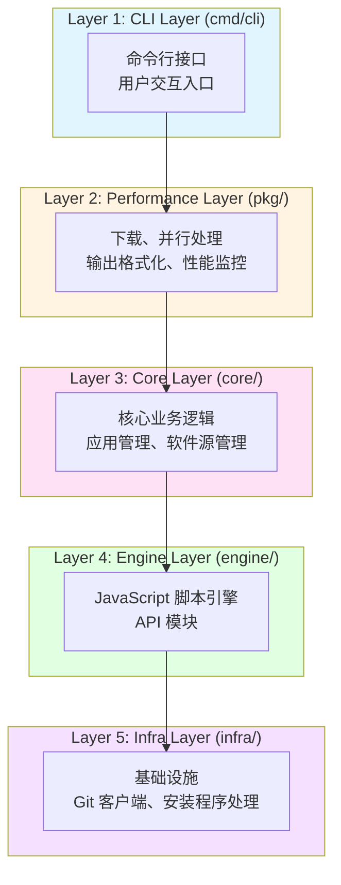
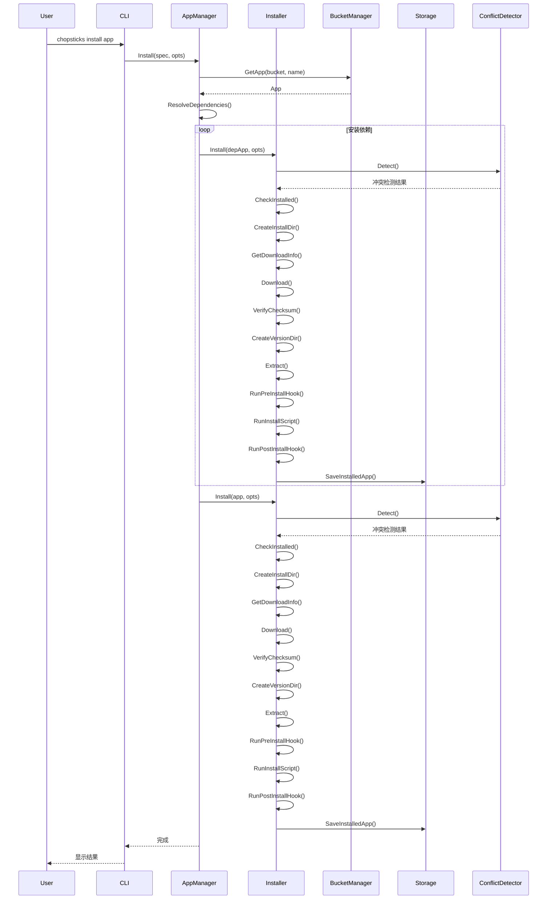
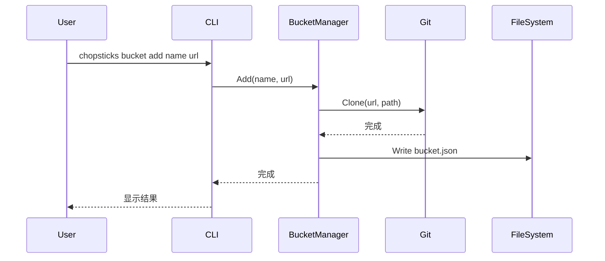
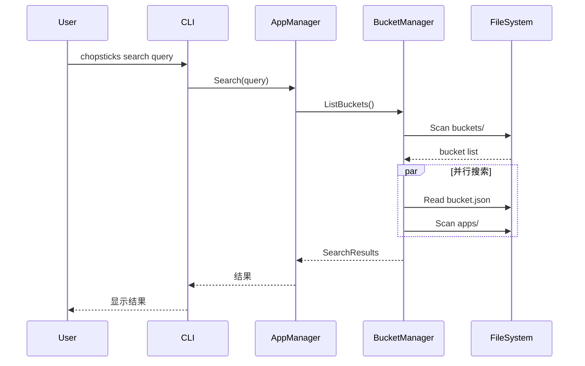

# Chopsticks 架构文档

> 版本：v0.10.0-alpha
> 最后更新：2026-03-06

> 描述 Chopsticks 系统架构设计、核心组件、数据模型和扩展点

---

## 1. 架构概述

Chopsticks 是一个 Windows 包管理器，采用分层架构设计，核心设计理念是：

- **文件系统优先**: 软件源信息通过 `bucket.json` 存储，应用信息通过文件系统扫描获取
- **同步优先**: 核心功能使用同步函数，调用方通过 `errgroup` 控制并发
- **纯 Go 实现**: 零 CGO 依赖，使用 Goja (JS 引擎)、go-git (Git 客户端)、modernc/sqlite (数据库)

### 1.1 架构分层



```
┌─────────────────────────────────────────────────────────────────┐
│ Layer 1: CLI Layer (cmd/cli)                                    │
│   - 命令行接口，用户交互入口                                     │
├─────────────────────────────────────────────────────────────────┤
│ Layer 2: Performance Layer (pkg/)                               │
│   - 下载、并行处理、输出格式化、性能监控等通用功能                │
├─────────────────────────────────────────────────────────────────┤
│ Layer 3: Core Layer (core/)                                     │
│   - 核心业务逻辑：应用管理、软件源管理                                │
├─────────────────────────────────────────────────────────────────┤
│ Layer 4: Engine Layer (engine/)                                 │
│   - JavaScript 脚本引擎和 API 模块                              │
├─────────────────────────────────────────────────────────────────┤
│ Layer 5: Infra Layer (infra/)                                   │
│   - 基础设施：Git 客户端、安装程序处理                               │
└─────────────────────────────────────────────────────────────────┘
```

### 1.2 核心组件

| 组件                 | 包路径            | 职责                       |
| -------------------- | ----------------- | -------------------------- |
| **AppManager**       | `core/app`        | 应用安装、卸载、更新、查询 |
| **BucketManager**    | `core/bucket`     | 软件源管理、应用搜索       |
| **Storage**          | `core/store`      | 已安装应用数据持久化       |
| **ConflictDetector** | `core/conflict`   | 冲突检测与格式化           |
| **Manifest**         | `core/manifest`   | 应用和软件源数据结构定义   |
| **JSEngine**         | `engine`          | JavaScript 脚本执行        |
| **Git**              | `infra/git`       | 软件源仓库操作             |
| **Installer**        | `infra/installer` | 安装程序处理               |

## 2. 核心接口

### 2.1 AppManager - 应用管理器

```go
type AppManager interface {
    Install(ctx context.Context, spec InstallSpec, opts InstallOptions) error
    Remove(ctx context.Context, name string, opts RemoveOptions) error
    Update(ctx context.Context, name string, opts UpdateOptions) error
    UpdateAll(ctx context.Context, opts UpdateOptions) error
    Switch(ctx context.Context, name, version string) error
    ListInstalled() ([]*manifest.InstalledApp, error)
    Info(ctx context.Context, bucket, name string) (*manifest.AppInfo, error)
    Search(ctx context.Context, query string, bucket string) ([]SearchResult, error)
}
```

### 2.2 BucketManager - 软件源管理器

```go
type BucketManager interface {
    Add(ctx context.Context, name, url string, opts AddOptions) error
    Remove(ctx context.Context, name string, purge bool) error
    Update(ctx context.Context, name string) error
    UpdateAll(ctx context.Context) error
    GetBucket(ctx context.Context, name string) (*manifest.BucketConfig, error)
    GetApp(ctx context.Context, bucket, name string) (*manifest.App, error)
    ListApps(ctx context.Context, bucket string) (map[string]*manifest.AppRef, error)
    ListBuckets(ctx context.Context) ([]string, error)
    Search(ctx context.Context, query string, opts SearchOptions) ([]SearchResult, error)
}
```

### 2.3 Storage - 数据存储

```go
type Storage interface {
    // 已安装的应用
    SaveInstalledApp(ctx context.Context, a *manifest.InstalledApp) error
    GetInstalledApp(ctx context.Context, name string) (*manifest.InstalledApp, error)
    DeleteInstalledApp(ctx context.Context, name string) error
    ListInstalledApps(ctx context.Context) ([]*manifest.InstalledApp, error)
    IsInstalled(ctx context.Context, name string) (bool, error)

    // 安装操作追踪
    SaveInstallOperation(ctx context.Context, op *InstallOperation) error
    GetInstallOperations(ctx context.Context, installedID string) ([]*InstallOperation, error)
    DeleteInstallOperations(ctx context.Context, installedID string) error

    // 系统操作追踪
    SaveSystemOperation(ctx context.Context, op *SystemOperation) error
    GetSystemOperations(ctx context.Context, installedID string) ([]*SystemOperation, error)
    DeleteSystemOperations(ctx context.Context, installedID string) error

    Close() error
}
```

### 2.4 Installer - 安装器

```go
type Installer interface {
    Install(ctx context.Context, app *manifest.App, opts InstallOptions) error
    Uninstall(ctx context.Context, name string, opts UninstallOptions) error
    Refresh(ctx context.Context, app *manifest.App, installed *manifest.InstalledApp, opts RefreshOptions) error
    Switch(ctx context.Context, name, version string) error
}
```

## 3. 数据模型

### 3.1 软件包模型

```go
// App - 软件包完整信息
type App struct {
    Script *AppScript // 脚本信息（来自 .js 文件）
    Meta   *AppMeta   // 元数据（来自 .meta.json 文件）
    Ref    *AppRef    // 引用信息
}

// AppScript - 软件包脚本信息
type AppScript struct {
    Name         string       // 软件名称
    Description  string       // 描述
    Homepage     string       // 主页 URL
    License      string       // 许可证
    Category     string       // 分类
    Tags         []string     // 标签
    Maintainer   string       // 维护者
    Bucket       string       // 所属软件源
    Dependencies []Dependency // 依赖列表
}

// Dependency - 依赖定义
type Dependency struct {
    Name       string            // 依赖软件包名称
    Version    string            // 版本约束（如 ">=1.0.0"）
    Optional   bool              // 是否为可选依赖
    Conditions map[string]string // 安装条件
}

// AppMeta - 软件包元数据
type AppMeta struct {
    Version  string                 // 当前版本
    Versions map[string]VersionInfo // 所有版本信息
}

// VersionInfo - 版本信息
type VersionInfo struct {
    Version    string                  // 版本号
    ReleasedAt time.Time               // 发布时间
    Downloads  map[string]DownloadInfo // 各架构下载信息
}

// DownloadInfo - 下载信息
type DownloadInfo struct {
    URL  string // 下载地址
    Hash string // 校验和
    Size int64  // 文件大小
    Type string // 压缩类型
}

// AppRef - 软件包引用（索引用）
type AppRef struct {
    Name        string   // 名称
    Description string   // 描述
    Version     string   // 最新版本
    Category    string   // 分类
    Tags        []string // 标签
    ScriptPath  string   // 脚本文件路径
    MetaPath    string   // 元数据文件路径
}

// InstalledApp - 已安装软件包
type InstalledApp struct {
    Name        string    // 名称
    Version     string    // 版本
    Bucket      string    // 所属软件源
    InstallDir  string    // 安装目录
    InstalledAt time.Time // 安装时间
    UpdatedAt   time.Time // 更新时间
}
```

### 3.2 软件源模型

```go
// BucketConfig - 软件源配置
type BucketConfig struct {
    ID          string         // 标识符
    Name        string         // 显示名称
    Author      string         // 作者
    Description string         // 描述
    Homepage    string         // 主页
    License     string         // 许可证
    Repository  RepositoryInfo // 仓库信息
}

// RepositoryInfo - 仓库信息
type RepositoryInfo struct {
    Type   string // 类型（git, svn 等）
    URL    string // 地址
    Branch string // 分支
}

// Bucket - 软件源完整信息
type Bucket struct {
    Config      BucketConfig       // 配置
    Path        string             // 本地路径
    Apps        map[string]*AppRef // 应用索引
    LastUpdated time.Time          // 最后更新时间
}
```

## 4. 数据存储

### 4.1 存储架构

Chopsticks 采用混合存储架构：

| 数据类型     | 存储位置                        | 格式       |
| ------------ | ------------------------------- | ---------- |
| 已安装软件包 | `data.db` (SQLite)              | 数据库表   |
| 软件源配置   | `buckets/{id}/bucket.json`      | JSON       |
| 软件包脚本   | `buckets/{id}/apps/*.js`        | JavaScript |
| 软件包元数据 | `buckets/{id}/apps/*.meta.json` | JSON       |
| 下载缓存     | `cache/downloads/`              | 二进制文件 |
| 持久化数据   | `persist/{app}/`                | 任意格式   |

### 4.2 数据库 Schema (data.db)

```sql
-- installed 表 - 已安装软件
CREATE TABLE installed (
    id TEXT PRIMARY KEY,
    name TEXT NOT NULL UNIQUE,
    version TEXT NOT NULL,
    bucket_id TEXT NOT NULL,
    install_dir TEXT NOT NULL,
    installed_at DATETIME DEFAULT CURRENT_TIMESTAMP,
    updated_at DATETIME DEFAULT CURRENT_TIMESTAMP
);

-- install_operations 表 - 安装操作记录
CREATE TABLE install_operations (
    id INTEGER PRIMARY KEY AUTOINCREMENT,
    installed_id TEXT NOT NULL,
    operation_type TEXT NOT NULL,
    target_path TEXT,
    target_value TEXT,
    created_at DATETIME DEFAULT CURRENT_TIMESTAMP,
    FOREIGN KEY (installed_id) REFERENCES installed(id) ON DELETE CASCADE
);

-- system_operations 表 - 系统操作记录
CREATE TABLE system_operations (
    id INTEGER PRIMARY KEY AUTOINCREMENT,
    installed_id TEXT NOT NULL,
    operation_type TEXT NOT NULL,
    target_type TEXT NOT NULL,
    target_path TEXT,
    target_key TEXT,
    target_value TEXT,
    original_value TEXT,
    created_at DATETIME DEFAULT CURRENT_TIMESTAMP,
    FOREIGN KEY (installed_id) REFERENCES installed(id) ON DELETE CASCADE
);
```

## 5. 核心流程

### 5.1 应用安装流程



### 5.2 软件源管理流程



### 5.3 搜索流程



## 6. JavaScript 引擎

### 6.1 引擎架构

Chopsticks 使用 Goja (纯 Go JavaScript 引擎) 执行应用安装脚本。

```
┌─────────────────────────────────────────┐
│           JS Engine (Goja)              │
├─────────────────────────────────────────┤
│  ┌─────────┐ ┌─────────┐ ┌─────────┐   │
│  │  fsutil │ │  fetch  │ │  execx  │   │
│  └─────────┘ └─────────┘ └─────────┘   │
│  ┌─────────┐ ┌─────────┐ ┌─────────┐   │
│  │ archive │ │ checksum│ │  pathx  │   │
│  └─────────┘ └─────────┘ └─────────┘   │
│  ┌─────────┐ ┌─────────┐ ┌─────────┐   │
│  │  logx   │ │  jsonx  │ │ symlink │   │
│  └─────────┘ └─────────┘ └─────────┘   │
│  ┌─────────┐ ┌─────────┐ ┌─────────┐   │
│  │registry │ │ semver  │ │chopsticks│   │
│  └─────────┘ └─────────┘ └─────────┘   │
│  ┌─────────┐                            │
│  │installer│                            │
│  └─────────┘                            │
└─────────────────────────────────────────┘
```

### 6.2 内置模块

| 模块         | 功能                        |
| ------------ | --------------------------- |
| `fsutil`     | 文件读写、目录操作          |
| `fetch`      | HTTP 请求、下载             |
| `execx`      | 命令执行                    |
| `archive`    | 压缩解压 (zip, tar, 7z)     |
| `checksum`   | 校验和验证 (MD5, SHA256)    |
| `pathx`      | 路径操作                    |
| `logx`       | 日志输出                    |
| `jsonx`      | JSON 处理                   |
| `symlink`    | 符号链接操作                |
| `registry`   | Windows 注册表操作          |
| `semver`     | 语义化版本比较              |
| `chopsticks` | 系统 API (获取架构、路径等) |
| `installer`  | 安装程序处理                |

## 7. 目录结构

```
chopsticks/
├── cmd/                    # 程序入口
│   ├── main.go            # 主函数
│   └── cli/               # CLI 命令
│       ├── root.go
│       ├── install.go
│       ├── search.go
│       └── ...
├── core/                   # 核心业务逻辑
│   ├── app/               # 应用管理
│   │   ├── manager.go
│   │   ├── install.go
│   │   └── installer.go
│   ├── bucket/            # 软件源管理
│   │   ├── bucket.go
│   │   ├── loader.go
│   │   └── parallel_search.go
│   ├── manifest/          # 数据结构
│   │   ├── app.go
│   │   └── bucket.go
│   ├── store/             # 数据存储
│   │   └── storage.go
│   └── conflict/          # 冲突检测
│       └── detector.go
├── engine/                 # JS 引擎
│   ├── engine.go
│   ├── js_engine.go
│   ├── js_pool.go
│   ├── js_batch.go
│   └── */register.go      # 模块注册
├── infra/                  # 基础设施
│   ├── git/               # Git 客户端
│   │   └── git.go
│   └── installer/         # 安装程序处理
│       └── installer.go
├── pkg/                    # 通用包
│   ├── config/            # 配置管理
│   ├── download/          # 下载功能
│   ├── errors/            # 错误处理
│   ├── metrics/           # 性能监控
│   ├── output/            # 输出格式化
│   └── parallel/          # 并行处理
└── wiki/                   # 文档
    ├── ARCHITECTURE.md    # 本文件
    ├── design/            # 设计文档
    └── user/              # 用户文档
```

## 8. 依赖列表

| 依赖                              | 用途            | 版本                  |
| --------------------------------- | --------------- | --------------------- |
| `github.com/dop251/goja`          | JavaScript 引擎 | v0.0.0-20260226184354 |
| `github.com/go-git/go-git/v5`     | Git 操作        | v5.17.0               |
| `modernc.org/sqlite`              | SQLite 数据库   | v1.46.1               |
| `github.com/spf13/cobra`          | CLI 框架        | v1.10.2               |
| `github.com/ulikunitz/xz`         | XZ 压缩         | v0.5.15               |
| `golang.org/x/sync`               | 并发工具        | v0.19.0               |
| `github.com/google/uuid`          | UUID 生成       | v1.6.0                |
| `github.com/natefinch/lumberjack` | 日志轮转        | v2.0.0                |

## 9. 设计原则

### 9.1 文件系统优先

- 软件源配置存储在 `bucket.json`，而非数据库
- 应用信息通过扫描文件系统获取
- 版本信息通过目录结构确定

### 9.2 同步优先

- 核心功能使用同步函数
- 调用方通过 `errgroup` 控制并发
- 避免在函数内部隐藏并发逻辑

### 9.3 纯 Go 实现

- 零 CGO 依赖
- 使用 Goja 替代 V8/QuickJS
- 使用 go-git 替代系统 Git
- 使用 modernc/sqlite 替代 CGO SQLite

### 9.4 接口隔离

- 每个模块定义清晰的接口
- 通过构造函数注入依赖
- 便于测试和 mock

## 10. 扩展点

### 10.1 添加新的 JS 模块

1. 在 `engine/` 下创建新目录
2. 实现 `JSRegistrar` 接口
3. 在 `engine/register.go` 注册模块

### 10.2 添加新的安装器类型

1. 实现 `Installer` 接口
2. 在 `core/app/app.go` 中配置使用

### 10.3 添加新的存储后端

1. 实现 `Storage` 接口
2. 在 `core/app/app.go` 中配置使用
