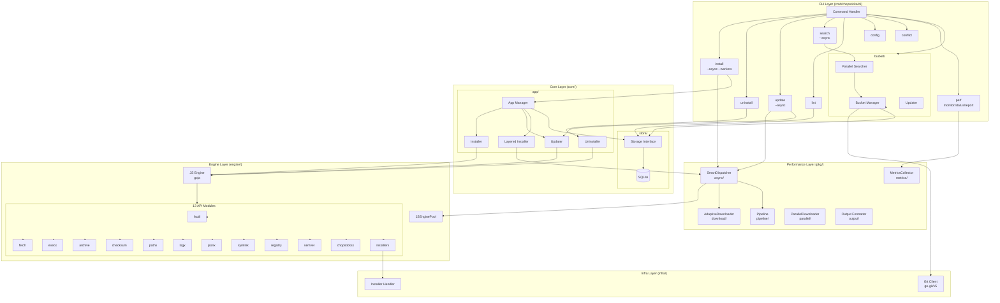
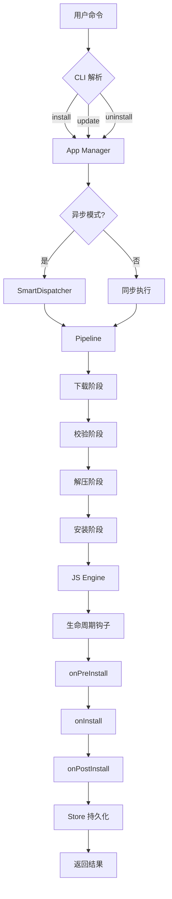
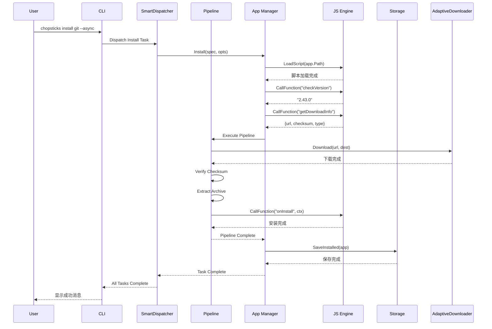
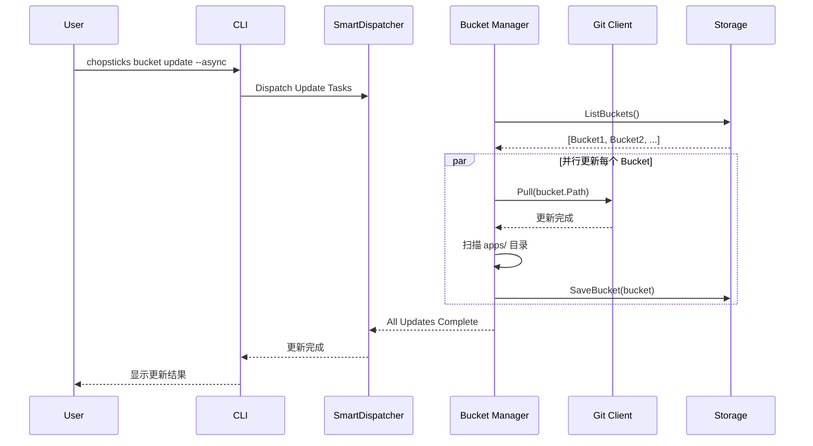

# Chopsticks 架构设计

> 版本: v0.8.0-alpha  
> 最后更新: 2026-03-01

> 系统架构和技术设计文档

---

## 目录

1. [架构概览](#架构概览)
2. [五层架构详解](#五层架构详解)
3. [系统架构图](#系统架构图)
4. [性能优化架构](#性能优化架构)
5. [核心模块](#核心模块)
6. [数据流](#数据流)
7. [技术选型](#技术选型)
8. [扩展机制](#扩展机制)
9. [安全设计](#安全设计)

---

## 架构概览

Chopsticks 采用**五层分层架构设计**，遵循以下核心原则：

- **关注点分离**: 每层负责单一职责，层间通过明确定义的接口交互
- **接口驱动**: 通过接口定义模块间契约，便于测试和替换实现
- **可测试性**: 模块间松耦合，支持单元测试和集成测试
- **可扩展性**: 支持插件扩展和脚本化应用定义
- **高性能**: 全链路并行处理，最大化系统资源利用率

### 五层架构总览

```
┌─────────────────────────────────────────────────────────────────────────────────┐
│  Layer 1: CLI Layer (cmd/chopsticks/cli)                                        │
│  ┌─────────┬───────────┬─────────┬─────────┬─────────┬─────────────────────────┐│
│  │ install │ uninstall │ update  │ search  │  list   │ bucket | config | perf  ││
│  │[--async]│           │[--async]│[--async]│         │[--async]     | [--workers]││
│  └────┬────┴─────┬─────┴────┬────┴────┬────┴────┬────┴──────────┬──────────────┘│
└───────┴──────────┴──────────┴─────────┴─────────┴───────────────┴─────────────────┘
                                      │
                                      ▼
┌─────────────────────────────────────────────────────────────────────────────────┐
│  Layer 2: Performance Layer (pkg/)                                                │
│  ┌──────────────┐  ┌──────────────┐  ┌──────────────┐  ┌──────────────────────┐ │
│  │    async     │  │   download   │  │   pipeline   │  │       metrics        │ │
│  │SmartDispatcher│  │AdaptiveDownloader│  │  Pipeline   │  │  MetricsCollector  │ │
│  │  智能任务调度  │  │  自适应下载器   │  │  流水线框架   │  │    性能监控         │ │
│  └──────────────┘  └──────────────┘  └──────────────┘  └──────────────────────┘ │
│  ┌──────────────┐  ┌──────────────┐                                               │
│  │   parallel   │  │    output    │                                               │
│  │ParallelDownloader│  │  输出格式化   │                                               │
│  │  并行下载器   │  │  Color/Progress│                                               │
│  └──────────────┘  └──────────────┘                                               │
└─────────────────────────────────────────────────────────────────────────────────┘
                                      │
                                      ▼
┌─────────────────────────────────────────────────────────────────────────────────┐
│  Layer 3: Core Layer (core/)                                                      │
│  ┌────────────────────┐  ┌────────────────────┐  ┌──────────────────────────┐   │
│  │    app/            │  │    bucket/         │  │        store/            │   │
│  │  ├─ Manager        │  │  ├─ Manager        │  │  ├─ Storage Interface    │   │
│  │  ├─ Installer      │  │  ├─ Parallel Search│  │  └─ SQLite Implementation│   │
│  │  ├─ Layered        │  │  └─ Updater        │  │                          │   │
│  │  │   Installer     │  │                    │  │                          │   │
│  │  ├─ Updater        │  │                    │  │                          │   │
│  │  └─ Uninstaller    │  │                    │  │                          │   │
│  └────────────────────┘  └────────────────────┘  └──────────────────────────┘   │
└─────────────────────────────────────────────────────────────────────────────────┘
                                      │
                                      ▼
┌─────────────────────────────────────────────────────────────────────────────────┐
│  Layer 4: Engine Layer (engine/)                                                  │
│  ┌───────────────────────────────────────────────────────────────────────────┐   │
│  │                        JS Engine (Goja)                                    │   │
│  │  ┌────────┬────────┬────────┬────────┬────────┬────────┬────────┬────────┐ │   │
│  │  │ fsutil │ fetch  │ execx  │archive │checksum│ pathx  │ logx   │ jsonx  │ │   │
│  │  │ 文件   │ 网络   │ 执行   │ 压缩   │ 校验   │ 路径   │ 日志   │ JSON   │ │   │
│  │  └────────┴────────┴────────┴────────┴────────┴────────┴────────┴────────┘ │   │
│  │  ┌────────┬────────┬────────┬────────┬────────────────────────────────────┐ │   │
│  │  │symlink │registry│ semver │chopsticksx│        installerx               │ │   │
│  │  │ 链接   │ 注册表 │ 版本   │ 系统API  │        安装器处理                │ │   │
│  │  └────────┴────────┴────────┴─────────┴────────────────────────────────────┘ │   │
│  └───────────────────────────────────────────────────────────────────────────┘   │
└─────────────────────────────────────────────────────────────────────────────────┘
                                      │
                                      ▼
┌─────────────────────────────────────────────────────────────────────────────────┐
│  Layer 5: Infra Layer (infra/)                                                    │
│  ┌────────────────────────────┐  ┌────────────────────────────────────────────┐ │
│  │      git/                  │  │          installer/                        │ │
│  │   Git Client               │  │      Installer Handler                     │ │
│  │   (go-git/v5)              │  │   (NSIS/MSI/Inno Setup)                    │ │
│  │   - Clone                  │  │   - Run Installer                          │ │
│  │   - Pull/Fetch             │  │   - Detect Type                            │ │
│  │   - Branch Management      │  │   - Silent Install                         │ │
│  └────────────────────────────┘  └────────────────────────────────────────────┘ │
└─────────────────────────────────────────────────────────────────────────────────┘
```

---

## 五层架构详解

### Layer 1: CLI Layer (cmd/chopsticks/cli)

CLI 层是用户与系统交互的入口，基于 `urfave/cli/v2` 框架实现。

#### 命令列表

| 命令 | 功能 | 实现文件 | 别名 | 异步支持 |
|------|------|----------|------|----------|
| `install` | 安装软件包 | `install.go` | `i` | ✓ `--async` |
| `uninstall` | 卸载软件包 | `uninstall.go` | `remove`, `rm` | - |
| `update` | 更新软件包 | `update.go` | `upgrade`, `up` | ✓ `--async` |
| `search` | 搜索软件包 | `search.go` | `find`, `s` | ✓ `--async` |
| `list` | 列出已安装/可用 | `list.go` | `ls` | - |
| `bucket` | 软件源管理 | `bucket.go` | `b` | ✓ `--async` |
| `config` | 配置管理 | `config.go` | - | - |
| `conflict` | 冲突检测 | `conflict.go` | - | - |
| `completion` | Shell 自动补全 | `completion.go` | - | - |
| `perf` | 性能监控 | `perf.go` | - | - |

#### 全局选项

| 选项 | 简写 | 说明 | 默认值 |
|------|------|------|--------|
| `--async` | - | 启用异步模式 | `false` |
| `--workers` | `-w` | 并发工作线程数 | `4` |
| `--config` | `-c` | 指定配置文件 | - |
| `--verbose` | `-v` | 详细输出 | `false` |

#### 异步模式

```go
// install.go - 异步安装入口
func installAction(c *cli.Context) error {
    if c.Bool("async") {
        return installAsyncAction(c)  // 使用 SmartDispatcher
    }
    // 同步模式...
}
```

---

### Layer 2: Performance Layer (pkg/)

性能层提供全链路的并行处理能力，是 Chopsticks 高性能的核心。

#### 2.1 async - SmartDispatcher 智能任务调度器

```go
// pkg/async/dispatcher.go
type SmartDispatcher struct {
    config       DispatcherConfig
    ioSemaphore  chan struct{}      // I/O 任务信号量
    cpuSemaphore chan struct{}      // CPU 任务信号量
    jsSemaphore  chan struct{}      // JS 任务信号量
    taskQueues   map[TaskCategory][]Task
    stats        DispatcherStats
}

type DispatcherConfig struct {
    MaxIOWorkers       int           // 默认 16
    MaxCPUWorkers      int           // 默认 CPU 核心数
    MaxJSWorkers       int           // 默认 4
    EnableAdaptive     bool          // 启用动态调整
    AdjustmentInterval time.Duration // 调整间隔
}
```

**特性**:
- 任务分类调度（IO/CPU/JS/Mixed）
- 信号量控制并发，避免资源耗尽
- 动态自适应调整（基于内存使用率）
- 实时统计信息收集

#### 2.2 download - AdaptiveDownloader 自适应下载器

```go
// pkg/download/adaptive.go
type AdaptiveDownloader struct {
    config           AdaptiveConfig
    bandwidthMonitor *BandwidthMonitor
    stats            DownloadStats
}

type AdaptiveConfig struct {
    MinConnections    int           // 最小连接数
    MaxConnections    int           // 最大连接数
    ChunkSize         int64         // 分片大小
    EnableAdaptive    bool          // 自适应调整
    TempFileSuffix    string        // 临时文件后缀
}
```

**特性**:
- 多连接分片并行下载
- 自适应带宽调整
- 断点续传支持
- 下载速度提升 3-5 倍

#### 2.3 pipeline - Pipeline 流水线框架

```go
// pkg/pipeline/pipeline.go
type Pipeline struct {
    stages      []Stage
    bufferSize  int
    errorPolicy ErrorPolicy
}

type Stage interface {
    Name() string
    Process(ctx context.Context, input <-chan Item, output chan<- Item) error
}
```

**处理阶段**:
1. **Download** - 并行下载
2. **Verify** - 校验和验证
3. **Extract** - 解压归档
4. **Execute** - 执行安装脚本
5. **Register** - 注册到系统

#### 2.4 metrics - MetricsCollector 性能监控

```go
// pkg/metrics/collector.go
type MetricsCollector struct {
    history        *MetricsHistory
    sampleInterval time.Duration
    collectors     map[string]Collector
}
```

**监控指标**:
- 任务统计：提交/完成速率、队列深度
- 资源使用：内存、Goroutines、GC
- JS 池：利用率、缓存命中率
- 下载：速度、活跃连接数、错误数

#### 2.5 parallel - 并行处理工具

```go
// pkg/parallel/parallel.go
type Pool struct {
    workers int
    tasks   []Task
    Errors  []error
}

type ParallelDownloader struct {
    workers   int
    downloads []DownloadTask
    progress  func(completed, total int)
}

type ParallelUpdater struct {
    workers  int
    apps     []string
    updateFn func(name string) error
}
```

---

### Layer 3: Core Layer (core/)

核心层处理应用和软件源的生命周期管理。

#### 3.1 app/ - 应用管理

```go
// core/app/manager.go
type Manager interface {
    Install(ctx context.Context, spec InstallSpec, opts InstallOptions) error
    Remove(ctx context.Context, name string, opts RemoveOptions) error
    Update(ctx context.Context, name string, opts UpdateOptions) error
    List(ctx context.Context) ([]*manifest.InstalledApp, error)
}

// core/app/layered_installer.go
type LayeredInstaller struct {
    scheduler   *async.SmartDispatcher
    resolver    *DependencyResolver
    maxParallel int
}
```

**组件**:
- `Manager` - 应用生命周期管理接口
- `Installer` - 安装流程协调
- `LayeredInstaller` - 依赖感知的并行安装
- `Updater` - 更新逻辑
- `Uninstaller` - 卸载逻辑

**分层安装器特性**:
- 依赖图拓扑排序分层
- 层内并行、层间顺序
- 批量安装性能提升 5-6 倍

#### 3.2 bucket/ - 软件源管理

```go
// core/bucket/bucket.go
type Manager interface {
    Add(name, url string) error
    Remove(name string) error
    Update(name string) error
    List() ([]*manifest.Bucket, error)
    Search(query string) ([]*manifest.App, error)
}

// core/bucket/parallel_search.go
type ParallelSearcher struct {
    manager     Manager
    maxParallel int
    cache       *SearchCache
}
```

**特性**:
- 并发搜索多个软件源
- 搜索结果缓存（TTL 5分钟）
- 搜索速度提升 5-6 倍

#### 3.3 store/ - 数据持久化

```go
// core/store/storage.go
type Storage interface {
    // Bucket 操作
    SaveBucket(bucket *manifest.Bucket) error
    GetBucket(name string) (*manifest.Bucket, error)
    ListBuckets() ([]*manifest.Bucket, error)
    DeleteBucket(name string) error
    
    // 应用操作
    SaveInstalled(app *manifest.InstalledApp) error
    GetInstalled(name string) (*manifest.InstalledApp, error)
    ListInstalled() ([]*manifest.InstalledApp, error)
    DeleteInstalled(name string) error
}
```

**数据库 Schema**:

```sql
-- buckets 表
CREATE TABLE buckets (
    id TEXT PRIMARY KEY,
    name TEXT NOT NULL,
    url TEXT NOT NULL,
    branch TEXT DEFAULT 'main',
    added_at DATETIME DEFAULT CURRENT_TIMESTAMP,
    updated_at DATETIME DEFAULT CURRENT_TIMESTAMP,
    local_path TEXT
);

-- installed 表
CREATE TABLE installed (
    id TEXT PRIMARY KEY,
    name TEXT NOT NULL,
    version TEXT NOT NULL,
    bucket_id TEXT NOT NULL,
    cook_dir TEXT NOT NULL,
    installed_at DATETIME DEFAULT CURRENT_TIMESTAMP,
    updated_at DATETIME DEFAULT CURRENT_TIMESTAMP,
    FOREIGN KEY (bucket_id) REFERENCES buckets(id)
);

-- operations 表
CREATE TABLE operations (
    id INTEGER PRIMARY KEY AUTOINCREMENT,
    app_id TEXT NOT NULL,
    operation_type TEXT NOT NULL,
    details TEXT,
    created_at DATETIME DEFAULT CURRENT_TIMESTAMP
);
```

---

### Layer 4: Engine Layer (engine/)

引擎层负责脚本执行环境，向 JavaScript 脚本暴露系统能力。

#### 4.1 JS Engine (Goja)

```go
// engine/js_engine.go
type JSEngine struct {
    vm   *goja.Runtime
    pool *JSEnginePool
}

// engine/js_pool.go
type JSEnginePool struct {
    engines chan *JSEngine
    maxSize int
    minSize int
    cache   *ScriptCache
}
```

**特性**:
- 引擎复用减少 80% 初始化时间
- 动态扩缩容适应负载
- 脚本缓存和预编译

#### 4.2 Engine API 模块 (13个)

| 模块 | 文件 | 功能描述 |
|------|------|----------|
| `fsutil` | `engine/fsutil/fsutil.go` | 文件读写、目录操作 |
| `fetch` | `engine/fetch/fetch.go` | HTTP 请求、文件下载 |
| `execx` | `engine/execx/execx.go` | 命令执行 |
| `archive` | `engine/archive/archive.go` | 压缩解压 (zip/7z/tar) |
| `checksum` | `engine/checksum/checksum.go` | 校验和验证 (SHA256/MD5) |
| `pathx` | `engine/pathx/pathx.go` | 路径操作 |
| `logx` | `engine/logx/logx.go` | 日志记录 |
| `jsonx` | `engine/jsonx/json.go` | JSON 处理 |
| `symlink` | `engine/symlink/symlink.go` | 符号链接 |
| `registry` | `engine/registry/registry.go` | Windows 注册表操作 |
| `semver` | `engine/semver/semver.go` | 版本比较 |
| `chopsticksx` | `engine/chopsticksx/chopsticks.go` | 系统 API |
| `installerx` | `engine/installerx/register.go` | 安装器处理 |

**模块注册**:

```go
func (e *JSEngine) initModules() {
    e.registerModule("fs", fsutil.New())
    e.registerModule("fetch", fetch.New())
    e.registerModule("exec", execx.New())
    e.registerModule("archive", archive.New())
    e.registerModule("checksum", checksum.New())
    e.registerModule("path", pathx.New())
    e.registerModule("log", logx.New())
    e.registerModule("JSON", jsonx.New())
    e.registerModule("symlink", symlink.New())
    e.registerModule("registry", registry.New())
    e.registerModule("semver", semver.New())
    e.registerModule("chopsticks", chopsticksx.New())
    e.registerModule("installer", installerx.New())
}
```

---

### Layer 5: Infra Layer (infra/)

基础设施层提供底层系统服务。

#### 5.1 git/ - Git 客户端

```go
// infra/git/git.go
type Client interface {
    Clone(url, dest string) error
    Pull(dir string) error
    Fetch(dir string) error
    Checkout(dir, branch string) error
}
```

**实现**: 基于 `go-git/v5` 纯 Go 实现，无需外部 Git 依赖。

#### 5.2 installer/ - 安装程序处理

```go
// infra/installer/installer.go
type Handler interface {
    Run(path string, opts Options) error
    DetectType(path string) InstallerType
}

type InstallerType string
const (
    NSIS  InstallerType = "nsis"
    MSI   InstallerType = "msi"
    Inno  InstallerType = "inno"
    Unknown InstallerType = "unknown"
)

type Options struct {
    InstallDir string
    Silent     bool
}
```

**支持类型**:
- **NSIS** - Nullsoft Scriptable Install System
- **MSI** - Windows Installer
- **Inno Setup** - Inno Setup 安装程序

---

## 系统架构图

### Mermaid 架构图



---

## 性能优化架构

### 并行处理系统架构

```
┌─────────────────────────────────────────────────────────────────────────────┐
│                         Performance Layer (pkg/)                            │
├─────────────────────────────────────────────────────────────────────────────┤
│                                                                             │
│  ┌─────────────────────────────────────────────────────────────────────┐   │
│  │                     SmartDispatcher (async/)                        │   │
│  │  ┌─────────────┐  ┌─────────────┐  ┌─────────────┐  ┌────────────┐  │   │
│  │  │  IO Tasks   │  │  CPU Tasks  │  │   JS Tasks  │  │ Mixed Tasks│  │   │
│  │  │  max: 16    │  │  max: CPU   │  │   max: 4    │  │  combined  │  │   │
│  │  │  semaphore  │  │  semaphore  │  │  semaphore  │  │  semaphore │  │   │
│  │  └─────────────┘  └─────────────┘  └─────────────┘  └────────────┘  │   │
│  │                                                                     │   │
│  │  ┌─────────────────────────────────────────────────────────────┐   │   │
│  │  │              Adaptive Concurrency Control                   │   │   │
│  │  │  - Memory-based adjustment                                  │   │   │
│  │  │  - 10s adjustment interval                                  │   │   │
│  │  └─────────────────────────────────────────────────────────────┘   │   │
│  └─────────────────────────────────────────────────────────────────────┘   │
│                                                                             │
│  ┌─────────────────────────────────────────────────────────────────────┐   │
│  │                    AdaptiveDownloader (download/)                   │   │
│  │  ┌─────────────┐  ┌─────────────┐  ┌─────────────┐  ┌────────────┐  │   │
│  │  │   Chunk 1   │  │   Chunk 2   │  │   Chunk 3   │  │  Chunk N   │  │   │
│  │  │  [======>   │  │  [======>   │  │  [======>   │  │  [======>  │  │   │
│  │  └─────────────┘  └─────────────┘  └─────────────┘  └────────────┘  │   │
│  │                                                                     │   │
│  │  ┌─────────────────────────────────────────────────────────────┐   │   │
│  │  │              Bandwidth Monitor & Adaptive Control           │   │   │
│  │  │  - Dynamic connection adjustment                            │   │   │
│  │  │  - Resume support                                           │   │   │
│  │  └─────────────────────────────────────────────────────────────┘   │   │
│  └─────────────────────────────────────────────────────────────────────┘   │
│                                                                             │
│  ┌─────────────────────────────────────────────────────────────────────┐   │
│  │                      Pipeline Framework (pipeline/)                 │   │
│  │                                                                     │   │
│  │   Input ──► [Download] ──► [Verify] ──► [Extract] ──► [Install]    │   │
│  │              │               │             │            │          │   │
│  │              ▼               ▼             ▼            ▼          │   │
│  │           Parallel         Parallel     Parallel     Parallel      │   │
│  │                                                                     │   │
│  │  ┌─────────────────────────────────────────────────────────────┐   │   │
│  │  │              Backpressure & Error Policy                    │   │   │
│  │  └─────────────────────────────────────────────────────────────┘   │   │
│  └─────────────────────────────────────────────────────────────────────┘   │
│                                                                             │
│  ┌─────────────────────────────────────────────────────────────────────┐   │
│  │                   Metrics Collector (metrics/)                      │   │
│  │  ┌─────────────┐  ┌─────────────┐  ┌─────────────┐  ┌────────────┐  │   │
│  │  │   Tasks     │  │  Resources  │  │    JS Pool  │  │  Download  │  │   │
│  │  │  submit/    │  │  memory/    │  │  util/cache │  │  speed/    │  │   │
│  │  │  complete   │  │  goroutines │  │  hit rate   │  │  active    │  │   │
│  │  └─────────────┘  └─────────────┘  └─────────────┘  └────────────┘  │   │
│  └─────────────────────────────────────────────────────────────────────┘   │
│                                                                             │
└─────────────────────────────────────────────────────────────────────────────┘
```

### 性能优化成果

| 场景 | 优化前 | 优化后 | 提升倍数 |
|------|--------|--------|----------|
| 批量安装 10 个独立应用 | 60s | 10s | **6x** |
| 安装带 5 层依赖的应用 | 45s | 15s | **3x** |
| 搜索 10 个 bucket | 2s | 0.3s | **6.7x** |
| 下载 100MB 文件 | 50s | 10s | **5x** |
| 批量更新 20 个应用 | 60s | 12s | **5x** |
| 执行 10 个 JS 脚本 | 25s | 8s | **3x** |

---

## 核心模块

### 应用生命周期



### 生命周期钩子


---

## 数据流

### 安装流程



### 软件源更新流程



---

## 技术选型

### 编程语言

| 语言 | 用途 | 版本 |
|------|------|------|
| Go | 主开发语言 | 1.25.6 |
| JavaScript | 应用脚本 | ES6+ |

### 核心依赖

| 库 | 用途 | 版本 |
|-------------------------------|---------------------|------------------------|
| `github.com/dop251/goja` | JavaScript 引擎 | v0.0.0-20260226184354 |
| `github.com/go-git/go-git/v5` | Git 操作 | v5.17.0 |
| `modernc.org/sqlite` | SQLite 数据库 | v1.46.1 |
| `github.com/ulikunitz/xz` | XZ 压缩支持 | v0.5.15 |
| `golang.org/x/sys` | Windows 系统调用 | v0.41.0 |
| `github.com/urfave/cli/v2` | CLI 框架 | v2.27.7 |
| `github.com/vbauerster/mpb/v8` | 多进度条显示 | v8.12.0 |
| `github.com/fatih/color` | 终端彩色输出 | v1.18.0 |
| `golang.org/x/sync` | 并发任务管理 | v0.19.0 |
| `gopkg.in/yaml.v3` | YAML 解析 | v3.0.1 |
| `gopkg.in/natefinch/lumberjack.v2` | 日志轮转 | v2.2.1 |

### 选型理由

1. **Go 1.25.6**: 编译型语言，单文件部署，跨平台，丰富的标准库，原生协程支持高并发
2. **Goja**: 纯 Go 实现的 JavaScript 引擎，无需 CGO，性能优秀，与 Go 无缝集成
3. **go-git/v5**: 纯 Go 实现的 Git 客户端，无需外部 Git 依赖，支持所有常用操作
4. **modernc.org/sqlite**: 纯 Go SQLite 驱动，无需 CGO，支持 Windows/Linux/macOS
5. **urfave/cli/v2**: 成熟的 Go CLI 框架，支持子命令、Flag 解析、自动补全
6. **mpb/v8**: 功能强大的多进度条库，支持并发、自定义装饰器
7. **fatih/color**: 流行的终端颜色库，自动检测颜色支持，跨平台兼容

---

## 扩展机制

### 1. 脚本扩展

应用通过 JavaScript 脚本定义安装逻辑：

```javascript
// apps/git.js
class GitApp extends App {
  constructor() {
    super({
      name: "git",
      description: "Distributed version control system",
      homepage: "https://git-scm.com/",
      license: "GPL-2.0",
    });
  }

  async checkVersion() {
    const response = await fetch.get(
      "https://api.github.com/repos/git-for-windows/git/releases/latest"
    );
    const data = JSON.parse(response.body);
    return data.tag_name.replace(/^v/, "");
  }

  async getDownloadInfo(version, arch) {
    const archMap = { amd64: "64-bit", x86: "32-bit" };
    const filename = `PortableGit-${version}-${archMap[arch]}.7z.exe`;
    return {
      url: `https://github.com/.../${filename}`,
      checksum: "sha256:...",
      type: "7z",
    };
  }

  async onInstall(ctx) {
    // 自定义安装逻辑
    const { cookDir } = ctx;
    path.addToPath(path.join(cookDir, "bin"));
  }
}

module.exports = new GitApp();
```

### 2. 自定义 Bucket

软件源是标准的 Git 仓库，结构如下：

```
bucket/
├── bucket.json          # 软件源配置
├── apps/
│   ├── _chopsticks_.js  # 基类定义
│   ├── _tools_.js       # 共享工具
│   └── *.js             # 应用脚本
└── .gitignore
```

---

## 安全设计

### 1. 脚本沙箱

- 脚本运行在受限的引擎环境中
- 只能通过暴露的 API 访问系统资源
- 禁止直接执行系统调用

### 2. 下载验证

- 支持 SHA256/MD5 校验和验证
- 可配置是否启用验证（默认启用）
- 验证失败时阻止安装

### 3. 权限控制

- 所有操作在用户级别执行
- 注册表操作限制在 HKCU
- 不修改系统关键文件

### 4. 操作追踪

- 自动记录所有系统操作（PATH、注册表等）
- 卸载时精确清理，不影响其他软件

---

_最后更新: 2026-03-01_  
_架构版本: v2.0_  
_软件版本: v0.8.0-alpha_
