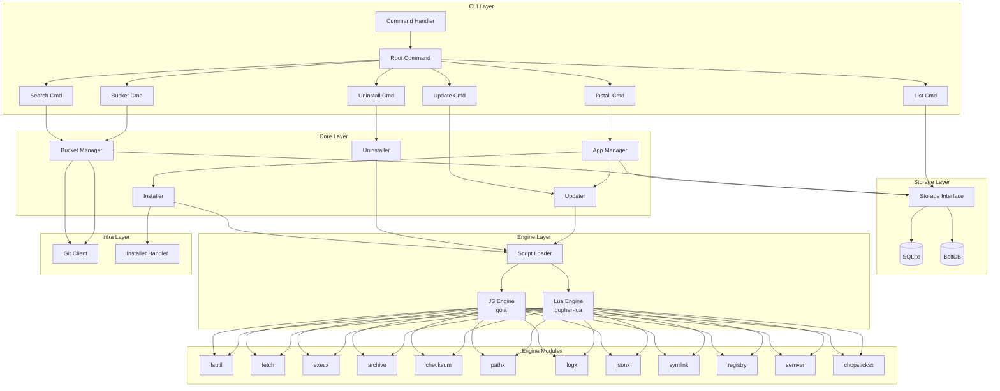
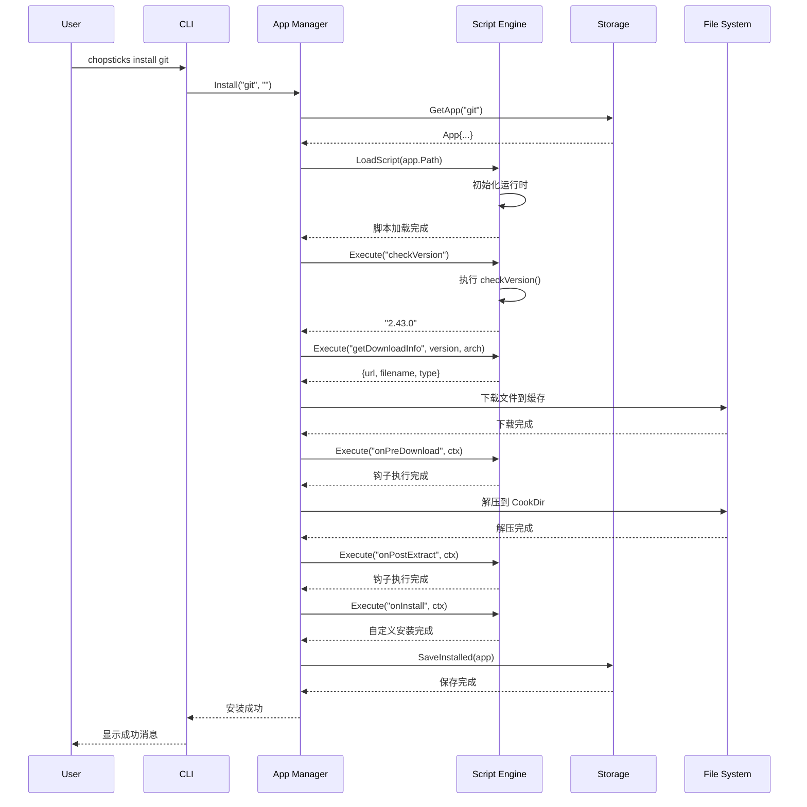
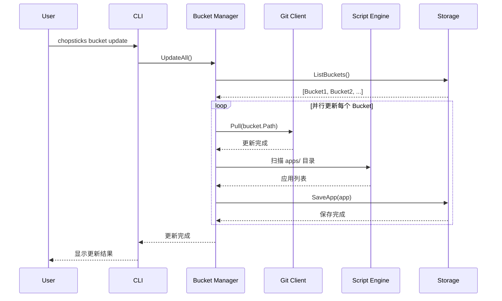
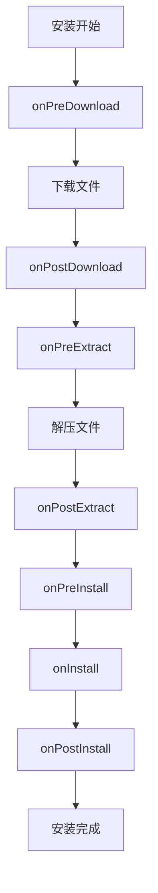

# Chopsticks 架构设计

> 系统架构和技术设计文档

---

## 目录

1. [架构概览](#架构概览)
2. [系统架构图](#系统架构图)
3. [核心模块](#核心模块)
4. [数据流](#数据流)
5. [技术选型](#技术选型)
6. [扩展机制](#扩展机制)
7. [安全设计](#安全设计)

---

## 架构概览

Chopsticks 采用分层架构设计，遵循以下原则：

- **关注点分离**: 每个模块负责单一职责
- **接口驱动**: 通过接口定义模块间契约
- **可测试性**: 模块间松耦合，便于单元测试
- **可扩展性**: 支持插件和脚本扩展

### 架构分层

```
┌─────────────────────────────────────────────────────────────┐
│                        CLI 层 (cmd)                          │
│  ┌─────────┐ ┌─────────┐ ┌─────────┐ ┌─────────┐           │
│  │ install │ │uninstall│ │ update  │ │ search  │ ...       │
│  └────┬────┘ └────┬────┘ └────┬────┘ └────┬────┘            │
└───────┼───────────┼───────────┼───────────┼─────────────────┘
        │           │           │           │
        └───────────┴─────┬─────┴───────────┘
                          │
┌─────────────────────────┼───────────────────────────────────┐
│                         ▼                                    │
│                      Core 层                                 │
│  ┌─────────────┐  ┌─────────────┐  ┌─────────────────────┐  │
│  │    App      │  │   Bucket    │  │       Store         │  │
│  │  Manager    │  │  Manager    │  │   (SQLite/BoltDB)   │  │
│  └──────┬──────┘  └──────┬──────┘  └──────────┬──────────┘  │
│         │                │                    │             │
│  ┌──────┴────────────────┴────────────────────┴──────┐      │
│  │                    Engine 层                       │      │
│  │  ┌─────────┐ ┌─────────┐ ┌─────────┐ ┌─────────┐  │      │
│  │  │   JS    │ │   Lua   │ │ Archive │ │Checksum │  │      │
│  │  │ Engine  │ │ Engine  │ │         │ │         │  │      │
│  │  └─────────┘ └─────────┘ └─────────┘ └─────────┘  │      │
│  │  ┌─────────┐ ┌─────────┐ ┌─────────┐ ┌─────────┐  │      │
│  │  │  Fetch  │ │  FSUtil │ │  Exec   │ │  Path   │  │      │
│  │  └─────────┘ └─────────┘ └─────────┘ └─────────┘  │      │
│  └────────────────────────────────────────────────────┘      │
└──────────────────────────────────────────────────────────────┘
        │
        ▼
┌──────────────────────────────────────────────────────────────┐
│                      Infra Layer                                │
│  ┌─────────────┐  ┌─────────────┐  ┌─────────────────────┐  │
│  │     Git     │  │  Installer  │  │   System (Windows)  │  │
│  │  (go-git)   │  │  Handler    │  │                     │  │
│  └─────────────┘  └─────────────┘  └─────────────────────┘  │
└──────────────────────────────────────────────────────────────┘
```

---

## 系统架构图

### 整体架构



---

## 核心模块

### 1. CLI 层 (cmd/chopsticks)

负责命令行界面和用户交互。

```go
// cmd/chopsticks/cli/commands.go
type Command interface {
    Execute(args []string) error
    GetName() string
    GetAliases() []string
    GetDescription() string
}
```

**主要命令**:

| 命令        | 功能       | 实现文件     |
| ----------- | ---------- | ------------ |
| `install`   | 安装应用   | `serve.go`   |
| `uninstall` | 卸载应用   | `clear.go`   |
| `update`    | 更新应用   | `refresh.go` |
| `search`    | 搜索应用   | `search.go`  |
| `list`      | 列出应用   | `list.go`    |
| `bucket`    | 软件源管理 | `bucket.go`  |

### 2. Core 层 (core/)

核心业务逻辑，处理应用和软件源的生命周期。

#### 2.1 App Manager (core/app/)

```go
// core/app/manager.go
type Manager interface {
    Install(app *manifest.App, version string) error
    Uninstall(app *manifest.App, purge bool) error
    Update(app *manifest.App) error
    List() ([]*manifest.InstalledApp, error)
    Get(name string) (*manifest.App, error)
}
```

**组件**:

- `manager.go` - 应用管理器接口和实现
- `install.go` - 安装流程协调
- `installer.go` - 安装器实现
- `updater.go` - 更新逻辑
- `uninstaller.go` - 卸载逻辑

#### 2.2 Bucket Manager (core/bucket/)

```go
// core/bucket/bucket.go
type Manager interface {
    Add(name, url string) error
    Remove(name string) error
    Update(name string) error
    List() ([]*manifest.Bucket, error)
    Search(query string) ([]*manifest.App, error)
}
```

#### 2.3 Store (core/store/)

数据持久化层，支持 SQLite 和 BoltDB。

```go
// core/store/storage.go
type Storage interface {
    // Bucket operations
    SaveBucket(bucket *manifest.Bucket) error
    GetBucket(name string) (*manifest.Bucket, error)
    ListBuckets() ([]*manifest.Bucket, error)
    DeleteBucket(name string) error

    // App operations
    SaveApp(app *manifest.App) error
    GetApp(bucket, name string) (*manifest.App, error)
    ListApps(bucket string) ([]*manifest.App, error)
    SearchApps(query string) ([]*manifest.App, error)

    // Installed operations
    SaveInstalled(app *manifest.InstalledApp) error
    GetInstalled(name string) (*manifest.InstalledApp, error)
    ListInstalled() ([]*manifest.InstalledApp, error)
    DeleteInstalled(name string) error
}
```

**数据库 Schema**:

```sql
-- buckets 表
CREATE TABLE buckets (
    id TEXT PRIMARY KEY,
    name TEXT NOT NULL,
    url TEXT NOT NULL,
    branch TEXT DEFAULT 'main',
    added_at DATETIME DEFAULT CURRENT_TIMESTAMP,
    updated_at DATETIME DEFAULT CURRENT_TIMESTAMP,
    local_path TEXT
);

-- apps 表
CREATE TABLE apps (
    id TEXT PRIMARY KEY,
    bucket_id TEXT NOT NULL,
    name TEXT NOT NULL,
    version TEXT,
    description TEXT,
    homepage TEXT,
    license TEXT,
    updated_at DATETIME DEFAULT CURRENT_TIMESTAMP,
    FOREIGN KEY (bucket_id) REFERENCES buckets(id)
);

-- installed 表
CREATE TABLE installed (
    id TEXT PRIMARY KEY,
    name TEXT NOT NULL,
    version TEXT NOT NULL,
    bucket_id TEXT NOT NULL,
    cook_dir TEXT NOT NULL,
    installed_at DATETIME DEFAULT CURRENT_TIMESTAMP,
    updated_at DATETIME DEFAULT CURRENT_TIMESTAMP,
    FOREIGN KEY (bucket_id) REFERENCES buckets(id)
);
```

### 3. Engine 层 (engine/)

脚本引擎和 API 模块，向 JavaScript/Lua 脚本暴露系统能力。

#### 3.1 脚本引擎

```go
// engine/engine.go
type Engine interface {
    LoadScript(path string) error
    Execute(method string, ctx *Context) (interface{}, error)
    RegisterModule(name string, module Module) error
}

// engine/js.go - JavaScript 引擎
type JSEngine struct {
    runtime *goja.Runtime
    modules map[string]Module
}

// engine/lua.go - Lua 引擎
type LuaEngine struct {
    state   *lua.LState
    modules map[string]Module
}
```

#### 3.2 API 模块

| 模块          | 文件                                | 功能描述              |
| ------------- | ----------------------------------- | --------------------- |
| `fsutil`      | `engine/fsutil/fsutil.go`           | 文件读写、目录操作    |
| `fetch`       | `engine/fetch/fetch.go`             | HTTP 请求、文件下载   |
| `execx`       | `engine/execx/execx.go`             | 命令执行              |
| `archive`     | `engine/archive/archive.go`         | 压缩解压 (zip/7z/tar) |
| `checksum`    | `engine/checksum/checksum.go`       | 校验和验证            |
| `pathx`       | `engine/pathx/pathx.go`             | 路径操作              |
| `logx`        | `engine/logx/logx.go`               | 日志记录              |
| `jsonx`       | `engine/jsonx/jsonx.go`             | JSON 处理             |
| `symlink`     | `engine/symlink/symlink.go`         | 符号链接              |
| `registry`    | `engine/registry/registry.go`       | Windows 注册表        |
| `semver`      | `engine/semver/semver.go`           | 版本比较              |
| `chopsticksx` | `engine/chopsticksx/chopsticksx.go` | 系统 API              |

**模块注册机制**:

```go
// 引擎初始化时注册所有模块
func (e *JSEngine) initModules() {
    e.RegisterModule("fs", fsutil.New())
    e.RegisterModule("fetch", fetch.New())
    e.RegisterModule("exec", execx.New())
    e.RegisterModule("archive", archive.New())
    e.RegisterModule("checksum", checksum.New())
    e.RegisterModule("path", pathx.New())
    e.RegisterModule("log", logx.New())
    e.RegisterModule("JSON", jsonx.New())
    e.RegisterModule("symlink", symlink.New())
    e.RegisterModule("registry", registry.New())
    e.RegisterModule("semver", semver.New())
    e.RegisterModule("chopsticks", chopsticksx.New())
}
```

### 4. Infra 层 (infra/)

基础设施服务。

#### 4.1 Git 客户端 (infra/git/)

```go
// infra/git/git.go
type Client interface {
    Clone(url, dest string) error
    Pull(dir string) error
    Fetch(dir string) error
    GetLatestTag(dir string) (string, error)
    GetCommitHash(dir string) (string, error)
}
```

#### 4.2 安装程序处理 (infra/installer/)

```go
// infra/installer/installer.go
type Handler interface {
    RunNSIS(path string, args []string) error
    RunMSI(path string, args []string) error
    RunInnoSetup(path string, args []string) error
}
```

---

## 数据流

### 安装流程



### 软件源更新流程



---

## 技术选型

### 编程语言

| 语言       | 用途            | 版本   |
| ---------- | --------------- | ------ |
| Go         | 主开发语言      | 1.25.6 |
| JavaScript | 应用脚本        | ES6+   |
| Lua        | 应用脚本 (备选) | 5.1    |

### 核心依赖

| 库                            | 用途             | 版本                  |
| ----------------------------- | ---------------- | --------------------- |
| `github.com/dop251/goja`      | JavaScript 引擎  | v0.0.0-20260106131823 |
| `github.com/yuin/gopher-lua`  | Lua 引擎         | v1.1.1                |
| `github.com/go-git/go-git/v5` | Git 操作         | v5.11.0               |
| `github.com/mattn/go-sqlite3` | SQLite 数据库    | v1.14.24              |
| `github.com/ulikunitz/xz`     | XZ 压缩支持      | v0.5.11               |
| `go.etcd.io/bbolt`            | BoltDB (备选)    | v1.4.3                |
| `golang.org/x/sys`            | Windows 系统调用 | v0.32.0               |

### 选型理由

1. **Go**: 编译型语言，单文件部署，跨平台，丰富的标准库
2. **Goja**: 纯 Go 实现的 JavaScript 引擎，无需 CGO，性能优秀
3. **Gopher-lua**: 轻量级 Lua 引擎，适合嵌入式场景
4. **go-git**: 纯 Go 实现的 Git 客户端，无需外部依赖
5. **SQLite**: 轻量级嵌入式数据库，单文件存储

---

## 扩展机制

### 1. 脚本扩展

应用通过 JavaScript/Lua 脚本定义安装逻辑：

```javascript
// apps/git.js
class GitApp extends App {
  constructor() {
    super({
      name: "git",
      description: "Distributed version control system",
      homepage: "https://git-scm.com/",
      license: "GPL-2.0",
    });
  }

  async checkVersion() {
    const response = await fetch.get(
      "https://api.github.com/repos/git-for-windows/git/releases/latest",
    );
    const data = JSON.parse(response.body);
    return data.tag_name.replace(/^v/, "");
  }

  async getDownloadInfo(version, arch) {
    const archMap = { amd64: "64-bit", x86: "32-bit" };
    const filename = `PortableGit-${version}-${archMap[arch]}.7z.exe`;
    return {
      url: `https://github.com/.../${filename}`,
      type: "7z",
    };
  }
}

module.exports = new GitApp();
```

### 2. 生命周期钩子



### 3. 自定义 Bucket

软件源是标准的 Git 仓库，结构如下：

```
bucket/
├── bucket.json          # 软件源配置
├── apps/
│   ├── _chopsticks_.js  # 基类定义
│   ├── _tools_.js       # 共享工具
│   └── *.js             # 应用脚本
└── .gitignore
```

---

## 安全设计

### 1. 脚本沙箱

- 脚本运行在受限的引擎环境中
- 只能通过暴露的 API 访问系统资源
- 禁止直接执行系统调用

### 2. 下载验证

- 支持 SHA256/MD5 校验和验证
- 可配置是否启用验证（默认启用）
- 验证失败时阻止安装

### 3. 权限控制

- 所有操作在用户级别执行
- 注册表操作限制在 HKCU
- 不修改系统关键文件

### 4. 操作追踪

- 自动记录所有系统操作（PATH、注册表等）
- 卸载时精确清理，不影响其他软件

---

## 性能考虑

### 1. 并发处理

- 软件源更新支持并行（默认 5 并发）
- 多文件下载支持并发
- 使用 goroutine + WaitGroup 实现

### 2. 缓存策略

- 下载文件缓存到本地
- 数据库查询结果缓存
- 脚本编译结果缓存

### 3. 启动优化

- 延迟加载非必要模块
- 数据库连接池
- 目标启动时间 < 500ms

---

_最后更新: 2026-02-27_
_架构版本: v1.0_
