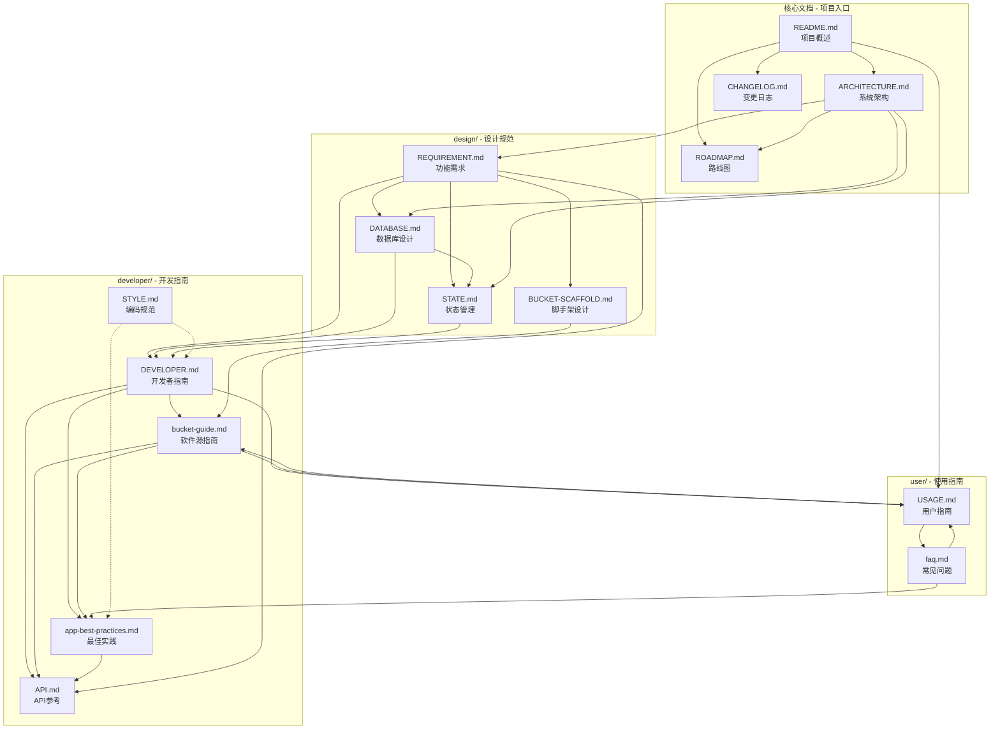
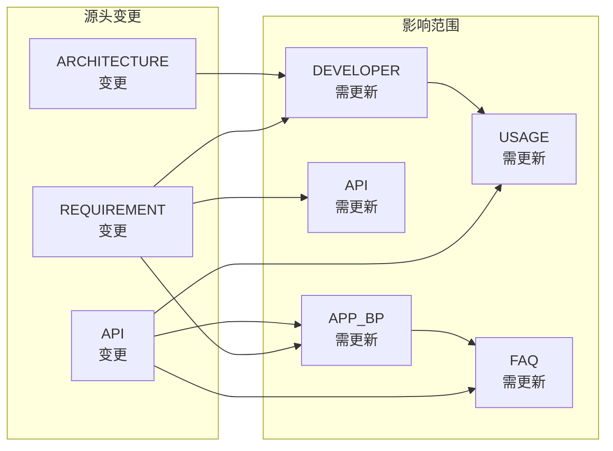

# 文档关联关系 (RELATION)

> 描述 Chopsticks Wiki 各文档之间的关联和依赖关系

---

## 1. 文档关系总览



---

## 2. 文档分类与角色

### 2.1 核心文档 (Core Documents)

| 文档 | 角色 | 主要关联 |
|------|------|----------|
| [README.md](README.md) | **入口文档** | 所有其他文档的导航入口 |
| [ARCHITECTURE.md](ARCHITECTURE.md) | **架构蓝图** | REQUIREMENT, DATABASE, STATE, DEVELOPER |
| [ROADMAP.md](ROADMAP.md) | **规划文档** | CHANGELOG, REQUIREMENT |
| [CHANGELOG.md](CHANGELOG.md) | **历史记录** | ROADMAP, 所有功能文档 |

### 2.2 设计文档 (Design Documents)

| 文档 | 角色 | 主要关联 |
|------|------|----------|
| [REQUIREMENT.md](design/REQUIREMENT.md) | **需求基线** | 所有功能实现文档的源头 |
| [DATABASE.md](design/DATABASE.md) | **数据设计** | REQUIREMENT, STATE, DEVELOPER |
| [STATE.md](design/STATE.md) | **状态定义** | REQUIREMENT, DATABASE |
| [BUCKET-SCAFFOLD.md](design/BUCKET-SCAFFOLD.md) | **工具设计** | REQUIREMENT, BUCKET_GUIDE |

### 2.3 开发者文档 (Developer Documents)

| 文档 | 角色 | 主要关联 |
|------|------|----------|
| [DEVELOPER.md](developer/DEVELOPER.md) | **开发总览** | REQUIREMENT, API, BUCKET_GUIDE |
| [API.md](developer/API.md) | **接口参考** | REQUIREMENT, DEVELOPER, APP_BP |
| [STYLE.md](developer/STYLE.md) | **规范约束** | 所有代码相关文档 |
| [bucket-guide.md](developer/bucket-guide.md) | **创建教程** | BUCKET_SCAFFOLD, APP_BP |
| [app-best-practices.md](developer/app-best-practices.md) | **实践指南** | API, BUCKET_GUIDE |

### 2.4 用户文档 (User Documents)

| 文档 | 角色 | 主要关联 |
|------|------|----------|
| [USAGE.md](user/USAGE.md) | **使用手册** | README, DEVELOPER, FAQ |
| [faq.md](user/faq.md) | **问题解答** | USAGE, APP_BP |

---

## 3. 详细关联矩阵

### 3.1 文档间引用关系

```
┌─────────────────┬─────────────────────────────────────────────────────────────┐
│ 源文档          │ 引用的目标文档                                               │
├─────────────────┼─────────────────────────────────────────────────────────────┤
│ README.md       │ ARCHITECTURE, CHANGELOG, ROADMAP, USAGE, FAQ                │
│                 │ DEVELOPER, API, STYLE, BUCKET_GUIDE, APP_BP                 │
├─────────────────┼─────────────────────────────────────────────────────────────┤
│ ARCHITECTURE.md │ REQUIREMENT, DATABASE, STATE                                │
├─────────────────┼─────────────────────────────────────────────────────────────┤
│ ROADMAP.md      │ STYLE (开发规范), REQUIREMENT (功能来源)                    │
├─────────────────┼─────────────────────────────────────────────────────────────┤
│ CHANGELOG.md    │ ROADMAP (版本规划), REQUIREMENT (功能实现)                  │
├─────────────────┼─────────────────────────────────────────────────────────────┤
│ REQUIREMENT.md  │ DATABASE, STATE, DEVELOPER, API                             │
├─────────────────┼─────────────────────────────────────────────────────────────┤
│ DATABASE.md     │ STATE (状态存储), REQUIREMENT (数据需求)                    │
├─────────────────┼─────────────────────────────────────────────────────────────┤
│ STATE.md        │ DATABASE (状态持久化), REQUIREMENT (状态需求)               │
├─────────────────┼─────────────────────────────────────────────────────────────┤
│ BUCKET-SCAFFOLD │ REQUIREMENT (脚手架需求), BUCKET_GUIDE (使用指南)           │
├─────────────────┼─────────────────────────────────────────────────────────────┤
│ DEVELOPER.md    │ API, BUCKET_GUIDE, APP_BP, DATABASE, STATE                  │
│                 │ REQUIREMENT (功能需求来源)                                  │
├─────────────────┼─────────────────────────────────────────────────────────────┤
│ API.md          │ REQUIREMENT (API需求), DEVELOPER (使用场景)                 │
├─────────────────┼─────────────────────────────────────────────────────────────┤
│ STYLE.md        │ 独立文档，被其他文档引用                                     │
├─────────────────┼─────────────────────────────────────────────────────────────┤
│ bucket-guide.md │ BUCKET_SCAFFOLD (设计依据), APP_BP (应用开发)               │
│                 │ API (接口使用), USAGE (用户视角)                            │
├─────────────────┼─────────────────────────────────────────────────────────────┤
│ app-best-       │ API (接口调用), BUCKET_GUIDE (创建前提)                     │
│ practices.md    │                                                             │
├─────────────────┼─────────────────────────────────────────────────────────────┤
│ USAGE.md        │ README (项目介绍), DEVELOPER (高级功能)                     │
│                 │ BUCKET_GUIDE (软件源管理), FAQ (问题解答)                   │
├─────────────────┼─────────────────────────────────────────────────────────────┤
│ faq.md          │ USAGE (使用指南), APP_BP (开发问题), API (接口问题)         │
│                 │ BUCKET_GUIDE (软件源问题)                                   │
└─────────────────┴─────────────────────────────────────────────────────────────┘
```

### 3.2 数据一致性关联

| 数据/概念 | 定义位置 | 引用位置 |
|-----------|----------|----------|
| **术语对照表** | README.md | REQUIREMENT, DEVELOPER, USAGE, FAQ |
| **数据库 Schema** | DATABASE.md | ARCHITECTURE, STATE, DEVELOPER |
| **状态生命周期** | STATE.md | REQUIREMENT, DATABASE, DEVELOPER |
| **API 模块列表** | REQUIREMENT.md | API.md, DEVELOPER.md |
| **生命周期钩子** | REQUIREMENT.md | API.md, APP_BP.md, DEVELOPER.md |
| **CLI 命令** | REQUIREMENT.md | USAGE.md, FAQ.md |
| **版本号** | CHANGELOG.md | ROADMAP.md, ARCHITECTURE.md |

---

## 4. 阅读路径推荐

### 4.1 新用户路径

```
README.md → USAGE.md → FAQ.md
                ↓
         bucket-guide.md (如需创建软件源)
```

### 4.2 开发者路径

```
README.md → ARCHITECTURE.md → REQUIREMENT.md → DEVELOPER.md
                                              ↓
                                    ┌─────────┼─────────┐
                                    ↓         ↓         ↓
                                  API.md  BUCKET_GUIDE  APP_BP
```

### 4.3 架构师路径

```
README.md → ARCHITECTURE.md → REQUIREMENT.md
                    ↓
            ┌───────┴───────┐
            ↓               ↓
      DATABASE.md      STATE.md
            └───────┬───────┘
                    ↓
              BUCKET_SCAFFOLD
```

### 4.4 维护者路径

```
CHANGELOG.md ← ROADMAP.md ← REQUIREMENT.md
                    ↓
              ARCHITECTURE.md
                    ↓
            ┌───────┴───────┐
            ↓               ↓
      DATABASE.md      STYLE.md
```

---

## 5. 文档更新影响分析

### 5.1 变更传播图



### 5.2 关键变更影响表

| 变更文档 | 直接影响 | 间接影响 | 建议检查 |
|----------|----------|----------|----------|
| REQUIREMENT.md | DATABASE, STATE, DEVELOPER, API | APP_BP, BUCKET_GUIDE, USAGE, FAQ | 所有功能描述 |
| DATABASE.md | STATE, DEVELOPER | APP_BP, FAQ | 数据表结构、ER图 |
| API.md | APP_BP, DEVELOPER | FAQ | API 签名、示例代码 |
| ARCHITECTURE.md | REQUIREMENT, DATABASE | 所有技术文档 | 架构图、模块关系 |
| CHANGELOG.md | ROADMAP | README | 版本号、发布日期 |

---

## 6. 文档元信息

### 6.1 文档属性

| 文档 | 类型 | 更新频率 | 目标读者 | 维护优先级 |
|------|------|----------|----------|------------|
| README.md | 入口 | 中 | 所有人 | P0 |
| ARCHITECTURE.md | 设计 | 低 | 架构师、开发者 | P0 |
| ROADMAP.md | 规划 | 高 | 所有人 | P1 |
| CHANGELOG.md | 记录 | 高 | 所有人 | P0 |
| REQUIREMENT.md | 需求 | 中 | 产品经理、开发者 | P0 |
| DATABASE.md | 设计 | 低 | 架构师、开发者 | P1 |
| STATE.md | 设计 | 低 | 架构师、开发者 | P1 |
| BUCKET-SCAFFOLD.md | 设计 | 低 | 开发者 | P2 |
| DEVELOPER.md | 指南 | 中 | 开发者 | P0 |
| API.md | 参考 | 中 | 开发者 | P0 |
| STYLE.md | 规范 | 低 | 开发者 | P2 |
| bucket-guide.md | 教程 | 中 | 开发者 | P1 |
| app-best-practices.md | 指南 | 中 | 开发者 | P1 |
| USAGE.md | 指南 | 中 | 用户 | P0 |
| faq.md | 问答 | 高 | 用户 | P1 |

### 6.2 版本一致性检查点

- [ ] README.md 中的版本号与 CHANGELOG.md 最新版本一致
- [ ] ARCHITECTURE.md 中的架构版本与软件版本匹配
- [ ] REQUIREMENT.md 中的功能状态与 ROADMAP.md 一致
- [ ] API.md 中的接口与 REQUIREMENT.md 定义一致
- [ ] 所有文档的"最后更新"日期准确

---

## 7. 相关链接

- [README.md](README.md) - 返回项目首页
- [ARCHITECTURE.md](ARCHITECTURE.md) - 查看系统架构
- [DEVELOPER.md](developer/DEVELOPER.md) - 开发者入门
- [USAGE.md](user/USAGE.md) - 用户指南

---

_最后更新：2026-02-28_
_关系图版本：v1.0_
