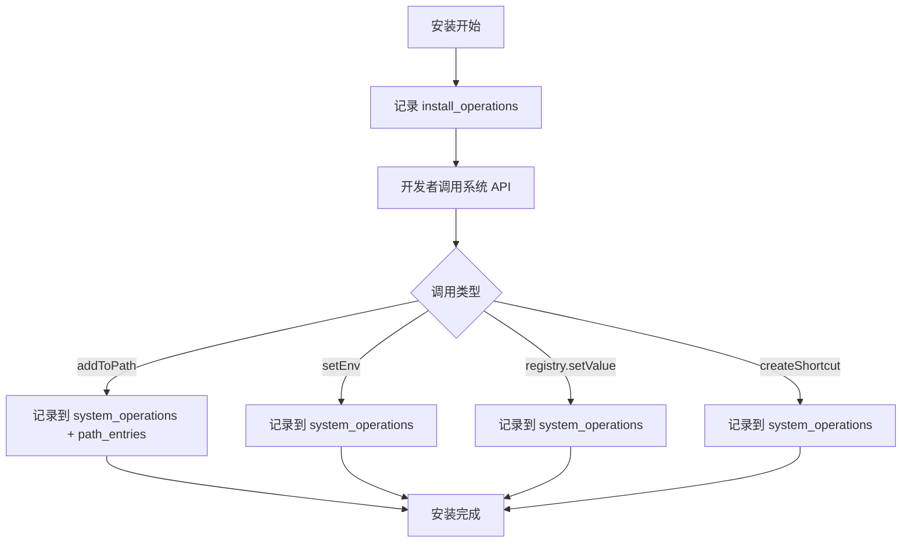
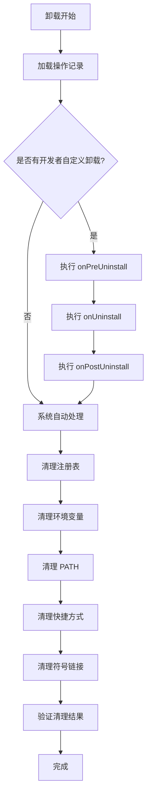
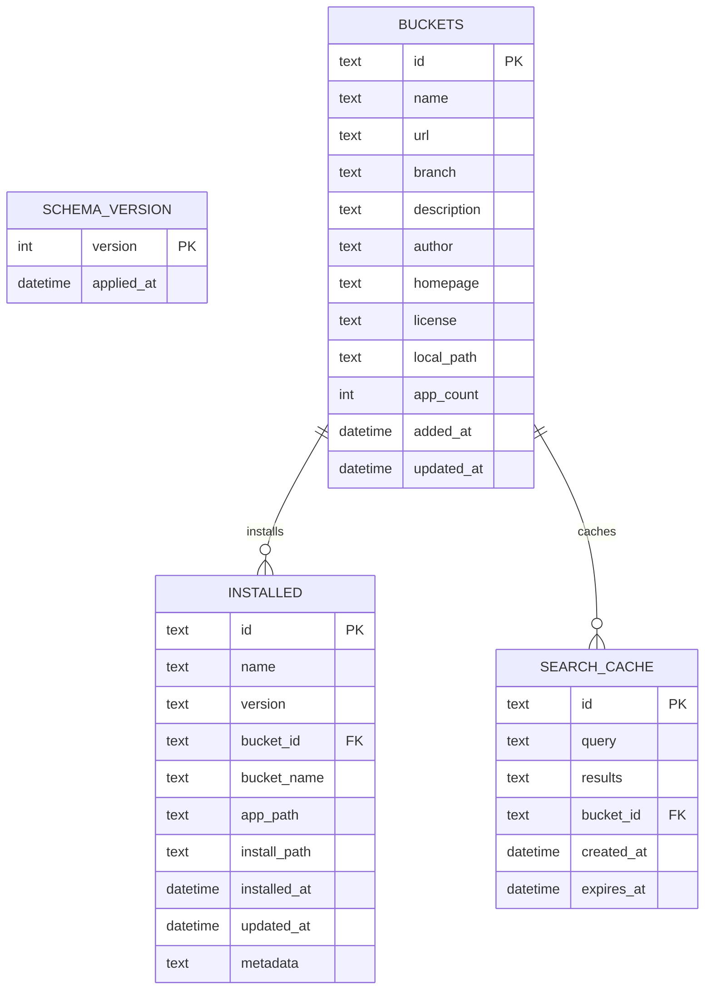
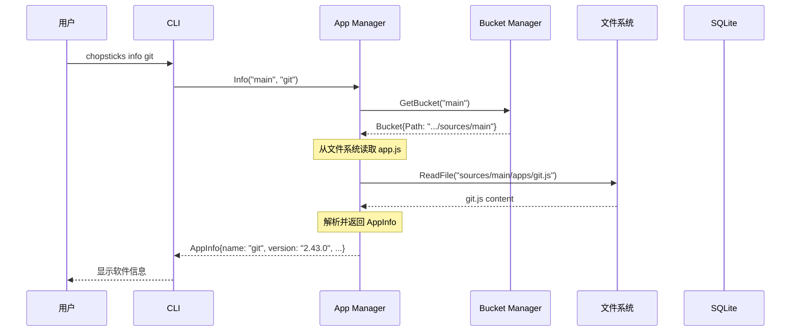
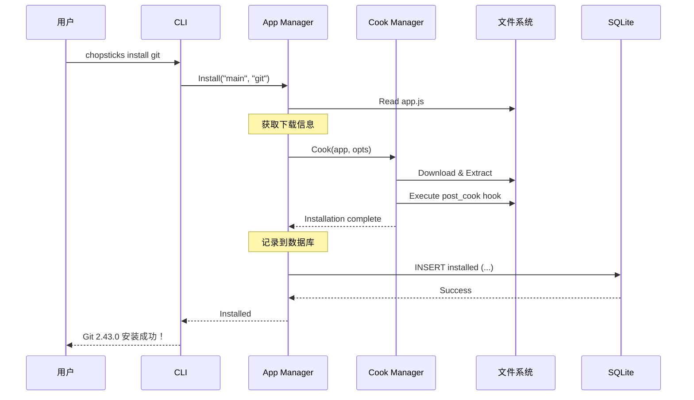

# Chopsticks 数据库设计

> 分布式数据库设计：Bucket 内文件存储 + 全局 SQLite 存储

---

## 1. 设计概述

Chopsticks 采用**分布式存储**策略：

| 存储位置                                               | 用途       | 存储方式  | 数据特性                 |
| ------------------------------------------------------ | ---------- | --------- | ------------------------ |
| `%USERPROFILE%\.chopsticks\sources\{bucket}\apps\`     | 应用脚本   | 文件 (JS) | **只读**，来自 Git 仓库  |
| `%USERPROFILE%\.chopsticks\sources\{bucket}\bucket.db` | 元数据缓存 | SQLite    | **只读**，自动生成的缓存 |
| `%USERPROFILE%\.chopsticks\data.db`                    | 已安装软件 | SQLite    | **读写**，运行时状态     |

### 1.1 设计原则

- **分离 元数据（只关注点**：Bucket读）与安装状态（读写）分离
- **本地优先**：Bucket 数据直接从本地文件系统读取，无需数据库
- **统一索引**：全局数据库仅存储已安装软件和搜索索引缓存

---

## 2. 数据文件结构

### 2.1 目录结构

```
%USERPROFILE%\.chopsticks\sources\
└── {bucket_id}\
    ├── bucket.json            # 配置
    ├── bucket.db                # 可选：元数据缓存（SQLite）
    ├── apps\
    │   ├── git.js             # 应用脚本（包含元数据和安装逻辑）
    │   └── nodejs.js
    └── .chopsticks\
        └── index.json        # 可选：预生成的搜索索引
```

### 2.2 app.js - 应用脚本（包含元数据和安装逻辑）

```javascript
// git.js - Git for Windows 安装脚本

class GitApp extends App {
  constructor() {
    super({
      name: "git",
      description: "Distributed version control system",
      homepage: "https://git-scm.com/",
      license: "GPL-2.0",
      category: "development",
      tags: ["vcs", "git", "scm"],
    });
  }

  // 获取最新版本
  async checkVersion() {
    const response = await fetch.get(
      "https://api.github.com/repos/git-for-windows/git/releases/latest",
    );
    const data = JSON.parse(response.body);
    return data.tag_name.replace(/^v/, "");
  }

  // 获取下载信息
  async getDownloadInfo(version, arch) {
    const archMap = {
      amd64: "64-bit",
      x86: "32-bit",
    };

    const filename = `PortableGit-${version}-${archMap[arch] || arch}.7z.exe`;

    return {
      url: `https://github.com/git-for-windows/git/releases/download/v${version}.windows.1/${filename}`,
      type: "7z",
    };
  }

  // 安装后钩子
  async postCook(ctx) {
    // 添加到 PATH
    chopsticks.addToPath("bin");
  }
}

module.exports = new GitApp();
```

### 2.3 可选：app.lua - Lua 安装脚本（备选）

```lua
-- app.lua: Git for Windows 安装脚本

app = {
    name = "git",
    version = "2.43.0",
    category = "development",
    tags = {"vcs", "git", "scm"}
}

function check_version()
    return app.version
end

function get_download_info(ctx, arch)
    local info = app.architectures[arch]
    return {
        url = info.download.url,
        hash = info.download.hash,
        type = info.download.type
    }
end

function pre_cook(ctx)
    -- 安装前处理
end

function post_cook(ctx)
    -- 添加到 PATH
    path.add(ctx, "Git/bin")
end
```

---

## 3. Bucket 数据库 (bucket.db)

### 3.1 文件位置

```
%USERPROFILE%\.chopsticks\sources\{bucket_id}\bucket.db
```

### 3. 2 用途

`bucket.db` 是每个 Bucket（软件源）独立的 SQLite 数据库，用于缓存该 Bucket 下所有应用（App）的元信息。它是可选的，由系统自动生成和维护。

**数据特性**：

- **只读缓存**：数据从 `apps/*.js` 脚本解析生成
- **自动生成**：首次添加/更新 Bucket 时自动创建
- **无需提交**：应添加到 `.gitignore`，不纳入版本控制

### 3.3 表列表

| 表名           | 说明         |
| -------------- | ------------ |
| `apps`         | 应用元信息   |
| `app_versions` | 应用版本信息 |

### 3.4 apps - 应用表

```sql
CREATE TABLE apps (
    id TEXT PRIMARY KEY,
    name TEXT NOT NULL,
    version TEXT,
    latest_version TEXT,
    latest_downloads TEXT,
    description TEXT,
    homepage TEXT,
    license TEXT,
    category TEXT,
    tags TEXT,
    author TEXT,
    script_path TEXT NOT NULL,
    created_at DATETIME DEFAULT CURRENT_TIMESTAMP,
    updated_at DATETIME DEFAULT CURRENT_TIMESTAMP
);

-- 索引
CREATE INDEX idx_apps_name ON apps(name);
CREATE INDEX idx_apps_category ON apps(category);
```

**字段说明**：

| 字段             | 类型     | 说明                     |
| ---------------- | -------- | ------------------------ |
| id               | TEXT     | 唯一标识（如 "git"）     |
| name             | TEXT     | 应用名称                 |
| version          | TEXT     | 当前版本                 |
| latest_version   | TEXT     | 最新版本                 |
| latest_downloads | TEXT     | 最新版本下载信息（JSON） |
| description      | TEXT     | 描述                     |
| homepage         | TEXT     | 主页                     |
| license          | TEXT     | 许可证                   |
| category         | TEXT     | 分类                     |
| tags             | TEXT     | 标签（JSON 数组）        |
| author           | TEXT     | 作者                     |
| script_path      | TEXT     | 脚本文件路径             |
| created_at       | DATETIME | 创建时间                 |
| updated_at       | DATETIME | 更新时间                 |

### 3.5 app_versions - 应用版本表

```sql
CREATE TABLE app_versions (
    id INTEGER PRIMARY KEY AUTOINCREMENT,
    app_id TEXT NOT NULL,
    version TEXT NOT NULL,
    released_at DATETIME,
    downloads TEXT,
    FOREIGN KEY (app_id) REFERENCES apps(id) ON DELETE CASCADE,
    UNIQUE(app_id, version)
);

-- 索引
CREATE INDEX idx_app_versions_app_id ON app_versions(app_id);
```

**字段说明**：

| 字段        | 类型     | 说明             |
| ----------- | -------- | ---------------- |
| id          | INTEGER  | 自增主键         |
| app_id      | TEXT     | 关联应用 ID      |
| version     | TEXT     | 版本号           |
| released_at | DATETIME | 发布时间         |
| downloads   | TEXT     | 下载信息（JSON） |

### 3.6 数据生成流程

```
用户添加 Bucket → 克隆 Git 仓库 → 扫描 apps/*.js
    → 解析脚本元数据 → 执行 checkVersion() 获取版本
    → 存储到 bucket.db
```

### 3.7 注意事项

- **不提交到 Git**：`bucket.db` 应添加到 `.gitignore`
- **自动更新**：Bucket 更新时自动刷新数据库
- **可删除**：删除后下次更新会自动重新生成

```bash
# .gitignore 添加
bucket.db
*.db
```

---

## 4. 全局数据库

### 4.1 文件位置

```
%USERPROFILE%\.chopsticks\data.db
```

### 4.2 表列表

| 表名             | 说明             |
| ---------------- | ---------------- |
| `schema_version` | 数据库版本       |
| `buckets`        | 软件源信息       |
| `installed`      | 已安装软件       |
| `search_cache`   | 搜索缓存（可选） |

---

### 4.3 schema_version - 数据库版本

```sql
CREATE TABLE schema_version (
    version INTEGER PRIMARY KEY,
    applied_at DATETIME DEFAULT CURRENT_TIMESTAMP
);
```

---

### 4.4 buckets - 软件源

```sql
CREATE TABLE buckets (
    id TEXT PRIMARY KEY,
    name TEXT NOT NULL,
    url TEXT NOT NULL,
    branch TEXT DEFAULT 'main',
    description TEXT,
    author TEXT,
    homepage TEXT,
    license TEXT,
    local_path TEXT,
    app_count INTEGER DEFAULT 0,
    added_at DATETIME DEFAULT CURRENT_TIMESTAMP,
    updated_at DATETIME DEFAULT CURRENT_TIMESTAMP
);

-- 索引
CREATE INDEX idx_buckets_name ON buckets(name);
CREATE INDEX idx_buckets_added_at ON buckets(added_at);
```

**字段说明**：

| 字段        | 类型     | 说明                  |
| ----------- | -------- | --------------------- |
| id          | TEXT     | 唯一标识（如 "main"） |
| name        | TEXT     | 显示名称              |
| url         | TEXT     | Git 仓库地址          |
| branch      | TEXT     | 分支名（默认 main）   |
| description | TEXT     | 描述                  |
| author      | TEXT     | 作者                  |
| homepage    | TEXT     | 主页                  |
| license     | TEXT     | 许可证                |
| local_path  | TEXT     | 本地克隆路径          |
| app_count   | INTEGER  | 应用数量              |
| added_at    | DATETIME | 添加时间              |
| updated_at  | DATETIME | 更新时间              |

---

### 4.5 installed - 已安装软件

```sql
CREATE TABLE installed (
    id TEXT PRIMARY KEY,
    name TEXT NOT NULL,
    version TEXT NOT NULL,
    bucket_id TEXT NOT NULL,
    bucket_name TEXT NOT NULL,
    app_path TEXT NOT NULL,
    install_path TEXT NOT NULL,
    installed_at DATETIME DEFAULT CURRENT_TIMESTAMP,
    updated_at DATETIME DEFAULT CURRENT_TIMESTAMP,
    metadata TEXT,
    FOREIGN KEY (bucket_id) REFERENCES buckets(id) ON DELETE SET NULL
);

-- 索引
CREATE INDEX idx_installed_name ON installed(name);
CREATE INDEX idx_installed_bucket_id ON installed(bucket_id);
CREATE INDEX idx_installed_version ON installed(version);
```

**字段说明**：

| 字段         | 类型     | 说明                             |
| ------------ | -------- | -------------------------------- |
| id           | TEXT     | 主键（name + version）           |
| name         | TEXT     | 软件名称                         |
| version      | TEXT     | 已安装版本                       |
| bucket_id    | TEXT     | 来源软件源 ID                    |
| bucket_name  | TEXT     | 来源软件源名称                   |
| app_path     | TEXT     | 应用目录路径（用于读取 app.lua） |
| install_path | TEXT     | 安装目录                         |
| installed_at | DATETIME | 安装时间                         |
| updated_at   | DATETIME | 更新时间                         |
| metadata     | TEXT     | 额外元数据（JSON）               |

---

### 4.6 search_cache - 搜索缓存（可选）

```sql
CREATE TABLE search_cache (
    id TEXT PRIMARY KEY,
    query TEXT NOT NULL,
    results TEXT NOT NULL,
    bucket_id TEXT,
    created_at DATETIME DEFAULT CURRENT_TIMESTAMP,
    expires_at DATETIME,
    FOREIGN KEY (bucket_id) REFERENCES buckets(id) ON DELETE CASCADE
);

-- 索引
CREATE INDEX idx_search_cache_query ON search_cache(query);
CREATE INDEX idx_search_cache_bucket_id ON search_cache(bucket_id);
CREATE INDEX idx_search_cache_expires ON search_cache(expires_at);
```

---

## 5. 安装追踪系统

### 5.1 设计目标

解决卸载时的自动清理问题：

| 挑战         | 解决方案                        |
| ------------ | ------------------------------- |
| 长时间间隔   | SQLite 持久化所有操作记录       |
| 版本更新     | 记录安装快照，精确匹配清理      |
| 不影响其他   | 智能 PATH 清理 + 共享检测       |
| 开发者自定义 | 分层执行：开发者钩子 → 系统自动 |

---

### 5.2 核心表结构

#### 4.2.1 install_operations - 安装操作记录

```sql
CREATE TABLE install_operations (
    id INTEGER PRIMARY KEY AUTOINCREMENT,
    app_id TEXT NOT NULL,
    version TEXT NOT NULL,
    installed_at DATETIME DEFAULT CURRENT_TIMESTAMP,
    operation_type TEXT NOT NULL,  -- 'install', 'update'
    from_version TEXT,             -- 更新时记录原版本
    PRIMARY KEY (app_id, version)
);

-- 索引
CREATE INDEX idx_install_ops_app ON install_operations(app_id);
CREATE INDEX idx_install_ops_time ON install_operations(installed_at);
```

**字段说明**：

| 字段           | 类型     | 说明                                   |
| -------------- | -------- | -------------------------------------- |
| app_id         | TEXT     | 软件包 ID                              |
| version        | TEXT     | 版本号                                 |
| installed_at   | DATETIME | 安装时间                               |
| operation_type | TEXT     | 操作类型：install(安装) / update(更新) |
| from_version   | TEXT     | 更新前的版本（仅 update 时有值）       |

#### 4.2.2 system_operations - 系统操作追踪

```sql
CREATE TABLE system_operations (
    id INTEGER PRIMARY KEY AUTOINCREMENT,
    app_id TEXT NOT NULL,
    version TEXT NOT NULL,
    operation_type TEXT NOT NULL,  -- 'path', 'env', 'registry', 'shortcut', 'symlink'
    key_name TEXT,                 -- 注册表键、PATH 条目、环境变量名
    value TEXT,                    -- 操作的值（JSON 序列化）
    original_value TEXT,           -- 操作前的值（用于回滚）
    created_at DATETIME DEFAULT CURRENT_TIMESTAMP,
    FOREIGN KEY (app_id, version) REFERENCES install_operations(app_id, version)
);

-- 索引
CREATE INDEX idx_sys_ops_app ON system_operations(app_id, version);
CREATE INDEX idx_sys_ops_type ON system_operations(operation_type);
```

**字段说明**：

| 字段           | 类型 | 说明                                         |
| -------------- | ---- | -------------------------------------------- |
| app_id         | TEXT | 软件包 ID                                    |
| version        | TEXT | 版本号                                       |
| operation_type | TEXT | 操作类型：path/env/registry/shortcut/symlink |
| key_name       | TEXT | 操作键名（如注册表路径、PATH 条目）          |
| value          | TEXT | 操作值（JSON）                               |
| original_value | TEXT | 操作前的原值                                 |

#### 4.2.3 path_entries - PATH 条目详情

```sql
CREATE TABLE path_entries (
    id INTEGER PRIMARY KEY AUTOINCREMENT,
    app_id TEXT NOT NULL,
    version TEXT NOT NULL,
    entry_path TEXT NOT NULL,      -- 添加的 PATH 路径
    entry_type TEXT DEFAULT 'user', -- 'user' 或 'system'
    verified_at DATETIME,          -- 最后验证时间
    FOREIGN KEY (app_id, version) REFERENCES install_operations(app_id, version)
);

-- 索引
CREATE INDEX idx_path_entries_path ON path_entries(entry_path);
```

### 5.3 操作记录流程



### 5.4 自动清理流程



### 5.5 智能 PATH 清理

```javascript
// PATH 清理伪代码
class PathManager {
  async removeFromPath(appId, version) {
    // 1. 获取本软件添加的所有 PATH 条目
    const entries = await db.query(
      "SELECT entry_path FROM path_entries WHERE app_id = ? AND version = ?",
      [appId, version],
    );

    for (const entry of entries) {
      // 2. 检查条目是否仍存在于当前 PATH
      const existsInPath = currentPath.includes(entry.entry_path);
      if (!existsInPath) {
        log.info(`PATH entry already removed: ${entry.entry_path}`);
        continue;
      }

      // 3. 检查是否被其他软件共享
      const isShared = await this.checkIfPathIsShared(entry.entry_path);

      if (isShared) {
        log.warn(`Skipping shared PATH: ${entry.entry_path}`);
        continue;
      }

      // 4. 安全移除
      await this.removePathEntry(entry.entry_path);
    }
  }

  async checkIfPathIsShared(targetPath) {
    const users = await db.query(
      `
            SELECT COUNT(DISTINCT app_id) as count
            FROM path_entries
            WHERE entry_path = ?
        `,
      [targetPath],
    );
    return users[0].count > 1;
  }
}
```

---

## 6. ER 图



---

## 7. 数据流

### 6.1 读取软件包信息流程



### 6.2 安装软件流程



---

## 8. 查询示例

### 7.1 从文件系统读取软件包信息

```bash
# 读取 app.js
cat "$SOURCES_PATH/main/apps/git.js"
# 输出: JavaScript 脚本内容
```

### 7.2 SQL 查询已安装软件

```sql
-- 获取所有已安装软件
SELECT * FROM installed ORDER BY installed_at DESC;

-- 获取指定软件信息
SELECT * FROM installed WHERE name = 'git';

-- 获取指定软件源已安装的软件
SELECT * FROM installed WHERE bucket_id = 'main';
```

### 8.3 搜索软件（组合查询）

```sql
-- 搜索已安装
SELECT * FROM installed WHERE name LIKE '%git%';

-- 搜索并关联软件源信息
SELECT i.*, b.name as bucket_name, b.url as bucket_url
FROM installed i
JOIN buckets b ON i.bucket_id = b.id
WHERE i.name LIKE '%node%';
```

---

## 9. 数据迁移

### 8.1 迁移策略

```sql
-- 迁移记录
INSERT INTO schema_version (version, applied_at)
VALUES (2, CURRENT_TIMESTAMP);
```

### 8.2 版本历史

| 版本 | 说明                                      | 日期       |
| ---- | ----------------------------------------- | ---------- |
| 1    | 初始版本                                  | 2026-02-25 |
| 2    | 分布式设计：Bucket内文件存储 + 全局SQLite | 2026-02-25 |

---

## 10. 性能优化

### 9.1 读取优化

- **文件系统缓存**：OS 会缓存频繁访问的文件
- **惰性加载**：仅在需要时读取 app.js
- **内存索引**：启动时加载 app 名称列表到内存

### 9.2 写入优化

- **批量写入**：多个安装操作使用事务
- **索引优化**：已在关键字段创建索引
- **搜索缓存**：热门搜索结果缓存

### 9.3 缓存策略

| 数据类型   | 缓存位置 | 过期策略          |
| ---------- | -------- | ----------------- |
| app.js     | 内存     | Bucket 更新时失效 |
| 搜索结果   | SQLite   | 1 小时过期        |
| 已安装列表 | 内存     | 每次操作后刷新    |

---

## 11. 备份与恢复

### 10.1 备份

```bash
# 备份数据库
cp ~/.chopsticks/data.db ~/.chopsticks/backup/data.db.bak

# 备份所有已安装软件配置
tar -czf ~/chopsticks-installed.tar.gz ~/.chopsticks/apps/
```

### 10.2 恢复

```bash
# 恢复数据库
cp ~/.chopsticks/backup/data.db.bak ~/.chopsticks/data.db
```

---

## 12. 设计优势

| 优势           | 说明                                            |
| -------------- | ----------------------------------------------- |
| **数据一致性** | Bucket 数据来自单一真实源（Git 仓库），无需同步 |
| **简单性**     | 无需在数据库中存储软件包元信息                  |
| **可扩展性**   | 每个 Bucket 可以独立更新其软件包                |
| **性能**       | 本地文件系统读取比数据库查询更快                |
| **版本追踪**   | 通过 Git 自然实现软件包版本历史                 |

---

_最后更新：2026-02-26_
_版本：v0.2.0-alpha_
