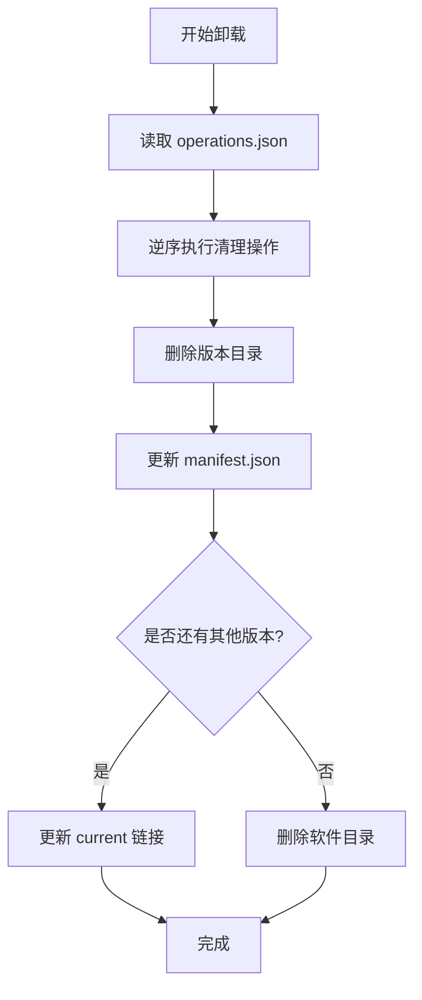
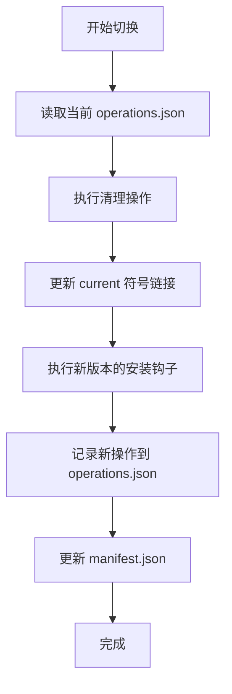

# Chopsticks 数据存储设计

> 版本: v1.0.0  
> 最后更新: 2026-03-06

> 基于文件系统的分布式存储设计

---

## 1. 设计概述

Chopsticks 采用**纯文件系统存储**策略，完全摒弃 SQLite 数据库，利用目录结构和 JSON 文件实现数据持久化。

### 1.1 核心原则

| 原则                 | 说明                                         |
| -------------------- | -------------------------------------------- |
| **文件系统即数据库** | 目录结构反映数据状态，删除目录即删除数据     |
| **去中心化存储**     | 每个软件独立管理自己的元数据                 |
| **人类可读**         | 所有元数据使用 JSON 格式，便于调试和手动修复 |
| **可重建**           | 所有索引文件可从原始数据重新生成             |

### 1.2 存储位置

| 路径                                          | 用途         | 数据特性            |
| --------------------------------------------- | ------------ | ------------------- |
| `%USERPROFILE%\.chopsticks\buckets\{bucket}\` | 软件源       | 只读，来自 Git 仓库 |
| `%USERPROFILE%\.chopsticks\apps\{app}\`       | 已安装软件   | 读写，运行时状态    |
| `%USERPROFILE%\.chopsticks\shims\`            | 命令快捷方式 | 自动生成            |
| `%USERPROFILE%\.chopsticks\cache\`            | 下载缓存     | 可清理              |
| `%USERPROFILE%\.chopsticks\persist\`          | 持久化数据   | 保留用户数据        |

---

## 2. 软件源存储 (Bucket)

### 2.1 目录结构

```
buckets/
└── {bucket_name}/
    ├── bucket.json          # 软件源配置
    ├── index.json           # 应用索引（可重建）
    └── apps/
        ├── git.js
        ├── nodejs.js
        └── ...
```

### 2.2 bucket.json - 软件源配置

```json
{
  "name": "main",
  "description": "Main bucket for chopsticks",
  "author": "Chopsticks Team",
  "homepage": "https://github.com/chopsticks-sh/main",
  "license": "MIT",
  "repository": {
    "type": "git",
    "url": "https://github.com/chopsticks-sh/main",
    "branch": "main"
  }
}
```

### 2.3 index.json - 应用索引

**说明**：从 `apps/*.js` 解析生成的索引，用于快速搜索，可删除后自动重建。

```json
{
  "generated_at": "2026-03-04T10:30:00Z",
  "apps": {
    "git": {
      "name": "git",
      "description": "Distributed version control system",
      "homepage": "https://git-scm.com/",
      "license": "GPL-2.0",
      "category": "development",
      "tags": ["vcs", "git", "scm"],
      "script_path": "apps/git.js",
      "latest_version": "2.43.0",
      "version_history": [
        {
          "version": "2.43.0",
          "released_at": "2024-01-01T00:00:00Z",
          "downloads": {
            "amd64": {
              "url": "https://github.com/...",
              "hash": "sha256:abc123...",
              "size": 12345678
            },
            "arm64": {
              "url": "https://github.com/...",
              "hash": "sha256:def456...",
              "size": 11500000
            }
          }
        },
        {
          "version": "2.42.0",
          "released_at": "2023-11-01T00:00:00Z",
          "downloads": { ... }
        }
      ]
    }
  }
}
```

### 2.4 字段说明

| 字段              | 类型   | 说明                         |
| ----------------- | ------ | ---------------------------- |
| `generated_at`    | string | 索引生成时间（ISO 8601）     |
| `apps`            | object | 应用字典，key 为应用名称     |
| `version_history` | array  | 版本历史，按发布时间倒序     |
| `downloads`       | object | 各架构下载信息，key 为架构名 |

---

## 3. 已安装软件存储

### 3.1 目录结构

```
apps/
└── {app_name}/
    ├── manifest.json          # 软件元数据（必需）
    ├── operations.json        # 系统操作记录（当前版本）
    ├── current -> {version}/  # 符号链接指向当前版本
    ├── {version_a}/           # 版本目录
    │   ├── bin/
    │   ├── lib/
    │   └── ...
    └── {version_b}/
        └── ...
```

### 3.2 manifest.json - 软件元数据

**位置**：`apps/{app_name}/manifest.json`

```json
{
  "name": "git",
  "bucket": "main",
  "current_version": "2.43.0",
  "installed_versions": ["2.43.0", "2.42.0"],
  "dependencies": {
    "runtime": [{ "name": "vcredist140", "version": ">=14.0", "shared": true }],
    "tools": [{ "name": "7zip", "version": ">=19.0", "shared": true }],
    "libraries": [],
    "conflicts": ["git-for-windows"]
  },
  "installed_at": "2026-03-04T10:30:00Z",
  "installed_on_request": true,
  "isolated": false
}
```

**字段说明**：

| 字段                   | 类型   | 说明                 |
| ---------------------- | ------ | -------------------- |
| `name`                 | string | 软件名称（标识符）   |
| `bucket`               | string | 来源软件源           |
| `current_version`      | string | 当前激活版本         |
| `installed_versions`   | array  | 已安装的所有版本     |
| `dependencies`         | object | 依赖声明（见第7章）  |
| `installed_at`         | string | 安装时间（ISO 8601） |
| `installed_on_request` | bool   | 是否用户主动安装     |
| `isolated`             | bool   | 是否为隔离安装       |

### 3.3 operations.json - 系统操作记录

**位置**：`apps/{app_name}/operations.json`

**说明**：仅记录**当前版本**的系统操作，用于卸载时自动清理。

```json
{
  "version": "2.43.0",
  "operations": [
    {
      "type": "path",
      "path": "bin",
      "created_at": "2026-03-04T10:30:00Z"
    },
    {
      "type": "env",
      "key": "GIT_HOME",
      "value": "C:\\Users\\xxx\\.chopsticks\\apps\\git\\2.43.0",
      "created_at": "2026-03-04T10:30:01Z"
    },
    {
      "type": "registry",
      "key": "HKCU\\Software\\Git",
      "name": "InstallPath",
      "value": "C:\\Users\\xxx\\.chopsticks\\apps\\git\\2.43.0",
      "created_at": "2026-03-04T10:30:02Z"
    },
    {
      "type": "shortcut",
      "path": "C:\\Users\\xxx\\AppData\\Roaming\\Microsoft\\Windows\\Start Menu\\Programs\\Git Bash.lnk",
      "target": "C:\\Users\\xxx\\.chopsticks\\apps\\git\\2.43.0\\git-bash.exe",
      "created_at": "2026-03-04T10:30:03Z"
    },
    {
      "type": "symlink",
      "link": "C:\\Users\\xxx\\.chopsticks\\shims\\git.exe",
      "target": "C:\\Users\\xxx\\.chopsticks\\apps\\git\\2.43.0\\bin\\git.exe",
      "created_at": "2026-03-04T10:30:04Z"
    }
  ]
}
```

**操作类型说明**：

| 类型       | 字段                   | 说明                   |
| ---------- | ---------------------- | ---------------------- |
| `path`     | `path`                 | 添加到 PATH 的相对路径 |
| `env`      | `key`, `value`         | 环境变量名和值         |
| `registry` | `key`, `name`, `value` | 注册表键、值名、值     |
| `shortcut` | `path`, `target`       | 快捷方式路径和目标     |
| `symlink`  | `link`, `target`       | 符号链接路径和目标     |

### 3.4 版本目录

**位置**：`apps/{app_name}/{version}/`

**说明**：纯软件文件，不包含任何元数据。版本目录名即为版本号。

```
apps/git/2.43.0/
├── bin/
│   ├── git.exe
│   └── ...
├── lib/
│   └── ...
└── ...
```

---

## 4. 核心操作流程

### 4.1 安装流程

```mermaid
flowchart TD
    A[开始安装] --> B[下载并解压到 apps/{name}/{version}/]
    B --> C[执行安装钩子]
    C --> D[记录系统操作到 operations.json]
    D --> E[创建/更新 manifest.json]
    E --> F[更新 current 符号链接]
    F --> G[完成]
```

### 4.2 卸载流程



### 4.3 切换版本流程



---

## 5. 查询操作

### 5.1 列出所有已安装软件

```go
func ListInstalled() []string {
    var apps []string
    entries, _ := os.ReadDir("apps/")
    for _, entry := range entries {
        if entry.IsDir() {
            // 检查是否存在 manifest.json
            if _, err := os.Stat("apps/" + entry.Name() + "/manifest.json"); err == nil {
                apps = append(apps, entry.Name())
            }
        }
    }
    return apps
}
```

### 5.2 获取软件信息

```go
func GetAppInfo(name string) (*AppInfo, error) {
    data, err := os.ReadFile("apps/" + name + "/manifest.json")
    if err != nil {
        return nil, err
    }

    var manifest Manifest
    json.Unmarshal(data, &manifest)

    // 读取 current 链接
    current, _ := os.Readlink("apps/" + name + "/current")

    return &AppInfo{
        Name: manifest.Name,
        CurrentVersion: current,
        InstalledVersions: manifest.InstalledVersions,
    }, nil
}
```

### 5.3 检查是否已安装

```go
func IsInstalled(name string) bool {
    _, err := os.Stat("apps/" + name + "/current")
    return err == nil
}

func IsVersionInstalled(name, version string) bool {
    _, err := os.Stat("apps/" + name + "/" + version)
    return err == nil
}
```

---

## 6. 数据一致性保障

### 6.1 文件系统天然一致性

| 操作              | 效果                            |
| ----------------- | ------------------------------- |
| 删除软件目录      | 完全卸载，无残留记录            |
| 删除版本目录      | 该版本被移除，manifest 自动更新 |
| 修改 current 链接 | 切换版本，operations 重新生成   |

### 6.2 异常情况处理

| 异常情况                    | 处理方式                       |
| --------------------------- | ------------------------------ |
| manifest.json 丢失          | 从目录结构重建（扫描版本目录） |
| operations.json 丢失        | 无法自动卸载，提示用户手动清理 |
| current 链接指向不存在版本  | 自动指向最新版本，或清空       |
| 版本目录存在但不在 manifest | 自动添加到 installed_versions  |

### 6.3 重建 manifest.json

```go
func RebuildManifest(appName string) error {
    manifest := Manifest{
        Name: appName,
    }

    // 扫描版本目录
    entries, _ := os.ReadDir("apps/" + appName + "/")
    for _, entry := range entries {
        if entry.IsDir() && isVersion(entry.Name()) {
            manifest.InstalledVersions = append(manifest.InstalledVersions, entry.Name())
        }
    }

    // 读取 current 链接
    current, err := os.Readlink("apps/" + appName + "/current")
    if err == nil {
        manifest.CurrentVersion = filepath.Base(current)
        manifest.Bucket = detectBucket(appName) // 从其他方式推断
    }

    // 保存
    data, _ := json.MarshalIndent(manifest, "", "  ")
    return os.WriteFile("apps/" + appName + "/manifest.json", data, 0644)
}
```

---

## 7. 性能优化

### 7.1 缓存策略

| 数据            | 缓存方式           | 重建条件         |
| --------------- | ------------------ | ---------------- |
| `index.json`    | 内存 + 文件        | Bucket 更新时    |
| `manifest.json` | 内存（启动时加载） | 变更时自动更新   |
| 已安装列表      | 内存（启动时扫描） | 每次启动重新扫描 |

### 7.2 启动时优化

```go
type AppCache struct {
    installed map[string]*Manifest  // 已安装软件缓存
    buckets   map[string]*Index     // Bucket 索引缓存
}

func (c *AppCache) Load() {
    // 并行加载
    var wg sync.WaitGroup

    // 加载已安装软件
    wg.Add(1)
    go func() {
        defer wg.Done()
        c.loadInstalled()
    }()

    // 加载 Bucket 索引
    wg.Add(1)
    go func() {
        defer wg.Done()
        c.loadBuckets()
    }()

    wg.Wait()
}
```

---

## 8. 备份与恢复

### 8.1 备份

```powershell
# 备份所有已安装软件配置
Compress-Archive -Path "$env:USERPROFILE\.chopsticks\apps" -DestinationPath "chopsticks-apps-backup.zip"

# 备份软件源
Compress-Archive -Path "$env:USERPROFILE\.chopsticks\buckets" -DestinationPath "chopsticks-buckets-backup.zip"
```

### 8.2 恢复

```powershell
# 恢复软件源
Expand-Archive -Path "chopsticks-buckets-backup.zip" -DestinationPath "$env:USERPROFILE\.chopsticks\" -Force

# 恢复已安装软件
Expand-Archive -Path "chopsticks-apps-backup.zip" -DestinationPath "$env:USERPROFILE\.chopsticks\" -Force

# 重新生成符号链接和 PATH
chopsticks repair
```

---

## 7. 依赖管理数据

### 7.1 依赖分类

Chopsticks 将依赖分为 **4 类**：

| 类型          | 说明                                   | 共享策略           | 卸载行为                                        |
| ------------- | -------------------------------------- | ------------------ | ----------------------------------------------- |
| **runtime**   | 系统级运行时库（VC++ Redist、.NET 等） | 全局共享，引用计数 | 最后一个使用者卸载时才清理                      |
| **tools**     | 通用工具软件                           | 全局共享           | 检查 `installed_on_request`，无主动安装者时提示 |
| **libraries** | 版本敏感的库文件                       | 不共享，各软件独立 | 随主软件一起卸载                                |
| **conflicts** | 功能重复的互斥软件                     | 不允许同时存在     | 安装时阻止，提示用户选择                        |

### 7.2 runtime-index.json - 运行时库索引

**位置**：`%USERPROFILE%\.chopsticks\runtime-index.json`

**说明**：记录运行时库的引用计数，用于管理共享依赖。

```json
{
  "vcredist140": {
    "version": "14.38.33135",
    "installed_at": "2026-03-04T10:30:00Z",
    "required_by": ["git", "nodejs", "python"],
    "ref_count": 3,
    "size": 23500000
  },
  "dotnet6": {
    "version": "6.0.25",
    "required_by": ["powershell"],
    "ref_count": 1
  }
}
```

**字段说明**：

| 字段           | 类型   | 说明                     |
| -------------- | ------ | ------------------------ |
| `version`      | string | 运行时库版本             |
| `installed_at` | string | 安装时间                 |
| `required_by`  | array  | 依赖此运行时库的软件列表 |
| `ref_count`    | int    | 引用计数                 |
| `size`         | int    | 占用字节数               |

### 7.3 deps-index.json - 依赖索引（可重建）

**位置**：`%USERPROFILE%\.chopsticks\deps-index.json`

**说明**：从所有 `manifest.json` 生成的依赖索引，用于快速查询，**可删除后自动重建**。

```json
{
  "generated_at": "2026-03-04T10:30:00Z",
  "apps": {
    "git": {
      "dependencies": ["vcredist140", "7zip"],
      "dependents": ["git-lfs", "hub"]
    },
    "7zip": {
      "dependencies": [],
      "dependents": ["git", "nodejs"]
    }
  }
}
```

**字段说明**：

| 字段           | 类型   | 说明                 |
| -------------- | ------ | -------------------- |
| `generated_at` | string | 索引生成时间         |
| `apps`         | object | 软件依赖关系字典     |
| `dependencies` | array  | 该软件依赖的其他软件 |
| `dependents`   | array  | 依赖该软件的其他软件 |

### 7.4 反向依赖计算

**设计原则**：不存储反向依赖，通过扫描所有 `manifest.json` 动态计算。

```go
func getDependents(appName string) []string {
    var dependents []string

    installedApps := ListInstalled()
    for _, app := range installedApps {
        if app == appName {
            continue
        }

        manifest := readManifest(app)
        allDeps := append(manifest.Dependencies.Runtime,
                         append(manifest.Dependencies.Tools,
                                manifest.Dependencies.Libraries...)...)

        for _, dep := range allDeps {
            if dep == appName {
                dependents = append(dependents, app)
                break
            }
        }
    }

    return dependents
}
```

### 7.5 孤儿依赖

**定义**：不再被任何软件需要的依赖项。

**检测逻辑**：

```go
func findOrphanDependencies(deps Dependencies) Orphans {
    var orphans Orphans

    // 检查运行时
    for _, runtime := range deps.Runtime {
        runtimeInfo := readRuntimeIndex(runtime)
        if runtimeInfo != nil && runtimeInfo.RefCount == 0 {
            orphans.Runtime = append(orphans.Runtime, runtime)
        }
    }

    // 检查工具
    for _, tool := range deps.Tools {
        if !isRequiredByOthers(tool) {
            manifest := readManifest(tool)
            if !manifest.InstalledOnRequest {
                orphans.Tools = append(orphans.Tools, tool)
            }
        }
    }

    return orphans
}
```

---

## 9. 设计优势

| 优势             | 说明                                             |
| ---------------- | ------------------------------------------------ |
| **天然一致性**   | 文件系统状态即真实状态，无数据库与文件不一致问题 |
| **易于调试**     | JSON 文件人类可读，可直接查看和修改              |
| **易于备份**     | 直接复制目录即可完整备份                         |
| **可移植性**     | 复制到另一台机器可直接使用                       |
| **无数据库依赖** | 减少组件，降低复杂度                             |
| **版本并存**     | 目录结构天然支持多版本                           |
| **原子操作**     | 文件系统操作可保证原子性                         |

---

## 10. 版本历史

| 版本 | 说明                                             | 日期       |
| ---- | ------------------------------------------------ | ---------- |
| 1    | 初始版本：SQLite 存储                            | 2026-02-25 |
| 2    | 分布式设计：Bucket SQLite + 全局 SQLite          | 2026-02-25 |
| 3    | 纯文件系统：完全摒弃 SQLite                      | 2026-03-04 |
| 4    | 添加依赖管理设计：runtime 引用计数、反向依赖计算 | 2026-03-04 |

---

## 11. 相关文档

- [REQUIREMENT.md](REQUIREMENT.md) - 功能需求规格
- [DEPENDENCY.md](DEPENDENCY.md) - 依赖管理设计
- [VERSION.md](VERSION.md) - 版本号处理设计
- [ARCHITECTURE.md](../ARCHITECTURE.md) - 系统架构

---

_最后更新：2026-03-06_  
_版本：v1.0.0_
