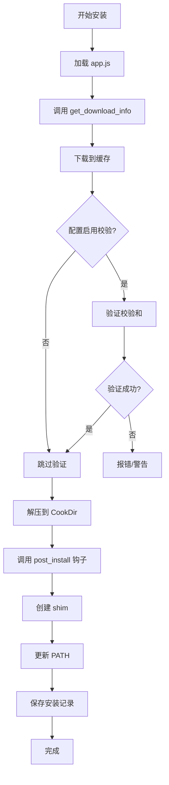
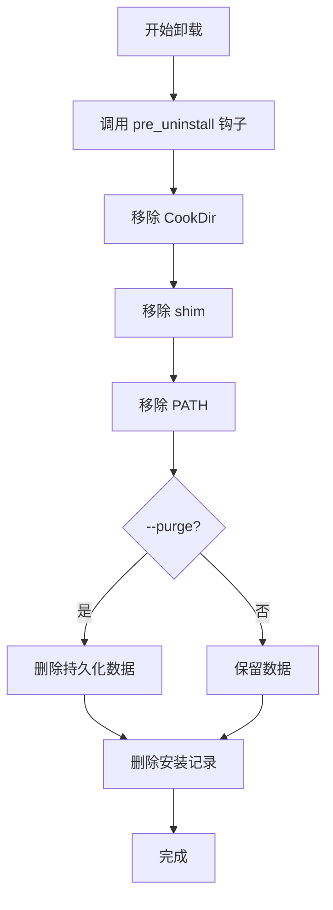
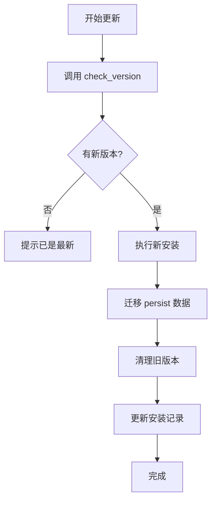
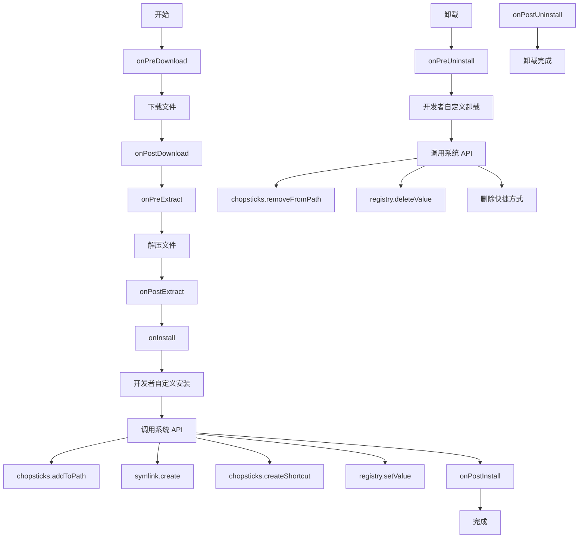
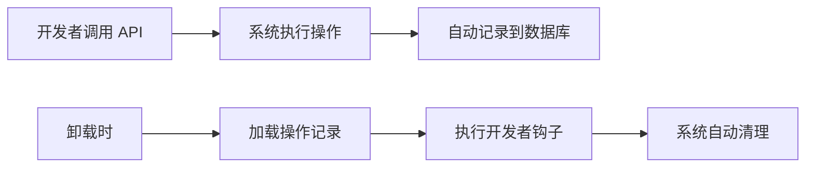
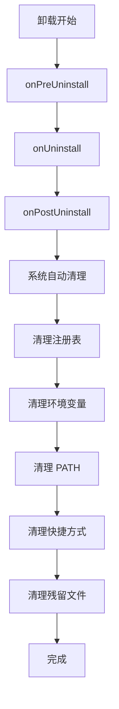

# Chopsticks 功能需求规格

> 基于官方文档的功能需求定义

---

## 1. 项目概述

### 1.1 项目定义

**Chopsticks（筷子）** 是一个为 Windows 平台设计的现代化命令行包管理器。

### 1.2 核心目标

- 提供快速、简单、优雅的软件管理方式
- 赋予开发者极大的灵活性来定义软件包
- 通过 JavaScript/Lua 脚本实现复杂的安装逻辑

### 1.3 灵感来源

- **Scoop** - 主要灵感，类似的体验
- **Homebrew** - 包管理理念
- **Chocolatey** - Windows 平台适配

---

## 2. 核心概念

### 2.1 术语对照

| 用户友好术语 | 英文      | 说明             |
| ------------ | --------- | ---------------- |
| 软件源       | Bucket    | 软件包的集合     |
| 软件包       | App       | 单个软件定义     |
| 安装         | Install   | 部署软件         |
| 卸载         | Uninstall | 移除软件         |
| 更新         | Update    | 升级软件         |
| 安装目录     | Cook Dir  | 软件实际安装位置 |

---

## 3. 功能需求

### 3.1 软件源（Bucket）管理

#### 3.1.1 结构定义

每个软件源是一个 Git 仓库，根目录包含：

- `bucket.json` - 软件源配置文件
- `apps/` - 应用目录

#### 3.1.2 配置文件 (bucket.json)

```json
{
  "name": "my-bucket",
  "description": "My Bucket",
  "author": "Author Name",
  "homepage": "https://...",
  "license": "MIT",
  "repository": {
    "type": "git",
    "url": "https://github.com/...",
    "branch": "main"
  },
  "keywords": ["chopsticks", "bucket"]
}
```

#### 3.1.3 CLI 操作

| 命令                      | 说明                   | 别名              |
| ------------------------- | ---------------------- | ----------------- |
| `bucket add <name> <url>` | 添加远程或本地软件源   | bow, b            |
| `bucket list`             | 列出所有已添加的软件源 | bucket ls, bow ls |
| `bucket update [name]`    | 从远程仓库拉取最新应用 | bucket up, bow up |
| `bucket remove <name>`    | 删除软件源             | bucket rm, bow rm |

#### 3.1.4 共享工具

支持在软件源根目录放置 `tools.js`，供该软件源内所有应用共享：

- 版本解析
- URL 构建
- GitHub API 调用

---

### 3.2 应用（App）定义

#### 3.2.1 文件结构

每个应用是一个 JavaScript 脚本文件：

- `app.js` - 脚本文件（包含元数据和安装逻辑）
- 可选：`app.lua` - Lua 脚本文件（备选方案）

#### 3.2.2 脚本文件 (app.js)

**基本定义**：

```javascript
class GitApp extends App {
  constructor() {
    super({
      name: "git",
      description: "Distributed version control system",
      homepage: "https://git-scm.com/",
      license: "GPL-2.0",
      category: "development",
      tags: ["vcs", "git"],
      maintainer: "author",
      bucket: "main",
    });
  }
}
```

**必需方法**：

| 方法                             | 说明         | 返回值                |
| -------------------------------- | ------------ | --------------------- |
| `checkVersion()`                 | 获取最新版本 | string                |
| `getDownloadInfo(version, arch)` | 获取下载信息 | {url, filename, type} |

**可选钩子**：

| 方法                   | 说明   | 上下文                              |
| ---------------------- | ------ | ----------------------------------- |
| `onPreDownload(ctx)`   | 下载前 | ctx.version, ctx.arch, ctx.cook_dir |
| `onPostDownload(ctx)`  | 下载后 | 同上                                |
| `onPreExtract(ctx)`    | 解压前 | 同上                                |
| `onPostExtract(ctx)`   | 解压后 | 同上                                |
| `onPreInstall(ctx)`    | 安装前 | 同上                                |
| `onInstall(ctx)`       | 安装中 | 同上                                |
| `onPostInstall(ctx)`   | 安装后 | 同上                                |
| `onPreUninstall(ctx)`  | 卸载前 | 同上                                |
| `onUninstall(ctx)`     | 卸载中 | 同上                                |
| `onPostUninstall(ctx)` | 卸载后 | 同上                                |

**可选配置方法**：

| 方法             | 说明       | 返回值                    |
| ---------------- | ---------- | ------------------------- |
| `getEnvPath()`   | PATH 目录  | string[]                  |
| `getBin()`       | 可执行文件 | string[]                  |
| `getPersist()`   | 持久化目录 | string[]                  |
| `getDepends()`   | 依赖列表   | {name, bucket, version}[] |
| `getConflicts()` | 冲突列表   | string[]                  |

---

### 3.3 安装（Install）生命周期

#### 3.3.1 安装流程 (Install)



**详细步骤**：

1. 解析 app.js 中的 get_download_info
2. 下载文件到缓存目录
3. **可选**：使用 checksum 验证哈希（可配置跳过）
4. 根据 type 字段解压到 CookDir
5. 执行 post_install 钩子
6. 创建 shim（命令链接）
7. 更新 PATH 环境变量
8. 保存安装记录

**配置选项**：

- `verify_checksum: true/false` - 是否验证校验和（默认 true）

#### 3.3.2 卸载流程 (Uninstall)



#### 3.3.3 更新流程 (Update)



---

### 3.4 CLI 命令

#### 3.4.1 主命令

| 命令         | 实现文件      | 别名                     | 说明         |
| ------------ | ------------- | ------------------------ | ------------ |
| `install`    | serve.go      | `serve`, `i`             | 安装软件     |
| `uninstall`  | clear.go      | `clear`, `rm`, `remove`  | 卸载软件     |
| `update`     | refresh.go    | `refresh`, `up`, `upgrade`| 更新软件    |
| `search`     | search.go     | `find`, `s`              | 搜索软件     |
| `list`       | list.go       | `ls`                     | 列出软件     |
| `bucket`     | bucket.go     | -                        | 软件源管理   |
| `completion` | completion.go | -                        | 生成补全脚本 |
| `help`       | root.go       | `--help`, `-h`           | 显示帮助     |

#### 3.4.2 子命令

**bucket 子命令**：

| 子命令   | 别名        | 说明       |
| -------- | ----------- | ---------- |
| `add`    | a           | 添加软件源 |
| `remove` | rm, delete  | 删除软件源 |
| `list`   | ls          | 列出软件源 |
| `update` | up, upgrade | 更新软件源 |

---

### 3.5 JavaScript API

#### 3.5.1 日志模块 (log)

```javascript
log.debug(message); // 调试日志
log.info(message); // 信息日志
log.warn(message); // 警告日志
log.error(message); // 错误日志
```

#### 3.5.2 JSON 模块 (json)

```javascript
const str = JSON.stringify(object); // 对象转 JSON
const object = JSON.parse(str); // JSON 转对象
```

#### 3.5.3 路径模块 (path)

```javascript
const full = path.join("dir", "file.txt"); // 连接路径
const abs = path.abs("relative"); // 转绝对路径
const dir = path.dir("/path/to/file"); // 获取目录
const base = path.base("/path/to/file"); // 获取文件名
```

#### 3.5.4 执行模块 (exec)

```javascript
const result = await exec.exec("git", "--version");
// result.exitCode, result.stdout, result.stderr, result.success

const result = await exec.shell("echo hello");
const result = await exec.powershell("Get-Process");
```

#### 3.5.5 HTTP 模块 (fetch)

```javascript
const response = await fetch.get(url);
// response.status, response.ok, response.body, response.headers

const response = await fetch.post(url, body, contentType);
await fetch.download(url, destPath);
```

#### 3.5.6 文件系统模块 (fs)

```javascript
const content = fs.readFile(path); // 读文件
fs.writeFile(path, content); // 写文件
fs.mkdir(path); // 创建目录
fs.exists(path); // 检查存在
fs.isDir(path); // 检查是否为目录
fs.remove(path); // 删除
fs.copy(src, dst); // 复制
```

#### 3.5.7 校验和模块 (checksum)

```javascript
const hash = await checksum.sha256(path); // SHA256
const hash = await checksum.md5(path); // MD5
const valid = await checksum.verify(path, expected, "sha256");
```

#### 3.5.8 版本模块 (semver)

```javascript
const result = semver.compare("1.2.3", "1.2.4"); // -1, 0, 1
const is_gt = semver.gt("2.0.0", "1.9.0"); // true/false
const is_lt = semver.lt("1.0.0", "2.0.0"); // true/false
const is_gte = semver.gte("1.2.3", "1.0.0"); // true/false
```

#### 3.5.9 压缩模块 (archive)

```javascript
await archive.extractZip(src, dest);
await archive.extract7z(src, dest);
await archive.extractTarGz(src, dest);
```

#### 3.5.10 包系统模块 (chopsticks)

```javascript
const cookDir = chopsticks.getCookDir("git", "2.43.0");
chopsticks.createShim("source.exe", "alias");
chopsticks.createShortcut({ source, name, description, icon });
chopsticks.addToPath("bin");
chopsticks.setEnv("VAR", "value");
```

---

## 4. 非功能性需求

### 4.1 性能

- 单文件下载: 支持断点续传
- 多文件安装: 支持并行下载
- 启动时间: < 500ms

### 4.2 兼容性

- Windows 10/11
- PowerShell 5.1+ / CMD
- x64 / arm64

### 4.3 安全性

- 下载校验 (SHA256)
- 脚本沙箱
- 不修改系统关键文件

### 4.4 可用性

- 命令自动补全 (Bash/Zsh/PowerShell/Fish)
- 详细错误提示
- 操作日志

---

## 5. 新增功能需求

### 5.1 并行更新

支持同时更新多个软件源，提升效率。

```bash
# 更新所有软件源（并行）
chopsticks source update

# 更新指定软件源
chopsticks source update main extras
```

**实现方式**：

- 使用 Go 并发 (goroutine + waitgroup)
- 控制最大并发数（默认 5）
- 错误收集后统一报告

### 5.2 Git 仓库支持

内置 Git 功能，支持克隆和更新软件源仓库。

```go
// Git 模块功能
type GitClient interface {
    Clone(url, dest string) error
    Pull(dir string) error
    Fetch(dir string) error
    GetLatestTag(dir string) (string, error)
    GetCommitHash(dir string) (string, error)
}
```

### 5.3 系统功能

#### 5.3.1 压缩解压

| 格式           | 支持      |
| -------------- | --------- |
| .zip           | ✅        |
| .7z            | ✅        |
| .tar.gz / .tgz | ✅        |
| .tar.xz        | ✅        |
| .rar           | ✅ (可选) |

#### 5.3.2 安装程序处理

支持静默安装常见安装程序：

```javascript
// 安装程序处理
installer.run("installer.exe", ["/S", "/D=path"]); // NSIS
installer.run("msi.msi", ["/quiet", "/norestart"]); // MSI
installer.run("setup.exe", ["/VERYSILENT", "/SUPPRESSMSGBOXES"]); // Inno Setup
```

#### 5.3.3 软链接处理

```javascript
// 创建符号链接
await symlink.create(source, linkName); // 符号链接
await symlink.createHard(source, linkName); // 硬链接
await symlink.createJunction(source, linkName); // Windows 目录联接
```

#### 5.3.4 Windows 注册表

```javascript
// 注册表操作
await registry.setValue("HKCU\\Software\\App", "Version", "1.0.0");
await registry.getValue("HKCU\\Software\\App", "Version");
await registry.deleteKey("HKCU\\Software\\App");
await registry.createKey("HKCU\\Software\\App");
```

### 5.4 自定义工作流程

开发者可通过生命周期钩子和系统 API 灵活控制安装/卸载流程。



**生命周期 Hooks**：

| Hook              | 时机   | 用途           |
| ----------------- | ------ | -------------- |
| `onPreDownload`   | 下载前 | 准备下载目录   |
| `onPostDownload`  | 下载后 | 验证文件       |
| `onPreExtract`    | 解压前 | 准备目录       |
| `onPostExtract`   | 解压后 | 移动文件       |
| `onPreInstall`    | 安装前 | 检查依赖       |
| `onInstall`       | 安装中 | 自定义安装逻辑 |
| `onPostInstall`   | 安装后 | 自定义配置     |
| `onPreUninstall`  | 卸载前 | 备份数据       |
| `onUninstall`     | 卸载中 | 自定义卸载逻辑 |
| `onPostUninstall` | 卸载后 | 清理残留       |

**系统 API**（开发者自行调用）：

| API 模块                      | 说明         |
| ----------------------------- | ------------ |
| `chopsticks.addToPath()`      | 添加到 PATH  |
| `chopsticks.setEnv()`         | 设置环境变量 |
| `symlink.create()`            | 创建符号链接 |
| `chopsticks.createShortcut()` | 创建快捷方式 |
| `registry.setValue()`         | 操作注册表   |
| `installer.run()`             | 运行安装程序 |

### 5.5 自动追踪与智能清理

Chopsticks 提供**自动操作追踪**功能，解决卸载时的清理问题：

#### 5.5.1 设计目标

| 挑战         | 解决方案                        |
| ------------ | ------------------------------- |
| 长时间间隔   | SQLite 持久化所有操作记录       |
| 版本更新     | 记录安装快照，精确匹配清理      |
| 不影响其他   | 智能 PATH 清理 + 共享检测       |
| 开发者自定义 | 分层执行：开发者钩子 → 系统自动 |

#### 5.5.2 追踪机制

开发者调用系统 API 时，系统**自动记录**所有操作：



#### 5.5.3 自动追踪的操作

| 操作类型 | 追踪方式       | 清理方式             |
| -------- | -------------- | -------------------- |
| PATH     | 记录添加的路径 | 智能移除（检测共享） |
| 环境变量 | 记录变量名和值 | 还原或删除           |
| 注册表   | 记录键路径和值 | 删除添加的键值       |
| 快捷方式 | 记录创建的路径 | 删除文件             |
| 符号链接 | 记录链接路径   | 删除链接             |

#### 5.5.4 智能 PATH 清理

```javascript
// 清理逻辑
async function cleanPath(appId, version) {
  const entries = await db.getPathEntries(appId, version);

  for (const entry of entries) {
    // 1. 检查 PATH 条目是否仍然存在
    if (!currentPath.includes(entry.path)) continue;

    // 2. 检查是否被其他软件共享
    const sharedBy = await db.getOtherSoftwareUsingPath(entry.path);
    if (sharedBy.length > 0) {
      log.warn(`Skipping shared PATH: ${entry.path}`);
      continue;
    }

    // 3. 安全移除
    await path.remove(entry.path);
  }
}
```

#### 5.5.5 分层执行顺序



---

## 6. 脚本语言

### 6.1 语言选择

推荐使用 **JavaScript** 编写 app，Lua 作为备选。

| 语言       | 优先级 | 引擎       |
| ---------- | ------ | ---------- |
| JavaScript | ⭐⭐⭐ | goja       |
| Lua        | ⭐⭐   | gopher-lua |

### 6.2 面向对象方式

使用类继承方式编写 app：

```javascript
// git.js - 继承 App 类

class GitApp extends App {
  constructor() {
    super({
      name: "git",
      description: "Distributed version control system",
      homepage: "https://git-scm.com/",
      license: "GPL-2.0",
    });
  }

  // 获取最新版本
  async checkVersion() {
    const response = await fetch.get(
      "https://api.github.com/repos/git-for-windows/git/releases/latest",
    );
    const data = JSON.parse(response.body);
    return data.tag_name.replace(/^v/, "");
  }

  // 获取下载信息
  async getDownloadInfo(version, arch) {
    const archMap = {
      amd64: "64-bit",
      x86: "32-bit",
    };

    const filename = `PortableGit-${version}-${archMap[arch] || arch}.7z.exe`;

    return {
      url: `https://github.com/git-for-windows/git/releases/download/v${version}.windows.1/${filename}`,
      type: "7z",
    };
  }
}

// 导出
module.exports = new GitApp();
```

### 6.3 App 基类

```javascript
class App {
  constructor(config) {
    this.name = config.name;
    this.description = config.description;
    this.homepage = config.homepage || "";
    this.license = config.license || "MIT";
    this.version = config.version || "0.0.0";
    this.bucket = config.bucket || "main";
  }

  // 生命周期钩子（可选重写）
  async onPreDownload(ctx) {}
  async onPostDownload(ctx) {}
  async onPreExtract(ctx) {}
  async onPostExtract(ctx) {}
  async onPreInstall(ctx) {}
  async onInstall(ctx) {}
  async onPostInstall(ctx) {}
  async onPreUninstall(ctx) {}
  async onUninstall(ctx) {}
  async onPostUninstall(ctx) {}

  // 必需方法
  async checkVersion() {
    throw new Error("checkVersion() must be implemented");
  }

  async getDownloadInfo(version, arch) {
    throw new Error("getDownloadInfo() must be implemented");
  }

  // 可选方法
  getDepends() {
    return [];
  }
  getConflicts() {
    return [];
  }
  getEnvPath() {
    return [];
  }
  getBin() {
    return [];
  }
  getPersist() {
    return [];
  }
}
```

---

## 7. 数据存储

### 7.1 SQLite 数据库

使用 SQLite 存储所有数据，替代 BoltDB。

#### 7.1.1 数据库位置

```
%USERPROFILE%\.chopsticks\data.db
```

#### 7.1.2 表结构

**buckets 表** - 软件源信息：

```sql
CREATE TABLE buckets (
    id TEXT PRIMARY KEY,
    name TEXT NOT NULL,
    url TEXT NOT NULL,
    branch TEXT DEFAULT 'main',
    added_at DATETIME DEFAULT CURRENT_TIMESTAMP,
    updated_at DATETIME DEFAULT CURRENT_TIMESTAMP,
    local_path TEXT
);
```

**apps 表** - 软件源内软件包元信息：

```sql
CREATE TABLE apps (
    id TEXT PRIMARY KEY,
    bucket_id TEXT NOT NULL,
    name TEXT NOT NULL,
    version TEXT,
    description TEXT,
    homepage TEXT,
    license TEXT,
    updated_at DATETIME DEFAULT CURRENT_TIMESTAMP,
    FOREIGN KEY (bucket_id) REFERENCES buckets(id)
);
```

**app_versions 表** - 软件包版本信息：

```sql
CREATE TABLE app_versions (
    id INTEGER PRIMARY KEY AUTOINCREMENT,
    app_id TEXT NOT NULL,
    version TEXT NOT NULL,
    released_at DATETIME,
    downloads TEXT,  -- JSON: {amd64: {url, hash, size}, x86: {...}}
    FOREIGN KEY (app_id) REFERENCES apps(id)
);
```

**installed 表** - 已安装软件：

```sql
CREATE TABLE installed (
    id TEXT PRIMARY KEY,
    name TEXT NOT NULL,
    version TEXT NOT NULL,
    bucket_id TEXT NOT NULL,
    cook_dir TEXT NOT NULL,
    installed_at DATETIME DEFAULT CURRENT_TIMESTAMP,
    updated_at DATETIME DEFAULT CURRENT_TIMESTAMP,
    FOREIGN KEY (bucket_id) REFERENCES buckets(id)
);
```

---

## 8. 非功能性需求

### 8.1 性能

- 单文件下载: 支持断点续传
- 多文件安装: 支持并行下载
- 软件源更新: 支持并行更新（默认 5 个并发）
- 启动时间: < 500ms
- 数据库查询: < 50ms

### 8.2 兼容性

- Windows 10/11
- PowerShell 5.1+ / CMD / PowerShell 7+
- x64 / arm64

### 8.3 安全性

- 下载校验 (SHA256，可配置跳过)
- 脚本沙箱
- 不修改系统关键文件
- 注册表操作在用户级别 (HKCU)

### 8.4 可用性

- 命令自动补全 (Bash/Zsh/PowerShell/Fish)
- 详细错误提示
- 操作日志

---

## 9. 未来扩展

### 9.1 计划功能

- [x] JavaScript 脚本支持
- [ ] GUI 界面
- [ ] 插件系统
- [ ] 多平台支持 (Linux/macOS)

### 9.2 生态系统

- 官方软件源: main, extras
- 社区软件源: 开发者贡献

---

_最后更新：2026-02-28_
_版本：v0.5.0-alpha_
