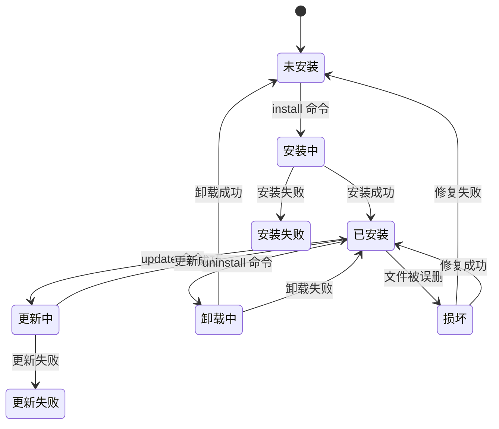
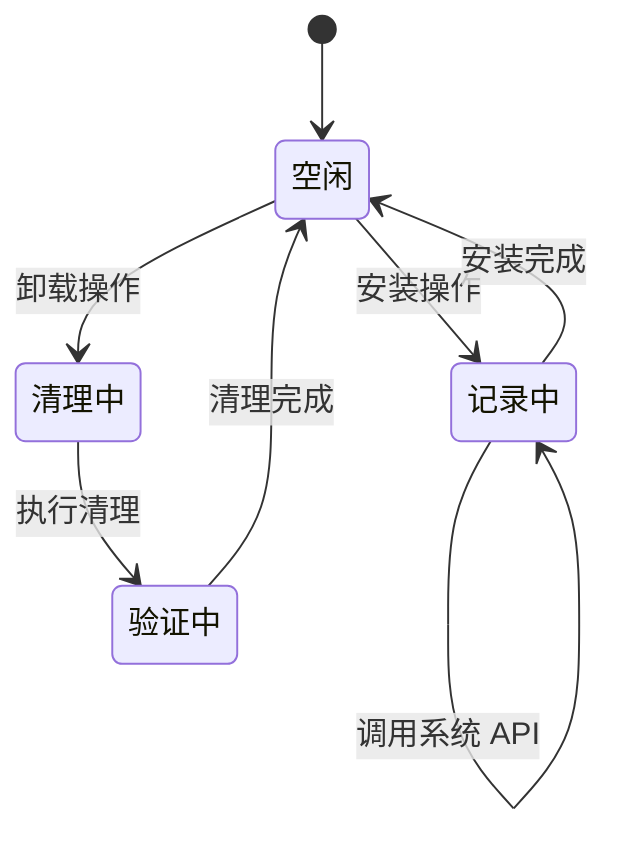
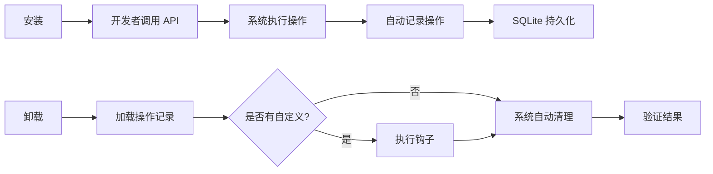
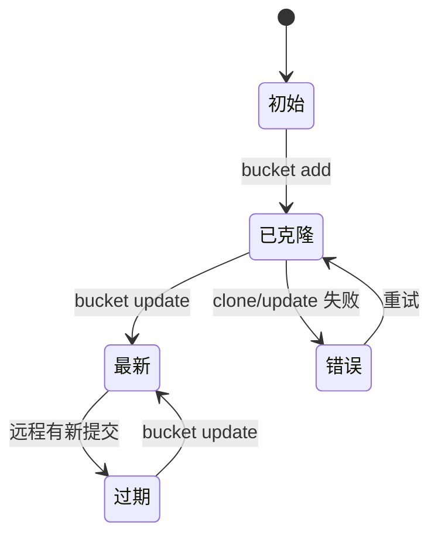
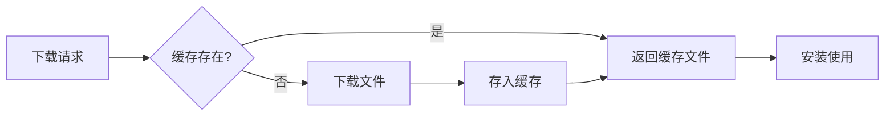

# Chopsticks 状态管理设计

> 版本: v0.10.0-alpha  
> 最后更新: 2026-03-01

> 系统状态定义与管理策略

---

## 1. 状态概述

Chopsticks 系统中存在多种状态，包括安装状态、软件源状态、应用配置等。本文档定义这些状态的结构、转换规则和持久化策略。

---

## 2. 状态类型

### 2.1 状态分类

| 状态类型   | 说明                   | 持久化            |
| ---------- | ---------------------- | ----------------- |
| 应用状态   | 全局配置、运行状态     | 数据库            |
| 安装状态   | 已安装软件信息         | 数据库            |
| 软件源状态 | 软件源的配置、同步状态 | 数据库 + 本地仓库 |
| 缓存状态   | 下载缓存、元数据缓存   | 文件系统          |

---

## 3. 应用状态

### 3.1 全局配置

```go
type Config struct {
    AppsPath    string // 安装目录
    CachePath   string // 缓存目录
    BucketsPath string // 软件源目录
    StoragePath string // 数据库路径
}
```

### 3.2 状态转换

```
启动 → 初始化 → 就绪
     ↓
  错误 → 恢复/退出
```

---

## 4. 安装状态

### 4.1 数据结构

```go
type InstalledApp struct {
    Name      string    // 应用名称 (唯一标识)
    Version   string    // 已安装版本
    Bucket    string    // 来源软件源
    CookDir   string    // 安装目录
    CookedAt  time.Time // 安装时间
    UpdatedAt time.Time // 更新时间
}
```

### 4.2 状态生命周期



### 4.3 状态持久化

| 状态           | 存储位置              | 格式      |
| -------------- | --------------------- | --------- |
| 已安装应用列表 | SQLite `installed` 表 | JSON      |
| 安装时间       | SQLite                | timestamp |
| 版本信息       | SQLite                | string    |

### 4.4 操作追踪状态

为了支持自动卸载，需要追踪安装过程中的所有系统操作：



#### 4.4.1 追踪数据结构

| 状态类型           | 存储位置 | 说明                  |
| ------------------ | -------- | --------------------- |
| install_operations | SQLite   | 记录安装/更新操作     |
| system_operations  | SQLite   | 记录所有系统 API 调用 |
| path_entries       | SQLite   | 记录 PATH 条目详情    |

#### 4.4.2 追踪流程



#### 4.4.3 智能清理状态

| 场景                | 处理方式           |
| ------------------- | ------------------ |
| PATH 条目不存在     | 跳过，记录日志     |
| PATH 被其他软件共享 | 跳过，避免影响     |
| 环境变量已修改      | 对比原值，安全处理 |
| 注册表键不存在      | 跳过，记录日志     |

---

## 5. 软件源状态

### 5.1 数据结构

```go
type BucketConfig struct {
    ID        string    // 唯一标识 (如 "main")
    Name      string    // 显示名称
    URL       string    // Git 仓库地址
    Branch    string    // 分支 (默认 "main")
    AddedAt   time.Time // 添加时间
    UpdatedAt time.Time // 最后更新时间
    LocalPath string    // 本地克隆路径
}
```

### 5.2 同步状态



### 5.3 本地仓库管理

```
%USERPROFILE%\.chopsticks\buckets\
├── main/              # 克隆的 main 软件源
│   ├── .git/          # Git 仓库
│   ├── bucket.json    # 软件源配置
│   └── apps/          # 软件包目录
├── extras/            # 克隆的 extras 软件源
└── ...
```

---

## 6. 缓存状态

### 6.1 缓存类型

| 缓存类型   | 位置               | 清理策略           |
| ---------- | ------------------ | ------------------ |
| 下载缓存   | `cache/downloads/` | 手动清理或磁盘满时 |
| 临时文件   | `cache/temp/`      | 每次启动清理       |
| 元数据缓存 | `cache/metadata/`  | 随软件源更新清理   |

### 6.2 缓存策略



---

## 7. 并发状态管理

### 7.1 竞态条件

| 场景             | 风险       | 解决方案    |
| ---------------- | ---------- | ----------- |
| 同时安装同一软件 | 数据竞争   | SQLite 事务 |
| 同时更新多个软件 | 版本覆盖   | 乐观锁      |
| 并发读写配置     | 状态不一致 | 互斥锁      |

### 7.2 事务支持

```go
// SQLite 事务示例
_, err := db.Exec("BEGIN TRANSACTION")
_, err = db.Exec("INSERT INTO installed ...")
_, err = db.Exec("COMMIT")
```

---

## 8. 故障恢复

### 8.1 状态检测

| 检测点 | 方法              | 恢复动作       |
| ------ | ----------------- | -------------- |
| 启动时 | 检查 CookDir 存在 | 提示修复或卸载 |
| 安装前 | 磁盘空间检查      | 提示清理       |
| 下载前 | 网络连通性        | 重试或跳过     |
| 解压后 | 文件完整性        | 重新下载       |

### 8.2 恢复策略

```
检测到损坏 → 标记状态 → 尝试修复 → 成功/失败处理
```

---

## 9. 状态查询

### 9.1 CLI 命令

```bash
# 列出已安装
chopsticks list --installed

# 检查软件状态
chopsticks info git

# 检查软件源状态
chopsticks bucket list

# 检查缓存
chopsticks cache show
```

---

## 10. 数据迁移

### 10.1 版本升级

当数据库结构变化时：

1. 读取旧版本数据
2. 转换为新格式
3. 写入新版本
4. 备份旧数据

### 10.2 迁移策略

```go
func migrate(db *sql.DB) error {
    version, _ := getSchemaVersion(db)

    migrations := map[int]func(*sql.DB) error{
        1: migrateV1toV2,
        2: migrateV2toV3,
    }

    for v, migrate := range migrations {
        if version < v {
            if err := migrate(db); err != nil {
                return err
            }
        }
    }

    return nil
}
```

---

## 11. 备份与恢复

### 11.1 自动备份

- 每次操作前备份相关数据
- 保留最近 N 个版本

### 11.2 手动备份

```bash
chopsticks backup export
chopsticks backup import
```

---

_最后更新：2026-03-01_  
_版本：v0.10.0-alpha_
