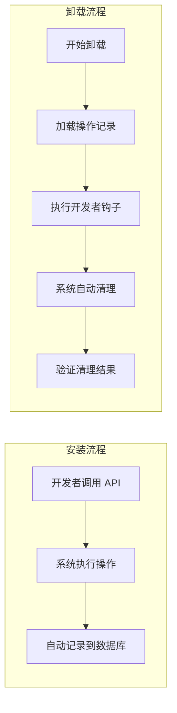
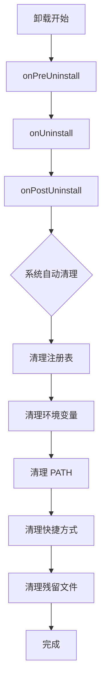

# Chopsticks 开发者指南

> 创建软件源（Bucket）和软件包（App）的完整指南

---

## 1. 概述

Chopsticks 推荐使用 **JavaScript** 编写 app，使用面向对象方式继承 App 基类。系统提供标准化工作流程，自动处理链接、PATH、注册表等。

### 核心概念

| 概念            | 说明                          |
| --------------- | ----------------------------- |
| 软件源 (Bucket) | 一个 Git 仓库，包含多个软件包 |
| 软件包 (App)    | 单个软件定义，继承 App 基类   |

### 语言选择

| 语言       | 优先级 | 说明     |
| ---------- | ------ | -------- |
| JavaScript | ⭐⭐⭐ | 推荐首选 |
| Lua        | ⭐⭐   | 兼容备用 |

---

## 2. 创建软件源（Bucket）

### 2.1 目录结构

根据 `bucket-js` 模板，标准 Bucket 目录结构如下：

```
my-bucket/
├── bucket.json            # 必需：Bucket 配置
├── bucket.db              # 可选：元数据缓存（SQLite）
├── .gitignore            # 必需：忽略文件
├── apps/                 # 必需：应用目录
│   ├── _chopsticks_.js   # 必需：类型定义（包含 App 基类）
│   ├── _example_.js      # 必需：示例应用
│   └── git.js            # 可选：应用脚本
└── README.md             # 可选：说明文档
```

### 2.2 Bucket 配置 (bucket.json)

```json
{
  "name": "my-bucket",
  "description": "A Chopsticks Bucket (JavaScript)",
  "homepage": "",
  "license": "MIT",
  "author": "",
  "keywords": ["chopsticks", "bucket", "javascript"]
}
```

---

## 3. 创建软件包（App）

### 3.1 类型定义 (_chopsticks_.js)

所有应用脚本都依赖 `_chopsticks_.js` 中定义的 App 基类：

```javascript
class App {
  constructor(metadata) {
    this.metadata = metadata;
  }

  async checkVersion() {
    throw new Error("Not implemented");
  }

  async getDownloadInfo(version, arch) {
    throw new Error("Not implemented");
  }

  async safeCall(fn) {
    try {
      const value = await fn();
      return { success: true, value };
    } catch (error) {
      return { success: false, error: String(error) };
    }
  }
}
```

### 3.2 应用脚本 (git.js)

使用面向对象方式继承 App 基类：

```javascript
// apps/git.js

class GitApp extends App {
  constructor() {
    super({
      name: "git",
      description: "Distributed version control system",
      homepage: "https://git-scm.com/",
      license: "GPL-2.0",
      category: "development",
      bucket: "my-bucket",
    });
  }

  // 获取最新版本
  async checkVersion() {
    const response = await fetch.get(
      "https://api.github.com/repos/git-for-windows/git/releases/latest",
    );
    const data = JSON.parse(response.body);
    return data.tag_name.replace(/^v/, "");
  }

  // 获取下载信息（最少需要 version 参数）
  async getDownloadInfo(version, arch) {
    const archMap = {
      amd64: "64-bit",
      x86: "32-bit",
    };

    const filename = `PortableGit-${version}-${archMap[arch] || arch}.7z.exe`;

    return {
      url: `https://github.com/git-for-windows/git/releases/download/v${version}.windows.1/${filename}`,
      type: "7z",
    };
  }

  // ============ 安装生命周期 ============

  // 安装前 - 准备工作
  async onPreInstall(ctx) {
    log.info("Preparing to install Git " + ctx.version);
  }

  // 安装中 - 主要安装步骤
  async onInstall(ctx) {
    log.info("Installing Git...");
    // 执行自定义安装逻辑
  }

  // 安装后 - 自定义配置
  async onPostInstall(ctx) {
    // 系统已自动处理链接和 PATH
    // 只需添加自定义配置
    const gitExe = path.join(ctx.cookDir, "bin", "git.exe");
    await exec.exec(gitExe, "config", "--global", "core.autocrlf", "true");
    await exec.exec(gitExe, "config", "--global", "core.longpaths", "true");
    log.info("Git installed and configured!");
  }

  // ============ 卸载生命周期 ============

  // 卸载前 - 备份用户数据
  async onPreUninstall(ctx) {
    log.info("Preparing to uninstall Git");
    // 可以备份用户配置
    const configDir = path.join(ctx.cookDir, "etc");
    if (fs.exists(configDir)) {
      const backupDir = path.join(
        process.env.USERPROFILE,
        ".chopsticks/backups/git",
      );
      fs.mkdirAll(backupDir);
      fs.copy(configDir, path.join(backupDir, "config_backup"));
      log.info("User config backed up");
    }
  }

  // 卸载中 - 主要卸载步骤
  async onUninstall(ctx) {
    log.info("Uninstalling Git...");
    // 执行自定义卸载逻辑
  }

  // 卸载后 - 清理残留
  async onPostUninstall(ctx) {
    log.info("Git uninstalled successfully");
    // 清理关联文件
  }
}

module.exports = new GitApp();
```

---

## 4. Bucket 数据库

每个 Bucket 目录下有一个 `bucket.db` SQLite 数据库，用于缓存该 Bucket 下所有 App 的元信息。

### 4.1 表结构

```sql
-- 应用表
CREATE TABLE apps (
    id TEXT PRIMARY KEY,
    name TEXT NOT NULL,
    version TEXT,
    latest_version TEXT,
    latest_downloads TEXT,
    description TEXT,
    homepage TEXT,
    license TEXT,
    category TEXT,
    tags TEXT,
    author TEXT,
    script_path TEXT NOT NULL,
    created_at DATETIME DEFAULT CURRENT_TIMESTAMP,
    updated_at DATETIME DEFAULT CURRENT_TIMESTAMP
);

-- 版本表
CREATE TABLE app_versions (
    id INTEGER PRIMARY KEY AUTOINCREMENT,
    app_id TEXT NOT NULL,
    version TEXT NOT NULL,
    released_at DATETIME,
    downloads TEXT,
    FOREIGN KEY (app_id) REFERENCES apps(id) ON DELETE CASCADE,
    UNIQUE(app_id, version)
);
```

### 4.2 数据流程

```
用户添加 Bucket → 克隆 Git 仓库 → 扫描 apps/*.js
    → 执行脚本获取版本信息 → 存储到 bucket.db
```

### 4.3 注意事项

- **不提交到 Git**：`bucket.db` 应添加到 `.gitignore`
- **自动生成**：首次添加 Bucket 时自动创建
- **按需更新**：Bucket 更新时自动刷新数据库

```bash
# .gitignore 添加
bucket.db
*.db
```

---

## 5. App 基类

App 基类在 `_chopsticks_.js` 中定义，提供以下核心功能：

### 5.1 必需方法

| 方法                              | 说明         | 参数                        | 返回值                  |
| --------------------------------- | ------------ | --------------------------- | ----------------------- |
| `checkVersion()`                  | 获取最新版本 | -                           | `Promise<string>`       |
| `getDownloadInfo(version, arch?)` | 获取下载信息 | `version` 必需，`arch` 可选 | `Promise<DownloadInfo>` |

### 5.2 安装/卸载生命周期钩子（可选）

| 钩子                   | 时机   | 说明         | 用途               |
| ---------------------- | ------ | ------------ | ------------------ |
| `onPreInstall(ctx)`    | 安装前 | 安装开始前   | 检查依赖、准备工作 |
| `onInstall(ctx)`       | 安装中 | 主要安装步骤 | 自定义安装逻辑     |
| `onPostInstall(ctx)`   | 安装后 | 安装完成后   | 自定义配置、初始化 |
| `onPreUninstall(ctx)`  | 卸载前 | 卸载开始前   | 备份数据、保存状态 |
| `onUninstall(ctx)`     | 卸载中 | 主要卸载步骤 | 自定义卸载逻辑     |
| `onPostUninstall(ctx)` | 卸载后 | 卸载完成后   | 清理残留、通知用户 |

### 5.3 下载生命周期钩子（可选）

| 钩子                  | 时机       | 说明           | 用途                 |
| --------------------- | ---------- | -------------- | -------------------- |
| `onPreDownload(ctx)`  | 下载前     | 下载开始前     | 准备下载目录         |
| `onPostDownload(ctx)` | 下载完成后 | 文件下载完成后 | 验证文件、计算校验和 |
| `onPreExtract(ctx)`   | 解压前     | 归档解压前     | 准备目录、清理旧文件 |
| `onPostExtract(ctx)`  | 解压后     | 归档解压完成后 | 移动文件、调整权限   |

### 5.4 可选配置方法

| 方法             | 说明       | 返回值         |
| ---------------- | ---------- | -------------- |
| `getDepends()`   | 获取依赖   | `Dependency[]` |
| `getConflicts()` | 获取冲突   | `string[]`     |
| `getEnvPath()`   | PATH 目录  | `string[]`     |
| `getBin()`       | 可执行文件 | `string[]`     |
| `getPersist()`   | 持久化目录 | `string[]`     |

---

## 6. 系统 API

Chopsticks 提供丰富的系统 API，开发者可在脚本中自行调用处理各种软件安装场景：

### 6.1 文件系统

```javascript
// 读取/写入文件
const content = fs.readFile("path/to/file", "utf8");
fs.writeFile("path/to/file", "content");

// 复制/删除
fs.copy("src", "dst");
fs.remove("path/to/file");
fs.removeAll("path/to/dir");

// 目录操作
fs.mkdirAll("path/to/nested/dir");
const entries = fs.readDir("path/to/dir");

// 文件检查
fs.exists("path/to/file");
fs.isDir("path/to/file");
fs.isFile("path/to/file");
const info = fs.stat("path/to/file");
// info.size, info.isDirectory, info.mtime
```

### 6.2 执行命令

```javascript
// 执行命令
const result = await exec.exec("git", "--version");
// result.exitCode, result.stdout, result.stderr, result.success

// 执行 shell
const result = await exec.shell("echo hello");

// 执行 PowerShell
const result = await exec.powershell("Get-Process");
```

### 6.3 HTTP 请求

```javascript
// GET 请求
const response = await fetch.get(url);
// response.status, response.ok, response.body, response.headers

// POST 请求
const response = await fetch.post(url, body, "application/json");

// 下载文件
await fetch.download(url, destPath);

// 带选项
const response = await fetch.get(url, {
  headers: { "User-Agent": "Chopsticks" },
  timeout: 30000,
});
```

### 6.4 压缩解压

```javascript
// 自动解压
await archive.extract("archive.zip", "dest/dir");
await archive.extract("archive.7z", "dest/dir");

// 指定类型
await archive.extractZip("archive.zip", "dest/dir");
await archive.extract7z("archive.7z", "dest/dir");
await archive.extractTarGz("archive.tar.gz", "dest/dir");
```

### 6.5 校验和

```javascript
// 计算哈希
const hash = await checksum.sha256("path/to/file");
const hash = await checksum.md5("path/to/file");

// 验证
const valid = await checksum.verify("path/to/file", expectedHash, "sha256");
```

### 6.6 版本比较

```javascript
// 比较版本
semver.compare("1.2.3", "1.2.4"); // -1, 0, 1

// 范围判断
semver.gt("2.0.0", "1.9.0"); // true
semver.satisfies("1.2.3", "^1.0.0"); // true
```

### 6.7 环境变量

```javascript
// PATH 管理
await chopsticks.addToPath("path/to/bin");
await chopsticks.removeFromPath("path/to/bin");
const paths = chopsticks.getPath();

// 环境变量
await chopsticks.setEnv("VAR_NAME", "value");
const value = await chopsticks.getEnv("VAR_NAME");
```

### 6.8 符号链接

```javascript
await symlink.create("target/file.exe", "link/name.exe");
await symlink.createDir("target/dir", "link/dir");
await symlink.createHard("target/file", "link/file");
await symlink.createJunction("target/dir", "link/dir");
const target = symlink.readLink("link");
```

### 6.9 快捷方式

```javascript
await chopsticks.createShortcut({
  source: "app.exe",
  name: "My App",
  description: "Description",
  icon: "app.ico",
  workingDir: "C:\\app",
  arguments: "--start",
});
```

### 6.10 Windows 注册表

```javascript
await registry.setValue("HKCU\\Software\\App", "Version", "1.0.0");
await registry.setDword("HKCU\\Software\\App", "Count", 42);
const value = await registry.getValue("HKCU\\Software\\App", "Version");
await registry.deleteValue("HKCU\\Software\\App", "Version");
await registry.createKey("HKCU\\Software\\App");
await registry.deleteKey("HKCU\\Software\\App");
const exists = await registry.keyExists("HKCU\\Software\\App");
```

### 6.11 安装程序

```javascript
// 自动检测类型运行
await installer.run("installer.exe", ["/S", "/D=path"]);

// 指定类型
await installer.runNSIS("installer.exe", ["/S"]);
await installer.runMSI("msi.msi", ["/quiet"]);
await installer.runInno("setup.exe", ["/VERYSILENT"]);

// 检测类型
const type = await installer.detectType("installer.exe");
// type = "nsis" | "msi" | "inno" | "autoit" | "unknown"
```

### 6.12 Chopsticks 系统

```javascript
// 获取目录
const cookDir = chopsticks.getCookDir("git", "2.43.0");
const cacheDir = chopsticks.getCacheDir();
const configDir = chopsticks.getConfigDir();
const shimDir = chopsticks.getShimDir();  // 获取 shim 目录
const persistDir = chopsticks.getPersistDir();  // 获取 persist 目录

// 创建 shim（命令快捷方式）
// shim 会被创建在 %USERPROFILE%\.chopsticks\shim\ 目录下
// 该目录已自动添加到 PATH，用户可直接在命令行调用
await chopsticks.createShim("source.exe", "alias");
```

**关于 Shim：**

Shim 是 Chopsticks 用来创建命令行可执行文件快捷方式的机制：

- **位置**：所有 shim 都存储在 `%USERPROFILE%\.chopsticks\shim\` 目录
- **PATH 集成**：shim 目录自动添加到用户 PATH，无需手动配置
- **命名**：通过 `createShim(source, alias)` 的 `alias` 参数指定命令名
- **示例**：`createShim("git.exe", "git")` 会创建 `shim/git.exe`，用户可直接运行 `git`

**关于 Persist：**

Persist 是 Chopsticks 用来持久化用户数据和配置的机制：

- **位置**：所有持久化数据存储在 `%USERPROFILE%\.chopsticks\persist\{appname}\` 目录
- **用途**：存储用户配置、数据文件等更新时需要保留的内容
- **生命周期**：应用更新时自动迁移，卸载时根据策略保留或删除
- **示例**：`persist("git", ["config", "data"])` 会在更新时保留这些目录

---

开发者**只需**关注：

- ✅ 版本获取逻辑（`checkVersion`）
- ✅ 下载信息构建（`getDownloadInfo`）
- ✅ 自定义安装/卸载逻辑（如 `onPostInstall`、`onPreUninstall`）
- ✅ 必要时调用系统 API（PATH、注册表、快捷方式等）

系统**自动**追踪所有操作并在卸载时自动清理。

---

## 7. 自动追踪与清理

### 7.1 工作原理

Chopsticks 提供**自动操作追踪**功能，开发者调用系统 API 时，系统会自动记录所有操作，卸载时自动清理。



### 7.2 自动追踪的操作

| 操作类型 | 追踪方式       | 清理方式             |
| -------- | -------------- | -------------------- |
| PATH     | 记录添加的路径 | 智能移除（检测共享） |
| 环境变量 | 记录变量名和值 | 还原或删除           |
| 注册表   | 记录键路径和值 | 删除添加的键值       |
| 快捷方式 | 记录创建的路径 | 删除文件             |
| 符号链接 | 记录链接路径   | 删除链接             |

### 7.3 示例：开发者无需手动清理

```javascript
class GitApp extends App {
  async onInstall(ctx) {
    // 开发者只需调用 API，系统自动记录
    await chopsticks.addToPath("C:\\Program Files\\Git\\bin");

    await registry.setValue("HKCU\\Software\\Git", "Version", ctx.version);

    await chopsticks.createShortcut({
      source: "git-bash.exe",
      name: "Git Bash",
    });
  }
  // 卸载时：系统自动清理以上所有操作
  // 无需编写 onUninstall！
}
```

### 7.4 智能 PATH 清理

系统采用**智能 PATH 清理策略**，确保不影响其他软件：

```javascript
// 清理时的判断逻辑
async function cleanPath(appId, version) {
  const entries = await db.getPathEntries(appId, version);

  for (const entry of entries) {
    // 1. 检查 PATH 条目是否仍然存在
    if (!currentPath.includes(entry.path)) {
      log.info("Already removed: " + entry.path);
      continue;
    }

    // 2. 检查是否被其他软件共享
    const sharedBy = await db.getOtherSoftwareUsingPath(entry.path);
    if (sharedBy.length > 0) {
      log.warn(
        `Skipping shared PATH: ${entry.path} (used by: ${sharedBy.join(", ")})`,
      );
      continue;
    }

    // 3. 安全移除
    await path.remove(entry.path);
    log.info(`Removed PATH: ${entry.path}`);
  }
}
```

### 7.5 分层执行顺序

卸载时采用**分层执行**策略：



**关键点**：

1. 先执行**开发者自定义钩子**
2. 开发者可以在钩子中自定义清理逻辑
3. 系统自动清理**剩余未处理**的操作

### 7.6 版本更新处理

更新软件时，系统会：

1. 记录 `from_version`（旧版本）
2. 安装新版本
3. 卸载时**仅清理当前版本**的操作

```sql
-- 更新时记录
INSERT INTO install_operations (app_id, version, operation_type, from_version)
VALUES ('git', '2.44.0', 'update', '2.43.0');

-- 卸载 2.44.0 时，只会清理 2.44.0 添加的操作
-- 不会影响 2.43.0 的任何残留（如果有的话）
```

### 7.7 长时间间隔支持

所有操作记录**持久化存储在 SQLite**，即使安装和卸载相隔数年，也能准确清理：

- ✅ 操作记录存储在 `%USERPROFILE%\.chopsticks\data.db`
- ✅ 不依赖内存状态
- ✅ 数据库文件随软件保留

---

## 8. 本地测试

```bash
# 添加本地软件源
chopsticks source add my-bucket /path/to/my-bucket

# 安装测试
chopsticks install my-bucket/git --verbose

# 查看日志
chopsticks install my-bucket/git --debug
```

---

## 9. 最佳实践

### 9.1 版本获取

```javascript
async checkVersion() {
    try {
        const response = await fetch.get(
            "https://api.github.com/repos/user/repo/releases/latest"
        );
        const data = JSON.parse(response.body);
        return data.tag_name.replace(/^v/, "");
    } catch (error) {
        log.warn("Failed to fetch version, using fallback");
        return "1.0.0"; // 回退版本
    }
}
```

### 9.2 下载信息

```javascript
async getDownloadInfo(version, arch) {
    return {
        url: `https://example.com/app-${version}-${arch}.zip`,
        type: "zip", // zip, 7z, tar.gz
        hash: "sha256:...", // 可选
    };
}
```

### 9.3 错误处理

```javascript
async checkVersion() {
    const ok = await this.safeCall(async () => {
        // 业务逻辑
    });

    if (!ok) {
        return "fallback-version";
    }
}
```

---

## 10. 脚手架工具

Chopsticks 提供 `bucket init` 命令帮助开发者快速创建标准 Bucket 目录结构。

### 10.1 使用脚手架创建 Bucket

```bash
# 创建新 Bucket（JavaScript 版本）
chopsticks bucket init my-bucket

# 创建 Lua 版本
chopsticks bucket init my-bucket --lua

# 指定目录创建
chopsticks bucket init my-bucket --dir ./buckets
```

### 10.2 生成的目录结构

**JavaScript 版本：**

```
my-bucket/
├── bucket.json                 # Bucket 配置
├── bucket.db                   # 可选：元数据缓存（SQLite）
├── .gitignore                  # 忽略文件
├── apps/                       # 应用目录
│   ├── _chopsticks_.js        # 类型定义（包含 App 基类）
│   ├── _example_.js            # 示例应用
│   └── git.js                  # 可选：应用脚本
└── README.md                   # 说明文档
```

**Lua 版本：**

```
my-bucket/
├── bucket.json                 # Bucket 配置
├── bucket.db                   # 可选：元数据缓存（SQLite）
├── .gitignore                  # 忽略文件
├── apps/                       # 应用目录
│   ├── _chopsticks_.lua       # 类型定义
│   ├── _example_.lua          # 示例应用
│   └── git.lua                 # 可选：应用脚本
└── README.md                   # 说明文档
```

### 10.3 开发工作流

```bash
# 1. 创建 Bucket
chopsticks bucket init my-software

# 2. 进入目录
cd my-software

# 3. 安装依赖（如需要）
npm install

# 4. 创建应用
chopsticks bucket create git

# 5. 开发应用
# 编辑 apps/git.js

# 6. 测试
chopsticks install git --bucket my-software
```

### 10.4 类型提示

**JavaScript（JSDoc）：**

```javascript
/** @type {import('./_chopsticks_')} */

class ExampleApp extends App {
  // ...
}
```

详细设计文档见 [BUCKET-SCAFFOLD](../design/BUCKET-SCAFFOLD.md)。

---

## 11. 发布

1. 创建 GitHub 仓库
2. 添加软件源到 Chopsticks
3. 提交给官方审核（可选）

```bash
# 用户添加你的软件源
chopsticks source add my-bucket https://github.com/username/my-bucket
```

---

_最后更新：2026-02-28_
_版本：v0.5.0-alpha_
