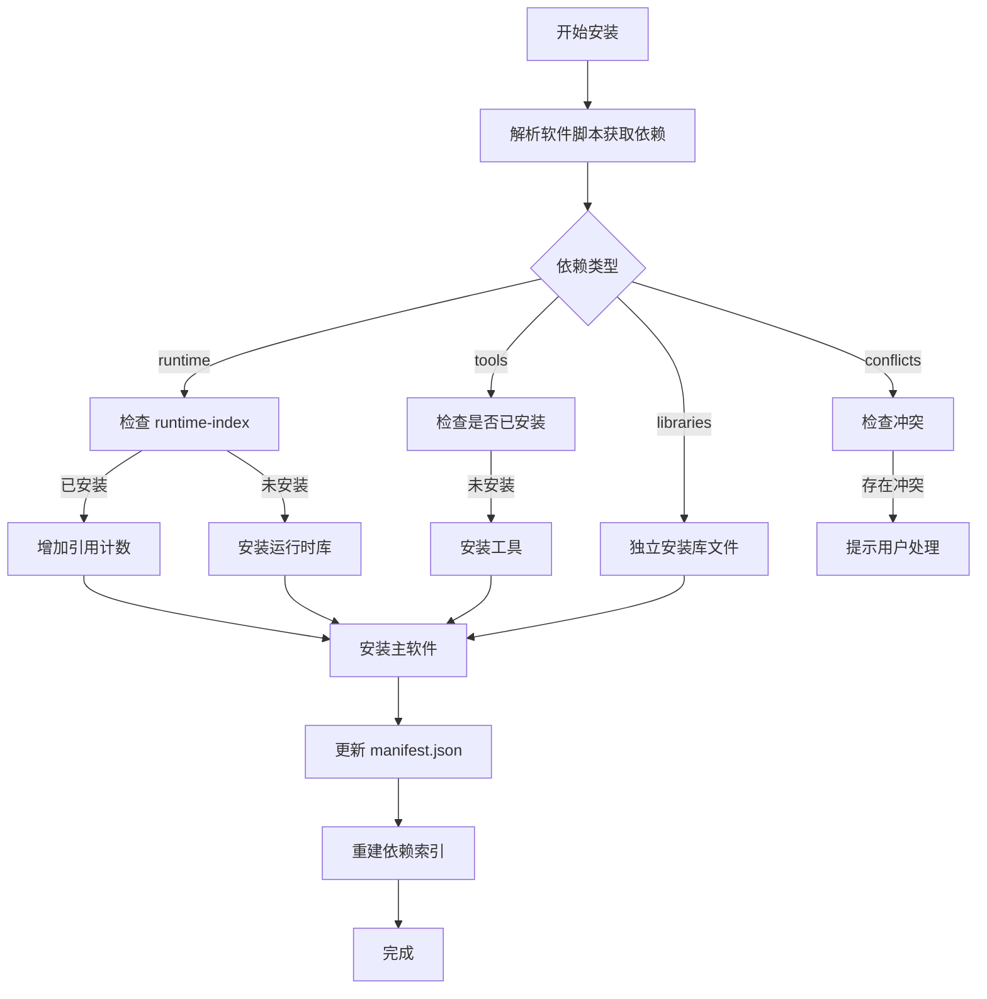
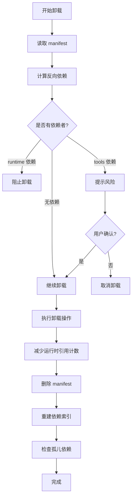

# Chopsticks 依赖管理设计

> 版本: v1.0.0  
> 最后更新: 2026-03-04

---

## 1. 设计概述

### 1.1 设计目标

Chopsticks 作为 Windows 包管理器，依赖管理需要解决以下核心问题：

| 问题 | 解决方案 |
|------|----------|
| 如何声明依赖 | 在 manifest.json 中分类声明 |
| 如何检测版本冲突 | 智能版本号解析与比较 |
| 如何卸载依赖 | 动态计算反向依赖，防止误删 |
| 如何处理运行时库 | 引用计数，共享管理 |
| 如何清理孤儿依赖 | `autoremove` 命令 + 分层提示 |

### 1.2 核心原则

| 原则 | 说明 |
|------|------|
| **声明式依赖** | 每个软件只声明"我依赖谁"，不存储"谁依赖我" |
| **动态计算反向依赖** | 通过扫描所有 manifest 实时计算，保证数据一致性 |
| **分类管理** | 运行时库、工具软件、库文件采用不同策略 |
| **用户可控** | 提供多种卸载选项，避免自动删除用户需要的软件 |

---

## 2. 依赖分类

针对 Windows 软件特点，将依赖分为 **4 类**：

```json
{
  "dependencies": {
    "runtime": ["vcredist140", "dotnet6"],
    "tools": ["7zip", "git"],
    "libraries": ["openssl", "zlib"],
    "conflicts": ["git-for-windows"]
  }
}
```

### 2.1 各类依赖特性

| 类型 | 特点 | 共享策略 | 卸载行为 |
|------|------|----------|----------|
| **runtime** | 系统级运行时库（VC++ Redist、.NET 等） | 全局共享，引用计数 | 最后一个使用者卸载时才清理 |
| **tools** | 通用工具软件 | 全局共享 | 检查 `installed_on_request`，无主动安装者时提示 |
| **libraries** | 版本敏感的库文件 | 不共享，各软件独立 | 随主软件一起卸载 |
| **conflicts** | 功能重复的互斥软件 | 不允许同时存在 | 安装时阻止，提示用户选择 |

### 2.2 依赖声明示例

```json
{
  "name": "git",
  "bucket": "main",
  "current_version": "2.43.0",
  "installed_versions": ["2.43.0"],
  
  "dependencies": {
    "runtime": [
      {
        "name": "vcredist140",
        "version": ">=14.0",
        "shared": true
      }
    ],
    "tools": [
      {
        "name": "7zip",
        "version": ">=19.0",
        "shared": true,
        "optional": false
      }
    ],
    "libraries": [],
    "conflicts": ["git-for-windows", "msys2-git"]
  },
  
  "installed_at": "2026-03-04T10:30:00Z",
  "installed_on_request": true,
  "isolated": false
}
```

---

## 3. 运行时库特殊处理

### 3.1 问题背景

Windows 软件最常依赖 VC++ Redistributable，特点：
- 体积大（20-50MB）
- 多个软件共享
- 卸载需谨慎（避免破坏其他软件）

### 3.2 引用计数机制

```json
// %USERPROFILE%\.chopsticks\runtime-index.json
{
  "vcredist140": {
    "version": "14.38.33135",
    "installed_at": "2026-03-04T10:30:00Z",
    "required_by": ["git", "nodejs", "python"],
    "ref_count": 3,
    "size": 23500000
  },
  "dotnet6": {
    "version": "6.0.25",
    "required_by": ["powershell"],
    "ref_count": 1
  }
}
```

### 3.3 安装时处理

```go
func installRuntime(dep string, version string, appName string) {
    runtime := readRuntimeIndex(dep)
    
    if runtime == nil {
        // 首次安装运行时
        installPackage(dep, version)
        runtime = &Runtime{
            Version: version,
            RequiredBy: []string{appName},
            RefCount: 1,
        }
    } else {
        // 已存在，增加引用计数
        runtime.RefCount++
        runtime.RequiredBy = append(runtime.RequiredBy, appName)
    }
    
    saveRuntimeIndex(dep, runtime)
}
```

### 3.4 卸载时处理

```go
func uninstallRuntime(dep string, appName string) {
    runtime := readRuntimeIndex(dep)
    
    runtime.RefCount--
    removeFromList(runtime.RequiredBy, appName)
    
    if runtime.RefCount == 0 {
        // 无人使用，提示用户可清理
        fmt.Printf("运行时 %s 不再被需要\n", dep)
        fmt.Println("运行 'chopsticks cleanup-runtime' 清理")
    }
    
    saveRuntimeIndex(dep, runtime)
}
```

---

## 4. 反向依赖计算

### 4.1 设计选择

**不存储反向依赖，动态计算**：

| 方案 | 优点 | 缺点 |
|------|------|------|
| 双向存储 | 查询快 O(1) | 需要维护一致性，容易出错 |
| 动态计算 | 数据一致性天然保证 | 查询稍慢 O(n) |

**决策**：采用动态计算，因为：
1. 已安装软件数量通常不多（几十到几百），扫描开销可忽略
2. 可以配合缓存优化性能
3. 避免双向维护的复杂性

### 4.2 计算算法

```go
func getDependents(appName string) []string {
    var dependents []string
    
    // 遍历所有已安装软件
    installedApps := ListInstalled()
    for _, app := range installedApps {
        if app == appName {
            continue
        }
        
        manifest := readManifest(app)
        
        // 检查是否依赖当前软件
        allDeps := append(manifest.Dependencies.Runtime, 
                         append(manifest.Dependencies.Tools, 
                                manifest.Dependencies.Libraries...)...)
        
        for _, dep := range allDeps {
            if dep == appName {
                dependents = append(dependents, app)
                break
            }
        }
    }
    
    return dependents
}
```

### 4.3 依赖索引缓存（可选优化）

```json
// %USERPROFILE%\.chopsticks\deps-index.json
{
  "generated_at": "2026-03-04T10:30:00Z",
  "apps": {
    "git": {
      "dependencies": ["vcredist140", "7zip"],
      "dependents": ["git-lfs", "hub"]
    },
    "7zip": {
      "dependencies": [],
      "dependents": ["git", "nodejs"]
    }
  }
}
```

**注意**：此文件为**可重建缓存**，真实数据仍在各 manifest 中。

---

## 5. 核心操作流程

### 5.1 安装流程



### 5.2 卸载流程



### 5.3 卸载时的依赖检查

```go
func Uninstall(appName string, options UninstallOptions) error {
    manifest := readManifest(appName)
    
    // 1. 检查反向依赖
    dependents := getDependents(appName)
    if len(dependents) > 0 {
        // 分类依赖者
        var runtimeDependents, toolDependents []string
        for _, d := range dependents {
            depManifest := readManifest(d)
            if contains(depManifest.Dependencies.Runtime, appName) {
                runtimeDependents = append(runtimeDependents, d)
            } else {
                toolDependents = append(toolDependents, d)
            }
        }
        
        // 运行时依赖：阻止卸载
        if len(runtimeDependents) > 0 {
            return fmt.Errorf(
                "无法卸载 %s：以下软件的运行时依赖它\n  - %s",
                appName, strings.Join(runtimeDependents, "\n  - ")
            )
        }
        
        // 工具依赖：提示风险
        if len(toolDependents) > 0 && !options.Force {
            fmt.Printf("警告：以下软件依赖 %s\n  - %s\n", 
                      appName, strings.Join(toolDependents, "\n  - "))
            if !confirm("这些软件可能无法正常工作，是否继续？") {
                return nil
            }
        }
    }
    
    // 2. 执行卸载
    // ...
    
    // 3. 处理孤儿依赖
    if !options.KeepOrphans {
        orphans := findOrphanDependencies(manifest.Dependencies)
        suggestCleanup(orphans)
    }
    
    return nil
}
```

---

## 6. 孤儿依赖清理

### 6.1 孤儿依赖定义

孤儿依赖：不再被任何软件需要的依赖项。

```go
func findOrphanDependencies(deps Dependencies) Orphans {
    var orphans Orphans
    
    // 检查运行时
    for _, runtime := range deps.Runtime {
        runtimeInfo := readRuntimeIndex(runtime)
        if runtimeInfo != nil && runtimeInfo.RefCount == 0 {
            orphans.Runtime = append(orphans.Runtime, runtime)
        }
    }
    
    // 检查工具
    for _, tool := range deps.Tools {
        if !isRequiredByOthers(tool) {
            manifest := readManifest(tool)
            // 仅清理非用户主动安装的工具
            if !manifest.InstalledOnRequest {
                orphans.Tools = append(orphans.Tools, tool)
            }
        }
    }
    
    return orphans
}
```

### 6.2 分层清理提示

```go
func suggestCleanup(orphans Orphans) {
    // 运行时库（占用大，优先提示）
    if len(orphans.Runtime) > 0 {
        fmt.Println("以下运行时库不再被需要：")
        for _, r := range orphans.Runtime {
            size := getPackageSize(r)
            fmt.Printf("  - %s (%s)\n", r, humanizeSize(size))
        }
        if confirm("是否清理这些运行时库？") {
            cleanupRuntimes(orphans.Runtime)
        }
    }
    
    // 工具软件
    if len(orphans.Tools) > 0 {
        fmt.Println("以下工具软件仍可独立使用：")
        for _, t := range orphans.Tools {
            fmt.Printf("  - %s\n", t)
        }
        fmt.Println("运行 'chopsticks autoremove' 可清理")
    }
}
```

### 6.3 autoremove 命令

```bash
# 清理所有孤儿依赖
chopsticks autoremove

# 预览可清理内容（不实际执行）
chopsticks autoremove --dry-run

# 仅清理运行时库
chopsticks cleanup-runtime
```

---

## 7. 用户交互设计

### 7.1 安装前预览

```bash
$ chopsticks install git --dry-run

将安装以下软件：
  git 2.43.0                    45.2 MB
  └── 7zip 23.01               1.2 MB  [已安装]
  └── vcredist140 14.38        23.5 MB [运行时库，将被其他软件共享]

磁盘空间：需下载 68.7 MB，安装后占用 89.4 MB

是否继续？ [Y/n]
```

### 7.2 依赖树查看

```bash
$ chopsticks deps git --tree

git 2.43.0
├── runtime: vcredist140 14.38 [shared by: git, nodejs, python]
├── tools: 7zip 23.01 [installed]
└── tools: curl 8.5.0 [will install]

反向依赖（依赖 git 的软件）：
├── git-lfs
└── hub
```

### 7.3 卸载确认

```bash
$ chopsticks uninstall git

警告：以下软件依赖 git，卸载后它们将无法正常工作：
  - git-lfs
  - hub

选项：
  [1] 取消卸载
  [2] 仅卸载 git（不推荐）
  [3] 一并卸载 git-lfs, hub

请选择 [1/2/3]: 
```

---

## 8. 命令设计

### 8.1 安装相关

```bash
chopsticks install <app>                    # 标准安装
chopsticks install <app> --isolate          # 隔离安装（依赖独立）
chopsticks install <app> --no-deps          # 不安装依赖（高级用户）
chopsticks install <app> --dry-run          # 预览安装内容
```

### 8.2 依赖查询

```bash
chopsticks deps <app>                       # 查看依赖列表
chopsticks deps <app> --tree                # 树形展示
chopsticks deps <app> --reverse             # 查看反向依赖
```

### 8.3 卸载相关

```bash
chopsticks uninstall <app>                  # 标准卸载
chopsticks uninstall <app> --cascade        # 级联卸载依赖者
chopsticks uninstall <app> --force          # 强制卸载（忽略依赖检查）
chopsticks uninstall <app> --autoremove     # 同时清理孤儿依赖
```

### 8.4 清理相关

```bash
chopsticks autoremove                       # 清理所有孤儿依赖
chopsticks autoremove --dry-run             # 预览可清理内容
chopsticks cleanup-runtime                  # 清理无用运行时库
```

---

## 9. 与 Scoop 的对比

| 特性 | Scoop | Chopsticks（本方案） |
|------|-------|---------------------|
| 依赖存储 | manifest.json | manifest.json + runtime-index.json |
| 运行时库处理 | 作为普通依赖 | 引用计数，共享管理 |
| 反向依赖 | 不支持查询 | 动态计算，支持 `deps --reverse` |
| 版本冲突 | 简单覆盖 | 检测 + 隔离安装选项 |
| 卸载提示 | 无 | 智能提示依赖影响 |
| 孤儿清理 | 不支持 | `autoremove` + `cleanup-runtime` |
| 隔离安装 | 不支持 | 支持 `--isolate` |

---

## 10. 数据文件汇总

### 10.1 manifest.json（每个软件）

位置：`apps/{app_name}/manifest.json`

```json
{
  "name": "git",
  "bucket": "main",
  "current_version": "2.43.0",
  "installed_versions": ["2.43.0"],
  
  "dependencies": {
    "runtime": [
      {"name": "vcredist140", "version": ">=14.0", "shared": true}
    ],
    "tools": [
      {"name": "7zip", "version": ">=19.0", "shared": true}
    ],
    "libraries": [],
    "conflicts": ["git-for-windows"]
  },
  
  "installed_at": "2026-03-04T10:30:00Z",
  "installed_on_request": true,
  "isolated": false
}
```

### 10.2 runtime-index.json（全局运行时索引）

位置：`.chopsticks/runtime-index.json`

```json
{
  "vcredist140": {
    "version": "14.38.33135",
    "ref_count": 3,
    "required_by": ["git", "nodejs", "python"],
    "size": 23500000
  }
}
```

### 10.3 deps-index.json（可重建的依赖缓存）

位置：`.chopsticks/deps-index.json`

```json
{
  "generated_at": "2026-03-04T10:30:00Z",
  "apps": {
    "git": {
      "dependencies": ["vcredist140", "7zip"],
      "dependents": ["git-lfs", "hub"]
    }
  }
}
```

---

## 11. 总结

本方案的核心特点：

1. **分类管理**：运行时库、工具软件、库文件采用不同策略
2. **引用计数**：运行时库共享管理，避免重复安装和误删
3. **动态计算**：反向依赖实时计算，保证数据一致性
4. **用户可控**：提供多种卸载选项，避免自动删除用户需要的软件
5. **智能提示**：安装前预览、卸载时警告、清理时确认

---

_最后更新：2026-03-04_  
_版本：v1.0.0_
