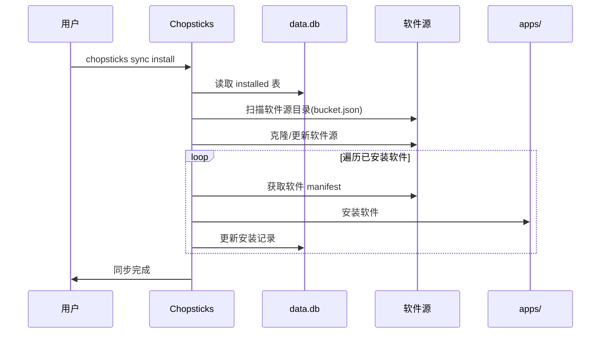

# Chopsticks 用户指南

> 详细的使用说明和示例

---

## 1. 快速开始

本指南将帮助你在 5 分钟内完成第一个软件的安装。

### 1.1 安装 Chopsticks

**Windows (PowerShell):**

```powershell
iwr -useb https://get.chopsticks.dev/install.ps1 | iex
```

**验证安装:**

```bash
chopsticks --version
```

### 1.2 添加软件源

Chopsticks 需要软件源才能知道有哪些软件可以安装：

```bash
# 添加官方主软件源
chopsticks bucket add main https://github.com/chopsticks-bucket/main

# 查看已添加的软件源
chopsticks bucket list
```

### 1.3 搜索和安装软件

```bash
# 搜索 Git
chopsticks search git

# 安装 Git
chopsticks install git

# 或使用短命令
chopsticks i git
```

### 1.4 验证安装

```bash
# 验证 Git 已正确安装
git --version

# 查看已安装的软件
chopsticks list
```

### 1.5 故障排除

**问题: 命令未找到**

- 确保安装脚本执行成功
- 重启终端或执行 `refreshenv`

**问题: 无法添加软件源**

- 检查网络连接
- 确认 Git 已安装: `git --version`

### 1.6 下一步

- 查看 [完整命令参考](#3-cli命令参考)
- 了解 [软件源管理](#4-软件源管理)
- 阅读 [常见问题](faq.md)

---

## 2. 安装与配置

### 2.1 从源码安装 Chopsticks

```powershell
# 克隆项目
git clone https://github.com/chopsticks-bucket/main.git
cd main

# 编译
go build -o chopsticks.exe

# 验证
./chopsticks.exe --help
```

### 2.2 环境配置

Chopsticks 默认使用以下目录：

| 目录         | 环境变量          | 默认路径                                | 说明                                |
| ------------ | ----------------- | --------------------------------------- | ----------------------------------- |
| 安装目录     | `CHOPSTICKS_HOME` | `%USERPROFILE%\.chopsticks`             | Chopsticks 主目录，包含所有数据     |
| 应用目录     | -                 | `%USERPROFILE%\.chopsticks\apps`        | 已安装软件的目录，支持多版本管理    |
| 缓存目录     | -                 | `%USERPROFILE%\.chopsticks\cache`       | 下载缓存、临时文件和元数据缓存      |
| 软件源目录   | -                 | `%USERPROFILE%\.chopsticks\buckets`     | 软件源（Bucket）仓库目录            |
| 持久化目录   | -                 | `%USERPROFILE%\.chopsticks\persist`     | 软件持久化数据，更新时保留          |
| 快捷方式目录 | -                 | `%USERPROFILE%\.chopsticks\shim`        | 可执行文件快捷方式，添加到 PATH     |
| 日志目录     | -                 | `%USERPROFILE%\.chopsticks\logs`        | 运行日志文件，便于排查问题          |
| 配置文件     | -                 | `%USERPROFILE%\.chopsticks\config.yaml` | 用户配置文件，包含代理、超时等设置  |
| 数据库文件   | -                 | `%USERPROFILE%\.chopsticks\data.db`     | SQLite 数据库，存储软件源和安装记录 |

---

## 3. 软件源管理

### 3.1 添加软件源

```bash
# 添加远程软件源
chopsticks bucket add main https://github.com/chopsticks-bucket/main

# 添加本地软件源
chopsticks bucket add local /path/to/local-source

# 指定分支
chopsticks bucket add extras https://github.com/chopsticks-bucket/extras --branch develop
```

### 3.2 列出软件源

```bash
# 列出所有软件源
chopsticks bucket list
chopsticks bucket ls
```

### 3.3 更新软件源

```bash
# 更新所有软件源
chopsticks bucket update

# 更新指定软件源
chopsticks bucket update main
```

### 3.4 删除软件源

```bash
# 删除软件源
chopsticks bucket remove extras

# 删除并清理本地数据
chopsticks bucket remove extras --purge
```

---

## 4. 软件包管理

### 4.1 安装软件

```bash
# 安装最新版本
chopsticks install git
chopsticks i git

# 安装指定版本
chopsticks install nodejs@18.17.0
chopsticks install python@3.12.0

# 从指定软件源安装
chopsticks install extras/vscode

# 强制重新安装
chopsticks install git --force

# 使用别名
chopsticks i git

# 批量安装（Go 层自动并发调度，性能提升 5-6 倍）
chopsticks install git go python nodejs

# 批量安装并指定并发数
chopsticks install app1 app2 app3 --workers 8
```

### 4.2 卸载软件

```bash
# 卸载软件（保留配置数据）
chopsticks uninstall git
chopsticks rm git

# 彻底卸载（删除所有数据）
chopsticks uninstall git --purge
chopsticks remove git
```

### 4.3 更新软件

```bash
# 更新指定软件
chopsticks update git
chopsticks up git

# 更新所有软件
chopsticks update --all
chopsticks up --all

# 强制更新
chopsticks update git --force

# 批量更新（Go 层自动并发调度）
chopsticks update git go python --workers 4
```

### 4.4 查看软件

```bash
# 列出已安装软件
chopsticks list
chopsticks ls

# 仅显示已安装
chopsticks list --installed

# 搜索软件
chopsticks search vscode
chopsticks s vscode

# 在指定软件源搜索
chopsticks search vscode --bucket extras

# 并行搜索（搜索多个软件源，性能提升 5-6 倍）
chopsticks search editor --workers 10
```

### 4.5 性能监控

Chopsticks 提供性能监控和诊断工具：

```bash
# 实时监控性能指标
chopsticks perf monitor

# 生成性能报告（收集 10 秒数据）
chopsticks perf report

# 生成性能报告（指定时长）
chopsticks perf report --duration 30

# 查看当前性能状态
chopsticks perf status

# 查看 JS 引擎池状态
chopsticks perf js-pool
```

---

## 5. 命令别名

Chopsticks 支持多种命令格式，您可以自由选择：

| 主命令      | 别名            | 说明       |
| ----------- | --------------- | ---------- |
| `install`   | `i`             | 安装软件   |
| `uninstall` | `rm`, `remove`  | 卸载软件   |
| `update`    | `up`, `upgrade` | 更新软件   |
| `search`    | `s`, `find`     | 搜索软件   |
| `list`      | `ls`            | 列出软件   |
| `bucket`    | `b`             | 软件源管理 |

---

## 6. Shell 自动补全

### 6.1 Bash

```bash
# 临时启用
source <(chopsticks completion bash)

# 永久启用
chopsticks completion bash >> ~/.bashrc
```

### 6.2 Zsh

```zsh
# 临时启用
source <(chopsticks completion zsh)

# 永久启用
chopsticks completion zsh >> ~/.zshrc
```

### 6.3 PowerShell

```powershell
# 临时启用
chopsticks completion powershell | Invoke-Expression

# 永久启用
chopsticks completion powershell >> $PROFILE
```

### 6.4 Fish

```fish
# 永久启用
chopsticks completion fish > ~/.config/fish/completions/chopsticks.fish
```

---

## 7. 高级用法

### 7.1 版本指定

```bash
# 使用 @ 指定版本
chopsticks install nodejs@18.17.0
chopsticks install python@3.11.5

# 不指定版本安装最新稳定版
chopsticks install git
```

### 7.2 架构指定

```bash
# 指定架构 (需要软件包支持)
chopsticks install app --arch amd64
chopsticks install app --arch x86
```

### 7.3 详细输出

```bash
# 详细模式
chopsticks install git --verbose

# 调试模式
chopsticks install git --debug
```

### 7.4 禁用彩色输出

```bash
# 使用 --no-color 选项禁用彩色输出
chopsticks install git --no-color

# 或者设置环境变量
$env:NO_COLOR = "1"
chopsticks install git
```

---

## 8. 界面说明

### 8.1 彩色输出

Chopsticks 使用彩色输出提升可读性：

| 颜色    | 含义       | 示例                   |
| ------- | ---------- | ---------------------- |
| 🟢 绿色 | 成功、完成 | ✓ git 安装成功         |
| 🔴 红色 | 错误、失败 | ✗ 安装失败: 网络错误   |
| 🟡 黄色 | 警告、注意 | ⚠ 配置文件已存在       |
| 🔵 蓝色 | 信息、提示 | ℹ 正在下载...          |
| 🔷 青色 | 高亮、强调 | → 下一步: 配置环境变量 |
| ⚪ 灰色 | 次要信息   | 路径: C:\Users\...     |

### 8.2 进度显示

安装软件时会显示进度条：

```
# 下载进度
nodejs.zip 12.5 MB / 50.0 MB [25%] 2.5 MB/s  ETA 15s

# 安装进度（多阶段）
nodejs [下载] 25% 1/4
nodejs [解压] 50% 2/4
nodejs [安装] 75% 3/4
nodejs [配置] 100% 4/4
✓ nodejs 安装成功
```

---

## 9. 故障排除

### 9.1 常见问题

**安装失败**

```bash
# 使用 --verbose 查看详细错误
chopsticks install git --verbose

# 使用 --debug 查看调试信息
chopsticks install git --debug
```

**网络问题**

```bash
# 检查网络连接
chopsticks bucket update --verbose
```

**权限问题**

```bash
# 确保有写入权限
chopsticks list --verbose
```

### 9.2 清理缓存

```bash
# 清理下载缓存
chopsticks cache clean
```

---

## 10. 配置文件

### 10.1 配置文件位置

- Windows: `%USERPROFILE%\.chopsticks\config.yaml`
- Linux/macOS: `~/.chopsticks/config.yaml`

### 10.2 配置示例

```yaml
# 目录配置
apps_path: "C:\Users\Username\.chopsticks\apps"
cache_path: "C:\Users\Username\.chopsticks\cache"
buckets_path: "C:\Users\Username\.chopsticks\buckets"

# 行为配置
auto_update: true
verify_checksum: true

# 网络配置
timeout: 30
retry: 3
```

---

## 11. 设备同步

### 11.1 功能概述

设备同步功能允许用户快速在新设备上恢复所有已安装的软件。当您需要更换电脑或重新安装系统时，只需复制整个 `.chopsticks` 目录到新设备，然后运行同步命令即可。

### 11.2 目录结构

```
%USERPROFILE%\.chopsticks\
├── buckets/           # 软件源（Bucket）目录
│   ├── main/          # 默认软件源
│   │   ├── git.js       # Git下载脚本
│   │   └── ...
│   └── extras/        # 其他软件源
├── apps/              # 已安装的软件目录
│   ├── app1/          # 应用1安装目录
│   │   ├── current/   # 当前版本（符号链接）
│   │   ├── 1.0.0/     # 版本 1.0.0
│   │   └── 1.1.0/     # 版本 1.1.0
│   └── app2/          # 应用2安装目录
├── cache/             # 缓存目录
│   ├── downloads/     # 下载的安装包缓存
│   ├── temp/          # 临时文件
│   └── metadata/      # 元数据缓存
├── persist/           # 持久化数据目录（更新时保留）
│   ├── app1/          # 应用1的持久化数据
│   │   ├── config/    # 配置文件
│   │   └── data/      # 数据文件
│   └── app2/          # 应用2的持久化数据
├── shim/              # 可执行文件快捷方式目录
│   ├── git.exe        # Git 命令快捷方式
│   └── ...
├── logs/              # 日志文件
│   └── chp_yyyy_mm_dd.log # 主日志文件
├── data.db            # 全局数据库（SQLite）
└── config.yaml        # 用户配置文件
```

**目录说明：**

| 目录/文件          | 说明                                                      |
| ------------------ | --------------------------------------------------------- |
| `buckets/`         | 存储所有软件源（Bucket），每个子目录对应一个软件源        |
| `apps/`            | 存储所有已安装的应用，每个应用一个子目录，支持多版本管理  |
| `cache/`           | 缓存目录，包含下载缓存、临时文件和元数据缓存              |
| `cache/downloads/` | 下载的安装包缓存                                          |
| `cache/temp/`      | 临时文件                                                  |
| `cache/metadata/`  | 元数据缓存                                                |
| `persist/`         | 持久化数据目录，更新软件时保留用户配置和数据              |
| `shim/`            | 可执行文件快捷方式目录，添加到 PATH 供全局调用            |
| `logs/`            | 运行日志，便于排查问题                                    |
| `data.db`          | SQLite 数据库，存储软件源配置、已安装软件信息、操作记录等 |
| `config.yaml`      | 用户配置文件，包含代理设置、并行数、超时时间等            |

### 11.3 使用场景

**场景一：换电脑**

1. 在旧电脑上，将 `%USERPROFILE%\.chopsticks` 目录复制到 U 盘或云盘
2. 在新电脑上，将目录复制到相同位置 `%USERPROFILE%\.chopsticks`
3. 运行同步命令恢复软件

**场景二：重装系统**

1. 重装系统前备份 `.chopsticks` 目录
2. 重装系统后，将备份目录恢复到 `%USERPROFILE%\.chopsticks`
3. 运行同步命令恢复软件

### 11.4 命令用法

#### 11.4.1 sync 命令语法

```bash
chopsticks sync [subcommand] [flags]
```

**子命令**:

| 子命令    | 说明                     | 示例                      |
| --------- | ------------------------ | ------------------------- |
| `list`    | 查看将同步的软件列表     | `chopsticks sync list`    |
| `install` | 同步安装所有已记录的软件 | `chopsticks sync install` |
| `status`  | 查看同步状态             | `chopsticks sync status`  |

**参数说明**:

| 参数               | 简写 | 说明                   | 示例                                       |
| ------------------ | ---- | ---------------------- | ------------------------------------------ |
| `--device`         | `-d` | 指定目标设备           | `chopsticks sync -d laptop`                |
| `--force`          | `-f` | 强制同步，覆盖冲突     | `chopsticks sync install -f`               |
| `--dry-run`        | `-n` | 模拟运行，不实际安装   | `chopsticks sync install -n`               |
| `--config-only`    | `-c` | 仅同步配置，不同步软件 | `chopsticks sync -c`                       |
| `--skip-installed` | -    | 跳过已安装的软件       | `chopsticks sync install --skip-installed` |

#### 11.4.2 常用命令示例

```bash
# 查看将同步的软件列表（不实际安装）
chopsticks sync list

# 同步安装所有已记录的软件
chopsticks sync install

# 同步安装（跳过已安装的）
chopsticks sync install --skip-installed

# 模拟同步（查看会发生什么，但不实际执行）
chopsticks sync install --dry-run

# 强制同步（覆盖已存在的配置）
chopsticks sync install --force

# 仅同步配置
chopsticks sync --config-only

# 查看同步状态
chopsticks sync status
```

### 11.5 同步流程



### 11.6 工作原理

`sync install` 命令会执行以下操作：

1. **读取数据库**: 从 `data.db` 读取 `installed` 表
2. **扫描软件源**: 扫描 `buckets` 目录，读取每个软件源的 `bucket.json`
3. **更新软件源**: 克隆或更新所有软件源仓库
4. **遍历安装**: 按依赖顺序安装每个软件
5. **冲突处理**: 根据策略处理版本冲突
6. **记录更新**: 更新数据库中的安装记录

### 11.7 冲突解决

当多个设备上的配置不一致时，系统提供三种冲突解决策略：

1. **本地优先** (`local`): 保留本地修改，覆盖云端
2. **云端优先** (`remote`): 使用云端版本，覆盖本地
3. **手动合并** (`merge`): 提示用户手动选择

```bash
# 设置默认冲突解决策略
chopsticks config set sync.conflict_strategy local

# 临时指定策略
chopsticks sync install --conflict-strategy remote
```

### 11.8 注意事项

- **数据库完整**：确保复制的 `data.db` 数据库文件完整无损
- **网络连接**：同步过程需要重新下载软件，请确保网络畅通
- **版本兼容**：部分软件可能在新设备上需要不同版本，请注意检查
- **存储空间**：确保新设备有足够的存储空间安装所有软件

### 11.9 故障排除

**问题: 同步失败**

```bash
# 查看详细错误信息
chopsticks sync install --verbose

# 检查数据库完整性
chopsticks doctor
```

**问题: 软件源无法访问**

```bash
# 更新软件源
chopsticks bucket update

# 检查网络连接
ping github.com
```

---

## 12. 缓存管理

Chopsticks 使用多级缓存机制来提升性能。详细说明请查看 [缓存管理指南](cache-management.md)。

### 12.1 常用命令

```bash
# 查看缓存大小
chopsticks cache size

# 清理缓存
chopsticks cache clean

# 查看详细缓存信息
chopsticks cache size --verbose
```

### 12.2 缓存类型

| 缓存类型   | 位置               | 说明                 |
| ---------- | ------------------ | -------------------- |
| 下载缓存   | `cache/downloads/` | 存储下载的软件包     |
| 元数据缓存 | `cache/metadata/`  | 存储软件源索引       |
| 临时文件   | `cache/temp/`      | 安装过程中的临时数据 |

---

_最后更新：2026-03-01_
_版本：v0.10.0-alpha_
